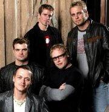

Американская рок-группа, основанная Брэдом Арнольдом, Мэттом Робертсом и Тоддом Харреллом в 1996 году.

* [Be Like That](Be%20Like%20That)
* [By My Side](By%20My%20Side)
* [Down Poison](Down%20Poison)
* [Duck And Run](Duck%20And%20Run)
* [Here Without You](Here%20Without%20You)
* [Kryptonite](Kryptonite)
* [Landing in London 2](Landing%20in%20London%202)
* [Landing in London](Landing%20in%20London)
* [Loser](Loser)
* [Smack](Smack)
* [So I Need You](So%20I%20Need%20You)
* [When I'm Gone](When%20I'm%20Gone)