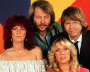

Шведская поп-группа, существующая с 1972 года.

* [Andante Andante](Andante%20Andante)
* [Angeleyes](Angeleyes)
* [Another Town Another Train](Another%20Town%20Another%20Train)
* [As Good As New](As%20Good%20As%20New)
* [Bang A Boomerang](Bang%20A%20Boomerang)
* [Cassandra](Cassandra)
* [Chiquitita (2 вариант)](Chiquitita%20(2%20вариант))
* [Chiquitita](Chiquitita)
* [Dance (While The Music Still Goes On)](Dance%20(While%20The%20Music%20Still%20Goes%20On))
* [Dancing Queen (2 вариант)](Dancing%20Queen%20(2%20вариант))
* [Dancing Queen](Dancing%20Queen)
* [Does Your Mother Know](Does%20Your%20Mother%20Know)
* [Dum Dum Diddle](Dum%20Dum%20Diddle)
* [Eagle](Eagle)
* [Elaine](Elaine)
* [Fernando](Fernando)
* [Gimme Gimme Gimme (2 вариант)](Gimme%20Gimme%20Gimme%20(2%20вариант))
* [Gimme Gimme Gimme](Gimme%20Gimme%20Gimme)
* [Gonna Sing You My Lovesong](Gonna%20Sing%20You%20My%20Lovesong)
* [Happy New Year (2 вариант)](Happy%20New%20Year%20(2%20вариант))
* [Happy New Year](Happy%20New%20Year)
* [Hasta Manana](Hasta%20Manana)
* [He Is Your Brother](He%20Is%20Your%20Brother)
* [Head Over Heels](Head%20Over%20Heels)
* [Hole In Your Soul](Hole%20In%20Your%20Soul)
* [Honey, Honey (2 вариант)](Honey,%20Honey%20(2%20вариант))
* [Honey, Honey](Honey,%20Honey)
* [I Am A Marionette](I%20Am%20A%20Marionette)
* [I Am The City](I%20Am%20The%20City)
* [I Do, I Do, I Do, I Do, I Do](I%20Do,%20I%20Do,%20I%20Do,%20I%20Do,%20I%20Do)
* [I Have A Dream (2 вариант)](I%20Have%20A%20Dream%20(2%20вариант))
* [I Have A Dream](I%20Have%20A%20Dream)
* [I Wonder](I%20Wonder)
* [If It Wasnt For The Nights](If%20It%20Wasnt%20For%20The%20Nights)
* [Im A Marionette](Im%20A%20Marionette)
* [Ive Been Waiting For You](Ive%20Been%20Waiting%20For%20You)
* [King Has Lost His Crown](King%20Has%20Lost%20His%20Crown)
* [King Kong Song](King%20Kong%20Song)
* [Kisses Of Fire](Kisses%20Of%20Fire)
* [Knowing Me Knowing You](Knowing%20Me%20Knowing%20You)
* [Lay All Your Love On Me](Lay%20All%20Your%20Love%20On%20Me)
* [Like An Angel Passing Through My Room](Like%20An%20Angel%20Passing%20Through%20My%20Room)
* [Lovelight](Lovelight)
* [Lovers Live A Little Longer](Lovers%20Live%20A%20Little%20Longer)
* [Mama Mia](Mama%20Mia)
* [Money Money Money](Money%20Money%20Money)
* [Move On](Move%20On)
* [My Love My Life](My%20Love%20My%20Life)
* [My Mama Said](My%20Mama%20Said)
* [Name Of The Game](Name%20Of%20The%20Game)
* [Nina Pretty Balerina (2 вариант)](Nina%20Pretty%20Balerina%20(2%20вариант))
* [Nina Pretty Balerina](Nina%20Pretty%20Balerina)
* [One Man One Woman](One%20Man%20One%20Woman)
* [One Of Us](One%20Of%20Us)
* [Our Last Summer](Our%20Last%20Summer)
* [People Need Love](People%20Need%20Love)
* [Ring, Ring](Ring,%20Ring)
* [SOS (2 вариант)](SOS%20(2%20вариант))
* [SOS](SOS)
* [Should I Laugh Or Cry](Should%20I%20Laugh%20Or%20Cry)
* [Slipping Through My Fingers](Slipping%20Through%20My%20Fingers)
* [So Long](So%20Long)
* [Soldiers](Soldiers)
* [Summer Night City](Summer%20Night%20City)
* [Super Trouper](Super%20Trouper)
* [Take A Chance On Me](Take%20A%20Chance%20On%20Me)
* [Thank You For The Music](Thank%20You%20For%20The%20Music)
* [Thats Me](Thats%20Me)
* [The King Has Lost His Crown](The%20King%20Has%20Lost%20His%20Crown)
* [The Name Of The Game](The%20Name%20Of%20The%20Game)
* [The Piper](The%20Piper)
* [The Visitors](The%20Visitors)
* [The Way Old Friends Do](The%20Way%20Old%20Friends%20Do)
* [The Winner Takes It All](The%20Winner%20Takes%20It%20All)
* [The day before you came](The%20day%20before%20you%20came)
* [Tiger](Tiger)
* [Tropical Loveland](Tropical%20Loveland)
* [Two For The Price Of One](Two%20For%20The%20Price%20Of%20One)
* [Under Attack](Under%20Attack)
* [Visitors](Visitors)
* [Voulez-vous](Voulez-vous)
* [Waterloo (2 вариант)](Waterloo%20(2%20вариант))
* [Waterloo](Waterloo)
* [Whan All Is Said And Done](Whan%20All%20Is%20Said%20And%20Done)
* [What About Livingstone](What%20About%20Livingstone)
* [When I Kissed The Teacher](When%20I%20Kissed%20The%20Teacher)
* [Why Did It Have To Be Me](Why%20Did%20It%20Have%20To%20Be%20Me)