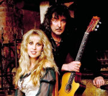

Фолк-рок-группа, основанная в 1997 году бывшим гитаристом *Deep Purple* и *Rainbow* Ричи Блэкмором и его женой Кэндис Найт.

* [A Maid Bedlam](A%20Maid%20Bedlam)
* [Again Someday](Again%20Someday)
* [All Because Of You](All%20Because%20Of%20You)
* [All Things Are Quiet Silent](All%20Things%20Are%20Quiet%20Silent)
* [Ancient Sojourn](Ancient%20Sojourn)
* [Avalon](Avalon)
* [Be mine tonight](Be%20mine%20tonight)
* [Benzai-Ten](Benzai-Ten)
* [Beyond Sunset](Beyond%20Sunset)
* [Castles and dreams](Castles%20and%20dreams)
* [Catherine Howard's fate](Catherine%20Howard's%20fate)
* [Crowning of the king](Crowning%20of%20the%20king)
* [Fires At Midnight](Fires%20At%20Midnight)
* [Fool's gold](Fool's%20gold)
* [Gone with the wind](Gone%20with%20the%20wind)
* [Green Leeves](Green%20Leeves)
* [Greensleeves](Greensleeves)
* [Hanging tree](Hanging%20tree)
* [Home Again](Home%20Again)
* [I Still Remember](I%20Still%20Remember)
* [Magical World](Magical%20World)
* [March the heroes home](March%20the%20heroes%20home)
* [Memmingen](Memmingen)
* [Menningen](Menningen)
* [Mid Winter's Night](Mid%20Winter's%20Night)
* [Mono Tanz](Mono%20Tanz)
* [Morning star](Morning%20star)
* [No Second Chance](No%20Second%20Chance)
* [Now And Then](Now%20And%20Then)
* [Nur Eine Minute](Nur%20Eine%20Minute)
* [Ocean Gypsy](Ocean%20Gypsy)
* [Past time with good company](Past%20time%20with%20good%20company)
* [Play, Minstrel Play](Play,%20Minstrel%20Play)
* [Possum Goes To Prague](Possum%20Goes%20To%20Prague)
* [Pretorious (Courante)](Pretorious%20(Courante))
* [Renaissance Faire](Renaissance%20Faire)
* [Self portrait](Self%20portrait)
* [Shadow Of The Moon](Shadow%20Of%20The%20Moon)
* [Spanish nights](Spanish%20nights)
* [Storm](Storm)
* [The Clock Ticks On](The%20Clock%20Ticks%20On)
* [The Times They Are A Changin](The%20Times%20They%20Are%20A%20Changin)
* [Under A Violet Moon](Under%20A%20Violet%20Moon)
* [Unquest Grave](Unquest%20Grave)
* [Village On The Sand](Village%20On%20The%20Sand)
* [Waiting Just For You](Waiting%20Just%20For%20You)
* [Wind in the willows](Wind%20in%20the%20willows)
* [Wish You Were Here](Wish%20You%20Were%20Here)
* [Writing On The Wall](Writing%20On%20The%20Wall)
* [Written In The Stars](Written%20In%20The%20Stars)