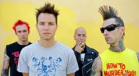

Американская панк-рок-группа из северного пригорода Сан-Диего. Образовалась в 1992 году.

* [Adam's Song](Adam's%20Song)
* [Aliens Exist](Aliens%20Exist)
* [All The Small things](All%20The%20Small%20things)
* [Always](Always)
* [Anthem Part 2](Anthem%20Part%202)
* [Apple Shampoo](Apple%20Shampoo)
* [Blow Job](Blow%20Job)
* [Boring](Boring)
* [Carousel](Carousel)
* [Dammit](Dammit)
* [Degenerate](Degenerate)
* [Dick Lips](Dick%20Lips)
* [Down](Down)
* [Dude Ranch](Dude%20Ranch)
* [Dumpweed](Dumpweed)
* [Dysentary Gary](Dysentary%20Gary)
* [EMO](EMO)
* [Family Reunion](Family%20Reunion)
* [Feeling This](Feeling%20This)
* [First Date](First%20Date)
* [Fuck A Dog](Fuck%20A%20Dog)
* [Going Away To College](Going%20Away%20To%20College)
* [I Miss You](I%20Miss%20You)
* [I Won't Be Home For Christmass](I%20Won't%20Be%20Home%20For%20Christmass)
* [I'm Sorry](I'm%20Sorry)
* [Josie](Josie)
* [Mothers Day](Mothers%20Day)
* [Mutt](Mutt)
* [Obviours](Obviours)
* [Online Songs](Online%20Songs)
* [Pathetic](Pathetic)
* [Reckless abandon](Reckless%20abandon)
* [Sex With His Sister](Sex%20With%20His%20Sister)
* [Shut Up](Shut%20Up)
* [Sometimes](Sometimes)
* [Stay Together For The Kids](Stay%20Together%20For%20The%20Kids)
* [Stockholm Syndrome](Stockholm%20Syndrome)
* [TV (2 вариант)](TV%20(2%20вариант))
* [TV](TV)
* [The Country Song](The%20Country%20Song)
* [The Rock Show](The%20Rock%20Show)
* [Transvestite](Transvestite)
* [Violence](Violence)
* [Voyeur](Voyeur)
* [Waggy](Waggy)
* [Wasting time](Wasting%20time)
* [What's My Age Again](What's%20My%20Age%20Again)
* [When You Fucked Grandpa](When%20You%20Fucked%20Grandpa)
* [m&m's](m&m's)