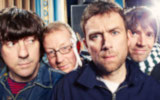

Британская рок-группа из Лондона. Одна из самых успешных групп 90-х годов.

* [1992](1992)
* [A Song](A%20Song)
* [Advert](Advert)
* [Alex's Song](Alex's%20Song)
* [Ambulance](Ambulance)
* [B.L.U.R.E.M.I](B.L.U.R.E.M.I)
* [Bad Day](Bad%20Day)
* [Badhead](Badhead)
* [Bang](Bang)
* [Bank Holiday](Bank%20Holiday)
* [Battery In Your Leg](Battery%20In%20Your%20Leg)
* [Battle](Battle)
* [Beetlebum](Beetlebum)
* [Best Days](Best%20Days)
* [Birthday](Birthday)
* [Blue Jeans](Blue%20Jeans)
* [Boys And Girls](Boys%20And%20Girls)
* [Brothers And Sisters](Brothers%20And%20Sisters)
* [Bugman](Bugman)
* [Caramel](Caramel)
* [Caravan](Caravan)
* [Charmless Man](Charmless%20Man)
* [Chemical World](Chemical%20World)
* [Chinese Bombs](Chinese%20Bombs)
* [Clover Over Dover](Clover%20Over%20Dover)
* [Coffee & TV](Coffee%20&%20TV)
* [Colin Zeal](Colin%20Zeal)
* [Come Together](Come%20Together)
* [Coping](Coping)
* [Country House](Country%20House)
* [Country Sad Ballad Man](Country%20Sad%20Ballad%20Man)
* [Crazy Beat](Crazy%20Beat)
* [Dan Abnormal](Dan%20Abnormal)
* [End Of A Century](End%20Of%20A%20Century)
* [Entertain Me](Entertain%20Me)
* [Ernold Same](Ernold%20Same)
* [Essex Dogs](Essex%20Dogs)
* [Explain](Explain)
* [Fade Away](Fade%20Away)
* [Far Out](Far%20Out)
* [Fool](Fool)
* [For Tomorrow](For%20Tomorrow)
* [Gene By Gene](Gene%20By%20Gene)
* [Girls and Boys](Girls%20and%20Boys)
* [Globe Alone](Globe%20Alone)
* [Good Song](Good%20Song)
* [He Thought Of Cars](He%20Thought%20Of%20Cars)
* [High Cool](High%20Cool)
* [I'm All Over](I'm%20All%20Over)
* [I'm Just A Killer For Your Lov](I'm%20Just%20A%20Killer%20For%20Your%20Lov)
* [It Could Be You](It%20Could%20Be%20You)
* [Jets](Jets)
* [Jubilee](Jubilee)
* [London Loves](London%20Loves)
* [Look Inside America](Look%20Inside%20America)
* [Luminous](Luminous)
* [M.O.R.](M.O.R.)
* [Magic America](Magic%20America)
* [Mellow Song](Mellow%20Song)
* [Miss America](Miss%20America)
* [Moroccan Peoples Revolutionary Bowls Club](Moroccan%20Peoples%20Revolutionary%20Bowls%20Club)
* [Movin' On](Movin'%20On)
* [Mr. Robinson's Quango](Mr.%20Robinson's%20Quango)
* [Music Is My Radar](Music%20Is%20My%20Radar)
* [No Distance Left To Run](No%20Distance%20Left%20To%20Run)
* [No Monsters In Me](No%20Monsters%20In%20Me)
* [Oily Water](Oily%20Water)
* [On The Way To The Club](On%20The%20Way%20To%20The%20Club)
* [On Your Own](On%20Your%20Own)
* [Out Of Time](Out%20Of%20Time)
* [Parklife](Parklife)
* [Peach](Peach)
* [Popscene](Popscene)
* [Pressure on Julian](Pressure%20on%20Julian)
* [Repetition](Repetition)
* [Resigned](Resigned)
* [She's So High](She's%20So%20High)
* [Sing](Sing)
* [Slow Down](Slow%20Down)
* [Song 2 (2 вариант)](Song%202%20(2%20вариант))
* [Song 2 (3 вариант)](Song%202%20(3%20вариант))
* [Song 2 (4 вариант)](Song%202%20(4%20вариант))
* [Song 2](Song%202)
* [Star Shaped](Star%20Shaped)
* [Stereotypes](Stereotypes)
* [Strange News From Another Star](Strange%20News%20From%20Another%20Star)
* [Sunday Sunday](Sunday%20Sunday)
* [Swamp Song](Swamp%20Song)
* [Sweet Song](Sweet%20Song)
* [Tame](Tame)
* [Tender](Tender)
* [The Debt Collector](The%20Debt%20Collector)
* [The Man Who Left Himself](The%20Man%20Who%20Left%20Himself)
* [The Universal](The%20Universal)
* [There's No Other Way](There's%20No%20Other%20Way)
* [This Is A Low](This%20Is%20A%20Low)
* [To The End](To%20The%20End)
* [Top Man](Top%20Man)
* [Tracy Jacks](Tracy%20Jacks)
* [Trailerpark](Trailerpark)
* [Trimm Trabb](Trimm%20Trabb)
* [Trouble In The Message Centre](Trouble%20In%20The%20Message%20Centre)
* [Turn It Up](Turn%20It%20Up)
* [Ultranol](Ultranol)
* [Villa Rosie](Villa%20Rosie)
* [We've Got A File On You](We've%20Got%20A%20File%20On%20You)
* [Wear Me Down](Wear%20Me%20Down)
* [You're So Great](You're%20So%20Great)
* [Young & Lovely](Young%20&%20Lovely)
* [Yuko & Hiro](Yuko%20&%20Hiro)