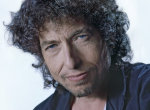

Американский музыкант, писатель, актер.  
Одна из самых влиятельных фигур в поп-музыке второй половины 20-го века.

* [115th Dream](115th%20Dream)
* [A Hard Rains A Gonna Fall](A%20Hard%20Rains%20A%20Gonna%20Fall)
* [Abandoned Love](Abandoned%20Love)
* [Absolutely Sweet Marie](Absolutely%20Sweet%20Marie)
* [All Along The Watchtower (2 вариант)](All%20Along%20The%20Watchtower%20(2%20вариант))
* [All Along The Watchtower](All%20Along%20The%20Watchtower)
* [Apple Suckling Tree](Apple%20Suckling%20Tree)
* [Arthur Mcbride](Arthur%20Mcbride)
* [Baby Ain That Fine](Baby%20Ain%20That%20Fine)
* [Baby, Stop Crying 2](Baby,%20Stop%20Crying%202)
* [Baby, Stop Crying](Baby,%20Stop%20Crying)
* [Blind Willie Mctell](Blind%20Willie%20Mctell)
* [Blowin' in the Wind (2 вариант)](Blowin'%20in%20the%20Wind%20(2%20вариант))
* [Blowin' in the Wind](Blowin'%20in%20the%20Wind)
* [Boots Of Spanish Leather](Boots%20Of%20Spanish%20Leather)
* [Buckets Of Rain](Buckets%20Of%20Rain)
* [Changing Of The Times](Changing%20Of%20The%20Times)
* [Dear Landlord](Dear%20Landlord)
* [Desolation Row](Desolation%20Row)
* [Dignity](Dignity)
* [Dirge](Dirge)
* [Don Think Twice](Don%20Think%20Twice)
* [Don Ya Tell Henry](Don%20Ya%20Tell%20Henry)
* [Drifters Escape](Drifters%20Escape)
* [Duncan And Brady](Duncan%20And%20Brady)
* [Emotionally Yours](Emotionally%20Yours)
* [Everything Is Broken](Everything%20Is%20Broken)
* [Farewell Angelina](Farewell%20Angelina)
* [Fixin To Die](Fixin%20To%20Die)
* [Forever Young](Forever%20Young)
* [Fourth Time Around](Fourth%20Time%20Around)
* [Freight Train Blues](Freight%20Train%20Blues)
* [Froggie Went A Courtin](Froggie%20Went%20A%20Courtin)
* [George Jackson](George%20Jackson)
* [Girl From The North Country](Girl%20From%20The%20North%20Country)
* [Gospel Plow](Gospel%20Plow)
* [Handsome Molly](Handsome%20Molly)
* [Highwater For Charley Patton](Highwater%20For%20Charley%20Patton)
* [House Of The Rising Sun](House%20Of%20The%20Rising%20Sun)
* [I And I](I%20And%20I)
* [I Shall Be Released (2 вариант)](I%20Shall%20Be%20Released%20(2%20вариант))
* [I Shall Be Released](I%20Shall%20Be%20Released)
* [I Want You (2 вариант)](I%20Want%20You%20(2%20вариант))
* [I Want You](I%20Want%20You)
* [I'm in the Mood for You](I'm%20in%20the%20Mood%20for%20You)
* [Id Have You Anytime](Id%20Have%20You%20Anytime)
* [Idiot Wind](Idiot%20Wind)
* [If Not For You](If%20Not%20For%20You)
* [Ill Be Your Baby Tonight](Ill%20Be%20Your%20Baby%20Tonight)
* [Isis](Isis)
* [It Ain Me Babe](It%20Ain%20Me%20Babe)
* [It Takes A Lot To Laugh It Takes A Train](It%20Takes%20A%20Lot%20To%20Laugh%20It%20Takes%20A%20Train)
* [It's Alright Ma, (I'm Only Bleeding)](It's%20Alright%20Ma,%20(I'm%20Only%20Bleeding))
* [Jokerman](Jokerman)
* [Just Like A Woman](Just%20Like%20A%20Woman)
* [Just Like Tom Thumbs Blues](Just%20Like%20Tom%20Thumbs%20Blues)
* [Knockin On Heavens Door (2 вариант)](Knockin%20On%20Heavens%20Door%20(2%20вариант))
* [Knockin On Heavens Door](Knockin%20On%20Heavens%20Door)
* [Lay Lady Lay](Lay%20Lady%20Lay)
* [Leopard-Skin Pill-Box Hat](Leopard-Skin%20Pill-Box%20Hat)
* [Let Me Die In My Footsteps](Let%20Me%20Die%20In%20My%20Footsteps)
* [License To Kill](License%20To%20Kill)
* [Like A Rolling Stone](Like%20A%20Rolling%20Stone)
* [Love Minus Zero(No Limit)](Love%20Minus%20Zero(No%20Limit))
* [Lovesick](Lovesick)
* [Maggies Farm](Maggies%20Farm)
* [Man On The Street](Man%20On%20The%20Street)
* [Man in the long black coat](Man%20in%20the%20long%20black%20coat)
* [Masters Of War](Masters%20Of%20War)
* [Meet Me In The Morning](Meet%20Me%20In%20The%20Morning)
* [Milk Cows Half Blues](Milk%20Cows%20Half%20Blues)
* [Moonshiner](Moonshiner)
* [Most of the time](Most%20of%20the%20time)
* [Mr Bojangles](Mr%20Bojangles)
* [Mr. Tambourine Man](Mr.%20Tambourine%20Man)
* [My Back Pages](My%20Back%20Pages)
* [New Morning](New%20Morning)
* [Nobody Cept You](Nobody%20Cept%20You)
* [North Country Blues](North%20Country%20Blues)
* [Obviously Five Believers](Obviously%20Five%20Believers)
* [Oh Sister](Oh%20Sister)
* [One More Cup Of Coffee (Valley Below)](One%20More%20Cup%20Of%20Coffee%20(Valley%20Below))
* [One Of Us Must Know](One%20Of%20Us%20Must%20Know)
* [Poor Boy](Poor%20Boy)
* [Positively 4th Street](Positively%204th%20Street)
* [Pretty Peggy O](Pretty%20Peggy%20O)
* [Queen Jane Approximately](Queen%20Jane%20Approximately)
* [Rainy Day Women](Rainy%20Day%20Women)
* [Restless Farewell](Restless%20Farewell)
* [Return To Me](Return%20To%20Me)
* [Rock Salt And Nails](Rock%20Salt%20And%20Nails)
* [Roving Gambler](Roving%20Gambler)
* [Sad-Eyed Lady Of The Lowlands](Sad-Eyed%20Lady%20Of%20The%20Lowlands)
* [Sally Girl](Sally%20Girl)
* [Sara](Sara)
* [Saved](Saved)
* [See That My Grave Is Kept Clean](See%20That%20My%20Grave%20Is%20Kept%20Clean)
* [Senor](Senor)
* [Series Of Dreams](Series%20Of%20Dreams)
* [Seven Curses](Seven%20Curses)
* [She Balongs To Me](She%20Balongs%20To%20Me)
* [Shelter From The Storm](Shelter%20From%20The%20Storm)
* [Sign Language](Sign%20Language)
* [Sign On The Window](Sign%20On%20The%20Window)
* [Simple Twist Of Fate (2 вариант)](Simple%20Twist%20Of%20Fate%20(2%20вариант))
* [Simple Twist Of Fate](Simple%20Twist%20Of%20Fate)
* [Somebody Touched Me](Somebody%20Touched%20Me)
* [Something There Is About You](Something%20There%20Is%20About%20You)
* [Subterranean Homesick Blues](Subterranean%20Homesick%20Blues)
* [Sweetheart Like You](Sweetheart%20Like%20You)
* [Talkin Bear Mountain Picnic Massacre](Talkin%20Bear%20Mountain%20Picnic%20Massacre)
* [Talkin New York](Talkin%20New%20York)
* [Tangled Up In Blue (2 вариант)](Tangled%20Up%20In%20Blue%20(2%20вариант))
* [Tangled Up In Blue](Tangled%20Up%20In%20Blue)
* [Temporary Like Achilles](Temporary%20Like%20Achilles)
* [The Ballad Of A Thin Man](The%20Ballad%20Of%20A%20Thin%20Man)
* [The Gates Of Eden](The%20Gates%20Of%20Eden)
* [The Lonesome Death Of Hattie Carroll](The%20Lonesome%20Death%20Of%20Hattie%20Carroll)
* [The Man In Me](The%20Man%20In%20Me)
* [The Mighty Quinn](The%20Mighty%20Quinn)
* [The Times They Are A Changin](The%20Times%20They%20Are%20A%20Changin)
* [Things Have Changed](Things%20Have%20Changed)
* [Time Of Dying](Time%20Of%20Dying)
* [Time Passes Slowly](Time%20Passes%20Slowly)
* [To Make You Feel My Love](To%20Make%20You%20Feel%20My%20Love)
* [To Ramona](To%20Ramona)
* [Tomorrow Is A Long Time](Tomorrow%20Is%20A%20Long%20Time)
* [Tonight Ill Be Staying Here With You](Tonight%20Ill%20Be%20Staying%20Here%20With%20You)
* [Visions Of Johanna](Visions%20Of%20Johanna)
* [Watching The River Flow](Watching%20The%20River%20Flow)
* [When I Paint My Masterpiece](When%20I%20Paint%20My%20Masterpiece)
* [When The Ship Comes In](When%20The%20Ship%20Comes%20In)
* [With God On Our Side](With%20God%20On%20Our%20Side)
* [You Ain Goin Nowhere](You%20Ain%20Goin%20Nowhere)
* [You Ain Going Nowhere](You%20Ain%20Going%20Nowhere)
* [Youre gonna make me lonesome when you go](Youre%20gonna%20make%20me%20lonesome%20when%20you%20go)