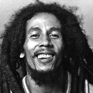

Ямайский музыкант, гитарист и композитор в стиле регги.

* [Burnin' And Lootin'](Burnin'%20And%20Lootin')
* [Concrete Jungle](Concrete%20Jungle)
* [Could You Be Loved](Could%20You%20Be%20Loved)
* [Do It Twice](Do%20It%20Twice)
* [Duppy Conquerer](Duppy%20Conquerer)
* [Exodus](Exodus)
* [Get Up Stand Up](Get%20Up%20Stand%20Up)
* [Guava Jelly](Guava%20Jelly)
* [I Shot The Sheriff](I%20Shot%20The%20Sheriff)
* [Is This Love](Is%20This%20Love)
* [Kaya](Kaya)
* [Lively Up Yourself](Lively%20Up%20Yourself)
* [Mr. Brown](Mr.%20Brown)
* [Rastaman](Rastaman)
* [Rebel Music (3 O'clock Road Block)](Rebel%20Music%20(3%20O'clock%20Road%20Block))
* [Roots, Rock, Reggae](Roots,%20Rock,%20Reggae)
* [Small Axe](Small%20Axe)
* [Sun Is Shining](Sun%20Is%20Shining)
* [Trench Town Rock](Trench%20Town%20Rock)
* [War](War)
* [Who The Cap Fit](Who%20The%20Cap%20Fit)