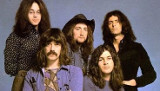

Легендарная британская хард-рок группа, одна из самых влиятельных в 20-м веке.

* [Anthem](Anthem)
* [Anya](Anya)
* [Anyone's Daughter](Anyone's%20Daughter)
* [April](April)
* [Black Night](Black%20Night)
* [Bloodsucker](Bloodsucker)
* [Burn](Burn)
* [Chasing Shadows](Chasing%20Shadows)
* [Child in Time](Child%20in%20Time)
* [Cry Free](Cry%20Free)
* [Demonds Eye](Demonds%20Eye)
* [Demons Eye](Demons%20Eye)
* [Fireball](Fireball)
* [Flight Of The Rat](Flight%20Of%20The%20Rat)
* [Fools](Fools)
* [Gypsy Kiss](Gypsy%20Kiss)
* [Gypsy's Kiss](Gypsy's%20Kiss)
* [Hallelujah](Hallelujah)
* [Hard Loving Man](Hard%20Loving%20Man)
* [Highway Star (2 вариант)](Highway%20Star%20(2%20вариант))
* [Highway Star](Highway%20Star)
* [Hush](Hush)
* [Into The Fire](Into%20The%20Fire)
* [King Of Dreams](King%20Of%20Dreams)
* [Knocking At Your Back Door](Knocking%20At%20Your%20Back%20Door)
* [Lalena](Lalena)
* [Lasy](Lasy)
* [Lay Down Stay Down](Lay%20Down%20Stay%20Down)
* [Lay Down](Lay%20Down)
* [Lazy](Lazy)
* [Loosen My Strings](Loosen%20My%20Strings)
* [Love Child](Love%20Child)
* [Love Conquerors All](Love%20Conquerors%20All)
* [Love Conquers All](Love%20Conquers%20All)
* [Lucille](Lucille)
* [Mandrake Root](Mandrake%20Root)
* [Mary Long](Mary%20Long)
* [Maybe I'm A Leo](Maybe%20I'm%20A%20Leo)
* [Mistreated](Mistreated)
* [Never Before](Never%20Before)
* [No No No](No%20No%20No)
* [One More Rainy Day](One%20More%20Rainy%20Day)
* [Perfect Strangers](Perfect%20Strangers)
* [Pictures Of Home](Pictures%20Of%20Home)
* [Rat Bat Blue](Rat%20Bat%20Blue)
* [Sail Away (2 вариант)](Sail%20Away%20(2%20вариант))
* [Sail Away](Sail%20Away)
* [Smoke On The Water](Smoke%20On%20The%20Water)
* [Soldier Of Fortune](Soldier%20Of%20Fortune)
* [Solitaire](Solitaire)
* [Sometimes I Feel Like Screaming](Sometimes%20I%20Feel%20Like%20Screaming)
* [Space Truckin](Space%20Truckin)
* [Speed King](Speed%20King)
* [Stormbringer](Stormbringer)
* [Strange kind of Woman](Strange%20kind%20of%20Woman)
* [The Battle Rages On](The%20Battle%20Rages%20On)
* [The Mule](The%20Mule)
* [The Spanish Archer](The%20Spanish%20Archer)
* [Time To Kill](Time%20To%20Kill)
* [Wasted Sunsets](Wasted%20Sunsets)
* [When A Blind Man Cries](When%20A%20Blind%20Man%20Cries)
* [Woman from Tokyo](Woman%20from%20Tokyo)
* [Wring That Neck](Wring%20That%20Neck)
* [You Can't Do It Right](You%20Can't%20Do%20It%20Right)
* [You Keep On Moving](You%20Keep%20On%20Moving)