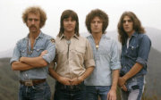

Американская рок-группа, основанная Доном Хенли и Гленном Фраем в 1971 году в Лос-Анджелосе, исполняющая мелодичный гитарный кантри-рок и софт-рок.  
Третья по продаваемости альбомов группа в Америке после *The Beatles* и *Led Zeppelin*.

* [After The Thrill Is Gone](After%20The%20Thrill%20Is%20Gone)
* [Already Gone](Already%20Gone)
* [Best Of My Love](Best%20Of%20My%20Love)
* [Crossroads](Crossroads)
* [Desperado (2 вариант)](Desperado%20(2%20вариант))
* [Desperado](Desperado)
* [Doolin Dalton](Doolin%20Dalton)
* [Earlybird](Earlybird)
* [Get Over It](Get%20Over%20It)
* [Hole In The World](Hole%20In%20The%20World)
* [Hotel California (табулатура)](Hotel%20California%20(табулатура))
* [Hotel California](Hotel%20California)
* [I Cant Tell You Why](I%20Cant%20Tell%20You%20Why)
* [In The City](In%20The%20City)
* [Learn To Be Still](Learn%20To%20Be%20Still)
* [Life In The Fast Lane (2 вариант)](Life%20In%20The%20Fast%20Lane%20(2%20вариант))
* [Life In The Fast Lane](Life%20In%20The%20Fast%20Lane)
* [Love Will Keep Us Alive (2 вариант)](Love%20Will%20Keep%20Us%20Alive%20(2%20вариант))
* [Love Will Keep Us Alive](Love%20Will%20Keep%20Us%20Alive)
* [Lyin Eyes](Lyin%20Eyes)
* [New Kid In Town](New%20Kid%20In%20Town)
* [New York Minute](New%20York%20Minute)
* [On The Border](On%20The%20Border)
* [One Of These Nights](One%20Of%20These%20Nights)
* [Out Of Control](Out%20Of%20Control)
* [Outlaw Man](Outlaw%20Man)
* [Peaceful Easy Feeling](Peaceful%20Easy%20Feeling)
* [Seven Bridges Road](Seven%20Bridges%20Road)
* [Seven Bridges](Seven%20Bridges)
* [Take It Easy](Take%20It%20Easy)
* [Take It To The Limit](Take%20It%20To%20The%20Limit)
* [Tequila Sunrise (2 вариант)](Tequila%20Sunrise%20(2%20вариант))
* [Tequila Sunrise](Tequila%20Sunrise)
* [The Girl From Yesterday](The%20Girl%20From%20Yesterday)
* [The Long Run (2 вариант)](The%20Long%20Run%20(2%20вариант))
* [The Long Run](The%20Long%20Run)
* [Try And Love Again](Try%20And%20Love%20Again)
* [Victim Of Love](Victim%20Of%20Love)
* [Witchy Women](Witchy%20Women)