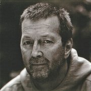

Британский рок-музыкант, гитарист-виртуоз.

* [Aint Nobodys Business](Aint%20Nobodys%20Business)
* [Alberta](Alberta)
* [Anyday](Anyday)
* [Bad Love](Bad%20Love)
* [Badge](Badge)
* [Before You Accuse Me](Before%20You%20Accuse%20Me)
* [Bell Bottom Blues](Bell%20Bottom%20Blues)
* [Black Rose](Black%20Rose)
* [Blues Before Sunrise](Blues%20Before%20Sunrise)
* [Born Under A Bad Sign](Born%20Under%20A%20Bad%20Sign)
* [Can't Find My Way Home](Can't%20Find%20My%20Way%20Home)
* [Circus Left Town](Circus%20Left%20Town)
* [Cocaine](Cocaine)
* [Crossroads](Crossroads)
* [Easy Now](Easy%20Now)
* [Give Me Strength](Give%20Me%20Strength)
* [Help Me Up](Help%20Me%20Up)
* [Hey, Hey](Hey,%20Hey)
* [Holy Mother](Holy%20Mother)
* [How Long Blues](How%20Long%20Blues)
* [I Can't Hold Out](I%20Can't%20Hold%20Out)
* [I Looked Away](I%20Looked%20Away)
* [I'm Tore Down](I'm%20Tore%20Down)
* [I'm so free](I'm%20so%20free)
* [I've Got A Rock And Roll Heart](I've%20Got%20A%20Rock%20And%20Roll%20Heart)
* [It Hurts Me Too](It%20Hurts%20Me%20Too)
* [It's Too Late](It's%20Too%20Late)
* [Keep On Growing](Keep%20On%20Growing)
* [Key to the Highway](Key%20to%20the%20Highway)
* [Lay Down Sally](Lay%20Down%20Sally)
* [Layla](Layla)
* [Let It Grow](Let%20It%20Grow)
* [Lonely Stranger](Lonely%20Stranger)
* [May You Never](May%20You%20Never)
* [Mean Old World](Mean%20Old%20World)
* [Motherless Child](Motherless%20Child)
* [My Father's Eyes](My%20Father's%20Eyes)
* [No Alibis](No%20Alibis)
* [Nobody Knows You When You're Down and Out](Nobody%20Knows%20You%20When%20You're%20Down%20and%20Out)
* [Old Love](Old%20Love)
* [Please Be With Me](Please%20Be%20With%20Me)
* [Presence Of The Lord](Presence%20Of%20The%20Lord)
* [Pretending](Pretending)
* [Promises](Promises)
* [Roll It Over](Roll%20It%20Over)
* [Rollin' And Tumblin'](Rollin'%20And%20Tumblin')
* [Running On Faith](Running%20On%20Faith)
* [San Francisco Bay Blues](San%20Francisco%20Bay%20Blues)
* [Signe](Signe)
* [Sinners Prayer](Sinners%20Prayer)
* [Someday, After A While](Someday,%20After%20A%20While)
* [Someone Like You](Someone%20Like%20You)
* [Swing Low Sweet Chariot](Swing%20Low%20Sweet%20Chariot)
* [Tears in Heaven](Tears%20in%20Heaven)
* [The Circus Left Town](The%20Circus%20Left%20Town)
* [The Sky is Crying](The%20Sky%20is%20Crying)
* [Thorn Tree In The Garden](Thorn%20Tree%20In%20The%20Garden)
* [Tulsa Time](Tulsa%20Time)
* [Walking Blues](Walking%20Blues)
* [Watch Out For Lucy](Watch%20Out%20For%20Lucy)
* [While my guitar gently weeps](While%20my%20guitar%20gently%20weeps)
* [White Room](White%20Room)
* [Why Does Love Got To Be So Sad](Why%20Does%20Love%20Got%20To%20Be%20So%20Sad)
* [Willie And The Hand Jive](Willie%20And%20The%20Hand%20Jive)
* [Wonderful Tonight](Wonderful%20Tonight)