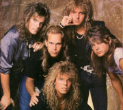

Шведская рок-группа, основанная вокалистом *Джоуи Темпестом* и гитаристом *Джоном Норумом*.  
Мировую известность получила в *1986* году после выхода альбома *The Final Countdown*.

* [Carrie](Carrie)
* [Cherokee](Cherokee)
* [Danger On The Track](Danger%20On%20The%20Track)
* [Heart Of Stone](Heart%20Of%20Stone)
* [Little Bit Of Lovin'](Little%20Bit%20Of%20Lovin')
* [Love Chaser](Love%20Chaser)
* [Ninja](Ninja)
* [On The Loose](On%20The%20Loose)
* [Open your heart](Open%20your%20heart)
* [Rock The Night](Rock%20The%20Night)
* [The Final Countdown](The%20Final%20Countdown)
* [Time Has Come](Time%20Has%20Come)