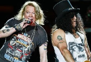

Американская хард-рок-группа из Лос-Анджелеса, образованная в 1985 году. Ключевые фигуры - Эксл Роуз (вокал) и Слэш (гитара).

* [14 Years](14%20Years)
* [Ain't It Fun](Ain't%20It%20Fun)
* [Always On The Run](Always%20On%20The%20Run)
* [Back Off Bitch](Back%20Off%20Bitch)
* [Bad Obsession](Bad%20Obsession)
* [Chinese Democracy](Chinese%20Democracy)
* [Civil War (2 вариант)](Civil%20War%20(2%20вариант))
* [Civil War](Civil%20War)
* [Coma](Coma)
* [Crash Diet](Crash%20Diet)
* [Dead Horse](Dead%20Horse)
* [Don't Cry](Don't%20Cry)
* [Don't Damn Me](Don't%20Damn%20Me)
* [Double Talkin jive](Double%20Talkin%20jive)
* [Down On The Farm](Down%20On%20The%20Farm)
* [Dust N Bones](Dust%20N%20Bones)
* [Estranged](Estranged)
* [Fill in with Rhy](Fill%20in%20with%20Rhy)
* [Hair Of The Dog](Hair%20Of%20The%20Dog)
* [I Don't Care About You](I%20Don't%20Care%20About%20You)
* [It's So Easy](It's%20So%20Easy)
* [Knockin' on Heaven's Door](Knockin'%20on%20Heaven's%20Door)
* [Knocking On Heavens Door](Knocking%20On%20Heavens%20Door)
* [Live And Let Die](Live%20And%20Let%20Die)
* [Locomotive](Locomotive)
* [Madagascar](Madagascar)
* [Mama Kin](Mama%20Kin)
* [Move To The City](Move%20To%20The%20City)
* [Mr. Brownstone](Mr.%20Brownstone)
* [My Michelle](My%20Michelle)
* [New Rose (2 вариант)](New%20Rose%20(2%20вариант))
* [New Rose](New%20Rose)
* [Nice Boys](Nice%20Boys)
* [Nightrain](Nightrain)
* [November Rain (2 вариант)](November%20Rain%20(2%20вариант))
* [November Rain](November%20Rain)
* [One in a Million](One%20in%20a%20Million)
* [Only Women Bleed](Only%20Women%20Bleed)
* [Out Ta Get Me](Out%20Ta%20Get%20Me)
* [Paradise City (2 вариант)](Paradise%20City%20(2%20вариант))
* [Paradise City](Paradise%20City)
* [Patience](Patience)
* [Perfect Crime](Perfect%20Crime)
* [Pretty Tied Up](Pretty%20Tied%20Up)
* [Reckless Life](Reckless%20Life)
* [Rhiad And The Bedouins](Rhiad%20And%20The%20Bedouins)
* [Right Next Door To Hell](Right%20Next%20Door%20To%20Hell)
* [Rocket Queen](Rocket%20Queen)
* [Shotgun Blues](Shotgun%20Blues)
* [Since I Don't Have You](Since%20I%20Don't%20Have%20You)
* [So Fine](So%20Fine)
* [Sweet Child Mine (2 вариант)](Sweet%20Child%20Mine%20(2%20вариант))
* [Sweet Child Mine](Sweet%20Child%20Mine)
* [Sweet child o'mine](Sweet%20child%20o'mine)
* [Sympathy For The Devil](Sympathy%20For%20The%20Devil)
* [The Blues](The%20Blues)
* [The Godfather Theme](The%20Godfather%20Theme)
* [Theme From The Godfather](Theme%20From%20The%20Godfather)
* [Used to Love Her](Used%20to%20Love%20Her)
* [Welcome To The Jungle](Welcome%20To%20The%20Jungle)
* [Whole Lotta Rosie](Whole%20Lotta%20Rosie)
* [Wild Horses](Wild%20Horses)
* [Word Up](Word%20Up)
* [Yesterdays (2 вариант)](Yesterdays%20(2%20вариант))
* [Yesterdays](Yesterdays)
* [You Aint The First](You%20Aint%20The%20First)
* [You Could Be Mine (2 вариант)](You%20Could%20Be%20Mine%20(2%20вариант))
* [You Could Be Mine](You%20Could%20Be%20Mine)
* [Your Crazy](Your%20Crazy)