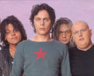

Популярная финская рок-группа, появившаяся в 1991.

* [Again](Again)
* [Beautiful](Beautiful)
* [Bury Me Deep Inside Your Heart](Bury%20Me%20Deep%20Inside%20Your%20Heart)
* [Close To The Flame](Close%20To%20The%20Flame)
* [For You](For%20You)
* [Heartkiller](Heartkiller)
* [Heaven Tonight](Heaven%20Tonight)
* [Love You Like I Do](Love%20You%20Like%20I%20Do)
* [Love's Requiem](Love's%20Requiem)
* [Pretending](Pretending)
* [Right Here In My Arms](Right%20Here%20In%20My%20Arms)
* [Sacrament](Sacrament)
* [Salt In Our Wounds](Salt%20In%20Our%20Wounds)
* [The Funeral Of Hearts](The%20Funeral%20Of%20Hearts)
* [Wicked Game](Wicked%20Game)