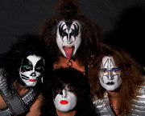

Американская рок-группа, основанная в Нью-Йорке в январе 1973 года Полом Стэнли и Джимом Симмонсоном. Известна своими сценическими макияжами и пиротехническими эффектами на концертах.

* [Anything for my Baby](Anything%20for%20my%20Baby)
* [Beth](Beth)
* [Black Diamond](Black%20Diamond)
* [Calling Doctor Love](Calling%20Doctor%20Love)
* [Cold Gin](Cold%20Gin)
* [Comin Home (2 вариант)](Comin%20Home%20(2%20вариант))
* [Comin Home](Comin%20Home)
* [Detroit Rock City](Detroit%20Rock%20City)
* [Domino](Domino)
* [Easy Thing](Easy%20Thing)
* [Every Time I Look At You](Every%20Time%20I%20Look%20At%20You)
* [Firehouse](Firehouse)
* [Forever](Forever)
* [God of Thunder](God%20of%20Thunder)
* [Got To Choose](Got%20To%20Choose)
* [Hard Luck Woman](Hard%20Luck%20Woman)
* [Heaven's On Fire](Heaven's%20On%20Fire)
* [Hotter Than Hell](Hotter%20Than%20Hell)
* [I Can't Stop the Rain](I%20Can't%20Stop%20the%20Rain)
* [I Love It Loud](I%20Love%20It%20Loud)
* [I Stole Your Love](I%20Stole%20Your%20Love)
* [I Was Made For Lovin You](I%20Was%20Made%20For%20Lovin%20You)
* [I Was Made for Loving You](I%20Was%20Made%20for%20Loving%20You)
* [It Never Ends](It%20Never%20Ends)
* [King of the Nighttine World](King%20of%20the%20Nighttine%20World)
* [Kissin' Time](Kissin'%20Time)
* [Ladies Room](Ladies%20Room)
* [Love Gun](Love%20Gun)
* [Love Her All I Can](Love%20Her%20All%20I%20Can)
* [Making Love](Making%20Love)
* [Parasite](Parasite)
* [Plaster Caster](Plaster%20Caster)
* [Rip It Out](Rip%20It%20Out)
* [Rock & Roll All Nite](Rock%20&%20Roll%20All%20Nite)
* [Rock Bottom](Rock%20Bottom)
* [Rocket Ride](Rocket%20Ride)
* [Save Your Love](Save%20Your%20Love)
* [She](She)
* [Shock Me](Shock%20Me)
* [Shout It Out Loud](Shout%20It%20Out%20Loud)
* [Strutter](Strutter)
* [Sure Know Something](Sure%20Know%20Something)
* [Then She Kissed Me](Then%20She%20Kissed%20Me)
* [Uh All Night](Uh%20All%20Night)
* [Unholy](Unholy)
* [War Machine](War%20Machine)
* [We Are One](We%20Are%20One)
* [Who wants to be Lonely](Who%20wants%20to%20be%20Lonely)