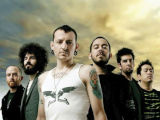

Американская рок-группа, основанная в 1996 году, исполняющая альтернативный рок.

* [A Place For My Head](A%20Place%20For%20My%20Head)
* [And One](And%20One)
* [Breaking The Habit](Breaking%20The%20Habit)
* [By Myself](By%20Myself)
* [Carousel](Carousel)
* [Crawling](Crawling)
* [Cure For The Itch](Cure%20For%20The%20Itch)
* [Don't Stay](Don't%20Stay)
* [Easier To Run](Easier%20To%20Run)
* [Faint](Faint)
* [Faith](Faith)
* [Figure.09](Figure.09)
* [Forgotten](Forgotten)
* [From the Inside](From%20the%20Inside)
* [High Voltage](High%20Voltage)
* [Hit The Floor](Hit%20The%20Floor)
* [In The End](In%20The%20End)
* [Lying From You](Lying%20From%20You)
* [My December](My%20December)
* [Nobody's Listening](Nobody's%20Listening)
* [Numb](Numb)
* [One Step Closer](One%20Step%20Closer)
* [Paper Cut](Paper%20Cut)
* [Papercut](Papercut)
* [Part Of Me](Part%20Of%20Me)
* [Points Of Authority](Points%20Of%20Authority)
* [Pushing Me Away](Pushing%20Me%20Away)
* [Runaway](Runaway)
* [Somewhere I Belong](Somewhere%20I%20Belong)
* [Somwhere I Belong](Somwhere%20I%20Belong)
* [Step Up](Step%20Up)
* [The Morning After](The%20Morning%20After)
* [What Ive done](What%20Ive%20done)
* [With You](With%20You)