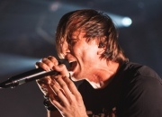

Российская рок-группа из Уфы. Образовалась в 1998 году.

* [02 (Благовещенск)](02%20(Благовещенск))
* [2000 лет](2000%20лет)
* [C4](C4)
* [Fuck Off](Fuck%20Off)
* [Бабочки](Бабочки)
* [В бетонной коробке](В%20бетонной%20коробке)
* [Вавилон](Вавилон)
* [Выходной](Выходной)
* [Голоса мира](Голоса%20мира)
* [Гореть](Гореть)
* [Государство](Государство)
* [Детки](Детки)
* [Дневник](Дневник)
* [До свидания](До%20свидания)
* [Друзья](Друзья)
* [Дыши](Дыши)
* [Зима](Зима)
* [Змей](Змей)
* [Зубы](Зубы)
* [Космонавт](Космонавт)
* [Котенки](Котенки)
* [Кофе](Кофе)
* [Между строчек](Между%20строчек)
* [Мечта](Мечта)
* [Мне в другую сторону](Мне%20в%20другую%20сторону)
* [Мое время](Мое%20время)
* [Навсегда](Навсегда)
* [Назови мне свое имя](Назови%20мне%20свое%20имя)
* [Не надо снов](Не%20надо%20снов)
* [Не спеши](Не%20спеши)
* [Небеса](Небеса)
* [Никто не знает](Никто%20не%20знает)
* [Одной Крови](Одной%20Крови)
* [С небес на землю](С%20небес%20на%20землю)
* [Свобода](Свобода)
* [Сид и Нэнси](Сид%20и%20Нэнси)
* [Синяя птица](Синяя%20птица)
* [Сколько](Сколько)
* [Три Пути](Три%20Пути)
* [Успокой меня](Успокой%20меня)