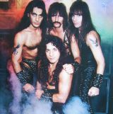

Американская пауэр-металл группа, известная своей воинственной тематикой песен.

* [Achilles, Agony And Ecstasy In Eight Parts](Achilles,%20Agony%20And%20Ecstasy%20In%20Eight%20Parts)
* [Battle Hymn](Battle%20Hymn)
* [Blood Of The Kings](Blood%20Of%20The%20Kings)
* [Bridge Of Death](Bridge%20Of%20Death)
* [Courage](Courage)
* [Dark Avenger](Dark%20Avenger)
* [Defender](Defender)
* [Fast Taker](Fast%20Taker)
* [Hail & Kill](Hail%20&%20Kill)
* [Hearth Of Steel](Hearth%20Of%20Steel)
* [Kingdom Come](Kingdom%20Come)
* [Kings Of Metal](Kings%20Of%20Metal)
* [Manowar](Manowar)
* [Master of the Wind](Master%20of%20the%20Wind)
* [Metal Daze](Metal%20Daze)
* [Metal Warriors](Metal%20Warriors)
* [Pleasure Slave](Pleasure%20Slave)
* [Shell Shock](Shell%20Shock)
* [Spritit Horse of the Cherokee](Spritit%20Horse%20of%20the%20Cherokee)
* [Sword In The Wind](Sword%20In%20The%20Wind)
* [The Crown And The Ring](The%20Crown%20And%20The%20Ring)