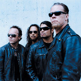

Американская метал-группа, образованная в 1981 году. Metallica является лидером и одним из основателей стиля "трэш-метал" или "спид-металл".

* [2x4](2x4)
* [Ain't my bitch](Ain't%20my%20bitch)
* [Am I Evil](Am%20I%20Evil)
* [And Justice For All Full Album](And%20Justice%20For%20All%20Full%20Album)
* [And Justice For All Intro](And%20Justice%20For%20All%20Intro)
* [And Justice For All](And%20Justice%20For%20All)
* [Astronomy](Astronomy)
* [Attitude (2 вариант)](Attitude%20(2%20вариант))
* [Attitude (3 вариант)](Attitude%20(3%20вариант))
* [Attitude](Attitude)
* [Bad Seed](Bad%20Seed)
* [Battery](Battery)
* [Beadfan](Beadfan)
* [Better Than You](Better%20Than%20You)
* [Black Hole Sun](Black%20Hole%20Sun)
* [Blackened (2 вариант)](Blackened%20(2%20вариант))
* [Blackened](Blackened)
* [Bleeding Me (2 вариант)](Bleeding%20Me%20(2%20вариант))
* [Bleeding Me](Bleeding%20Me)
* [Blues Jam](Blues%20Jam)
* [Breadfan (2 вариант)](Breadfan%20(2%20вариант))
* [Breadfan](Breadfan)
* [Call of the Ktulu](Call%20of%20the%20Ktulu)
* [Carpe Diem Baby](Carpe%20Diem%20Baby)
* [Crash Course In Brain Surgery (2 вариант)](Crash%20Course%20In%20Brain%20Surgery%20(2%20вариант))
* [Crash Course In Brain Surgery](Crash%20Course%20In%20Brain%20Surgery)
* [Creeping Death](Creeping%20Death)
* [Cunning Stunts Bass Solo](Cunning%20Stunts%20Bass%20Solo)
* [Cure (2 вариант)](Cure%20(2%20вариант))
* [Cure](Cure)
* [Damage Case](Damage%20Case)
* [Devils Dance](Devils%20Dance)
* [Die Die My Darling](Die%20Die%20My%20Darling)
* [Die, Die My Darling](Die,%20Die%20My%20Darling)
* [Dirty Window](Dirty%20Window)
* [Don't Tread On Me](Don't%20Tread%20On%20Me)
* [Dyers Eve](Dyers%20Eve)
* [Enter Sandman (2 вариант)](Enter%20Sandman%20(2%20вариант))
* [Enter Sandman](Enter%20Sandman)
* [Escape](Escape)
* [Eye Of The Beholder](Eye%20Of%20The%20Beholder)
* [Fade To Black](Fade%20To%20Black)
* [Fight Fire With Fire (2 вариант)](Fight%20Fire%20With%20Fire%20(2%20вариант))
* [Fight Fire With Fire](Fight%20Fire%20With%20Fire)
* [Fixxxer](Fixxxer)
* [For Whom The Bell Tolls (2 вариант)](For%20Whom%20The%20Bell%20Tolls%20(2%20вариант))
* [For Whom the Bell Tolls](For%20Whom%20the%20Bell%20Tolls)
* [Frantic](Frantic)
* [Frayed Ends of Sanity](Frayed%20Ends%20of%20Sanity)
* [Free Speech for the Dumb](Free%20Speech%20for%20the%20Dumb)
* [Fuel](Fuel)
* [Green Hell](Green%20Hell)
* [Harvester of Sorrow](Harvester%20of%20Sorrow)
* [Hero of the day](Hero%20of%20the%20day)
* [Hit The Lights](Hit%20The%20Lights)
* [Holier Than Thou](Holier%20Than%20Thou)
* [Human](Human)
* [I Disappear](I%20Disappear)
* [It's Electric](It's%20Electric)
* [Jump in the Fire](Jump%20in%20the%20Fire)
* [Justice](Justice)
* [Last caress](Last%20caress)
* [Leper Messiah](Leper%20Messiah)
* [Loverman](Loverman)
* [Low Man's Lyric](Low%20Man's%20Lyric)
* [Mama Said](Mama%20Said)
* [Master Of Puppets](Master%20Of%20Puppets)
* [Metal Militia](Metal%20Militia)
* [My Frend of Misery](My%20Frend%20of%20Misery)
* [My World](My%20World)
* [No Leaf Clover](No%20Leaf%20Clover)
* [No remorse](No%20remorse)
* [Nothing Else Matters](Nothing%20Else%20Matters)
* [One](One)
* [Orion](Orion)
* [Overkill](Overkill)
* [Poor Twisted Me](Poor%20Twisted%20Me)
* [Prince Charming](Prince%20Charming)
* [Purify](Purify)
* [Ride The Lightning](Ride%20The%20Lightning)
* [Sabbra Cadabra](Sabbra%20Cadabra)
* [Sad But True](Sad%20But%20True)
* [Seek And Destroy](Seek%20And%20Destroy)
* [So What](So%20What)
* [St. Anger](St.%20Anger)
* [Stone Dead Forever](Stone%20Dead%20Forever)
* [Sucking My Love](Sucking%20My%20Love)
* [Sweet Amber](Sweet%20Amber)
* [The God That Failed](The%20God%20That%20Failed)
* [The House Jack Built](The%20House%20Jack%20Built)
* [The More I See](The%20More%20I%20See)
* [The Small Hours](The%20Small%20Hours)
* [The Thing That Should Not Be](The%20Thing%20That%20Should%20Not%20Be)
* [The Unfogiven](The%20Unfogiven)
* [The Wait](The%20Wait)
* [The four horseman](The%20four%20horseman)
* [The last caress](The%20last%20caress)
* [Thorn Within](Thorn%20Within)
* [Through The Never](Through%20The%20Never)
* [To Live Is To Die](To%20Live%20Is%20To%20Die)
* [Too Late Too Late](Too%20Late%20Too%20Late)
* [Trapped Under Ice](Trapped%20Under%20Ice)
* [Tuesday's Gone](Tuesday's%20Gone)
* [Turn the Page](Turn%20the%20Page)
* [Unforgiven II](Unforgiven%20II)
* [Wasting my Hate](Wasting%20my%20Hate)
* [Where The Wild Thing Are](Where%20The%20Wild%20Thing%20Are)
* [Where The Wild Things Are (2 вариант)](Where%20The%20Wild%20Things%20Are%20(2%20вариант))
* [Where The Wild Things Are](Where%20The%20Wild%20Things%20Are)
* [Wherever I May Roam](Wherever%20I%20May%20Roam)
* [Whiplash](Whiplash)
* [Whiskey In The Jar](Whiskey%20In%20The%20Jar)