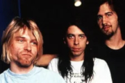

Американская рок-группа, созданная Куртом Кобейном и Кристом Новоселичем в 1987 году. Играла в стиле альтернативный рок, гранж. Распалась после смерти Кобейна 1994 году.

* [About a girl](About%20a%20girl)
* [Aero Zeppelin](Aero%20Zeppelin)
* [All apologies](All%20apologies)
* [Aneurysm](Aneurysm)
* [Baba O'Riley](Baba%20O'Riley)
* [Been A Son](Been%20A%20Son)
* [Beeswax](Beeswax)
* [Big Cheese](Big%20Cheese)
* [Big Long Now](Big%20Long%20Now)
* [Blew](Blew)
* [Blossom](Blossom)
* [Breed](Breed)
* [Come As You Are](Come%20As%20You%20Are)
* [Curmudgeon](Curmudgeon)
* [D-7](D-7)
* [Dive](Dive)
* [Downer](Downer)
* [Drain You](Drain%20You)
* [Dumb](Dumb)
* [Endless Nameless](Endless%20Nameless)
* [Even In His Youth](Even%20In%20His%20Youth)
* [Floyd The Barber](Floyd%20The%20Barber)
* [Frances Farmer Will Have Her Revenge On Seattle](Frances%20Farmer%20Will%20Have%20Her%20Revenge%20On%20Seattle)
* [Hairspray Queen](Hairspray%20Queen)
* [Heart Shaped Box](Heart%20Shaped%20Box)
* [Here She Comes Now](Here%20She%20Comes%20Now)
* [I Hate Myself And Want To Die](I%20Hate%20Myself%20And%20Want%20To%20Die)
* [In Bloom](In%20Bloom)
* [In His Hands](In%20His%20Hands)
* [Jesus Wants Me For A Sunbeam](Jesus%20Wants%20Me%20For%20A%20Sunbeam)
* [Lake Of Fire](Lake%20Of%20Fire)
* [Lithium](Lithium)
* [Lounge Act](Lounge%20Act)
* [Love Buzz](Love%20Buzz)
* [Man Who Sold The World](Man%20Who%20Sold%20The%20World)
* [Marigold](Marigold)
* [Mexican Seafood](Mexican%20Seafood)
* [Milk It](Milk%20It)
* [Moist Vagina](Moist%20Vagina)
* [Molly's Lips](Molly's%20Lips)
* [Mr. Moustache](Mr.%20Moustache)
* [Negative Creep](Negative%20Creep)
* [No Alternative](No%20Alternative)
* [Oh Me](Oh%20Me)
* [Oh, The Guilt](Oh,%20The%20Guilt)
* [On A Plain](On%20A%20Plain)
* [Opinion](Opinion)
* [Paper Cuts](Paper%20Cuts)
* [Pen Cap Chew](Pen%20Cap%20Chew)
* [Pennyroyal Tea](Pennyroyal%20Tea)
* [Plateau](Plateau)
* [Polly](Polly)
* [Radio Friendly Unit Shifter](Radio%20Friendly%20Unit%20Shifter)
* [Rape Me](Rape%20Me)
* [Return Of The Rat](Return%20Of%20The%20Rat)
* [Scentless Apprentice](Scentless%20Apprentice)
* [School](School)
* [Scoff](Scoff)
* [Serve The Servents](Serve%20The%20Servents)
* [Sifting](Sifting)
* [Sliver](Sliver)
* [Smells Like Teen Spirit](Smells%20Like%20Teen%20Spirit)
* [Something in the way](Something%20in%20the%20way)
* [Son Of A Gun](Son%20Of%20A%20Gun)
* [Spank Thru](Spank%20Thru)
* [Stain](Stain)
* [Stay Away](Stay%20Away)
* [Swap Meet](Swap%20Meet)
* [Talk To Me](Talk%20To%20Me)
* [Territorial Pissings](Territorial%20Pissings)
* [The Man Who Sold The Word](The%20Man%20Who%20Sold%20The%20Word)
* [Tourettes](Tourettes)
* [Turnaround](Turnaround)
* [Verse Chorus Verse](Verse%20Chorus%20Verse)
* [Very Ape](Very%20Ape)
* [Where Did You Sleep Last Night](Where%20Did%20You%20Sleep%20Last%20Night)
* [You Know You're Right](You%20Know%20You're%20Right)