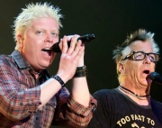

Американская панк-рок-группа из Калифорнии.

* [All Along](All%20Along)
* [All I Want](All%20I%20Want)
* [Amazed](Amazed)
* [Americana](Americana)
* [Bad Habit](Bad%20Habit)
* [Beheaded](Beheaded)
* [BlackBall](BlackBall)
* [Burn it Up](Burn%20it%20Up)
* [Change The World](Change%20The%20World)
* [Come Out And Play](Come%20Out%20And%20Play)
* [Come Out Swinging](Come%20Out%20Swinging)
* [Conspiracy Of One](Conspiracy%20Of%20One)
* [Cool To Hate](Cool%20To%20Hate)
* [Crossroads](Crossroads)
* [Da Hui](Da%20Hui)
* [Dammit, I Changed Again](Dammit,%20I%20Changed%20Again)
* [Defy You](Defy%20You)
* [Demons](Demons)
* [Denial, Revisited](Denial,%20Revisited)
* [Dirty Magic](Dirty%20Magic)
* [Disclaimer](Disclaimer)
* [Don't Pick It Up](Don't%20Pick%20It%20Up)
* [Elders](Elders)
* [Feelings](Feelings)
* [Forever And A Day](Forever%20And%20A%20Day)
* [Genocide](Genocide)
* [Get it Right](Get%20it%20Right)
* [Gone Away](Gone%20Away)
* [Gotta Get Away](Gotta%20Get%20Away)
* [Have You Ever](Have%20You%20Ever)
* [Hypodermic](Hypodermic)
* [I Choose](I%20Choose)
* [I'll Be Waiting](I'll%20Be%20Waiting)
* [Intermission](Intermission)
* [It'll Be A Long Time](It'll%20Be%20A%20Long%20Time)
* [Jennifer Lost The War](Jennifer%20Lost%20The%20War)
* [Kick Him When He's Down](Kick%20Him%20When%20He's%20Down)
* [Kids Arnt Alright](Kids%20Arnt%20Alright)
* [Kill The President](Kill%20The%20President)
* [Killboy Powerhead](Killboy%20Powerhead)
* [L.A.P.D](L.A.P.D)
* [Leave It Behind](Leave%20It%20Behind)
* [Living In Chaos](Living%20In%20Chaos)
* [Me & My Old Lady](Me%20&%20My%20Old%20Lady)
* [Million Miles Away](Million%20Miles%20Away)
* [Mota](Mota)
* [Nitro (Youth Energy)](Nitro%20(Youth%20Energy))
* [No Brakes](No%20Brakes)
* [No Hero](No%20Hero)
* [Not The One](Not%20The%20One)
* [Nothing from Something](Nothing%20from%20Something)
* [One Fine Day](One%20Fine%20Day)
* [Original Pranckster](Original%20Pranckster)
* [Original Prankster](Original%20Prankster)
* [Out On Patrol](Out%20On%20Patrol)
* [Pay The Man](Pay%20The%20Man)
* [Pretty Fly (For A White Guy)](Pretty%20Fly%20(For%20A%20White%20Guy))
* [Pretty Fly](Pretty%20Fly)
* [Race Against Myself](Race%20Against%20Myself)
* [Self Esteem](Self%20Esteem)
* [Session](Session)
* [She's Got Issues](She's%20Got%20Issues)
* [Smash](Smash)
* [So Alone](So%20Alone)
* [Something To Believe In](Something%20To%20Believe%20In)
* [Spare Me The Details](Spare%20Me%20The%20Details)
* [Special Delivery](Special%20Delivery)
* [Staring At The Sun](Staring%20At%20The%20Sun)
* [The Child Arent Alright](The%20Child%20Arent%20Alright)
* [The End Of The Line](The%20End%20Of%20The%20Line)
* [The Kids Arent Allright (2 вариант)](The%20Kids%20Arent%20Allright%20(2%20вариант))
* [The Kids Arent Allright](The%20Kids%20Arent%20Allright)
* [The Meaning Of Life](The%20Meaning%20Of%20Life)
* [Vultures](Vultures)
* [Walla Walla](Walla%20Walla)
* [Want You Bad](Want%20You%20Bad)
* [What Happened To You](What%20Happened%20To%20You)
* [Why Don't You Get A Job](Why%20Don't%20You%20Get%20A%20Job)