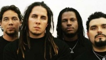

Американская рок-группа из Сан-Диего, работающая в жанре христианского металла.

* [Alive](Alive)
* [Allive](Allive)
* [Anything Right](Anything%20Right)
* [Boom](Boom)
* [Breath Babylon](Breath%20Babylon)
* [Bullet The Blue Sky](Bullet%20The%20Blue%20Sky)
* [Checkin' Levels](Checkin'%20Levels)
* [Follow Me](Follow%20Me)
* [Freestyle](Freestyle)
* [Full Color](Full%20Color)
* [Greetings](Greetings)
* [Guitarras de Amor](Guitarras%20de%20Amor)
* [Hollywood](Hollywood)
* [Image](Image)
* [Know Me](Know%20Me)
* [Lie Down](Lie%20Down)
* [Live And Die](Live%20And%20Die)
* [One Day](One%20Day)
* [Outkast](Outkast)
* [Portrait](Portrait)
* [Preach](Preach)
* [Rock The Party](Rock%20The%20Party)
* [Rosa Linda](Rosa%20Linda)
* [Satellite](Satellite)
* [Set It Off](Set%20It%20Off)
* [Set Your Eyes To Zion](Set%20Your%20Eyes%20To%20Zion)
* [Sothtown](Sothtown)
* [The Messenjah](The%20Messenjah)
* [Thinking About Forever](Thinking%20About%20Forever)
* [Tribal](Tribal)
* [Without Jah, Nothin'](Without%20Jah,%20Nothin')
* [Youth Of The Nation](Youth%20Of%20The%20Nation)