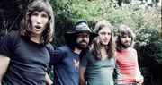

Легендарная британская рок-группа в жанре психоделический рок, симфо-рок.

* [A Saucerful of Secrets (Celestial Voices)](A%20Saucerful%20of%20Secrets%20(Celestial%20Voices))
* [A Saucerful of Secrets](A%20Saucerful%20of%20Secrets)
* [A great day for freedom](A%20great%20day%20for%20freedom)
* [A new machine part one](A%20new%20machine%20part%20one)
* [A new machine part two](A%20new%20machine%20part%20two)
* [A pillow of winds](A%20pillow%20of%20winds)
* [Another Brick In The Wall Part 1](Another%20Brick%20In%20The%20Wall%20Part%201)
* [Another Brick In The Wall Part 2](Another%20Brick%20In%20The%20Wall%20Part%202)
* [Another Brick In The Wall Part 3](Another%20Brick%20In%20The%20Wall%20Part%203)
* [Any Colour You Like](Any%20Colour%20You%20Like)
* [Arnold Layne](Arnold%20Layne)
* [Astronomy Domine (2 вариант)](Astronomy%20Domine%20(2%20вариант))
* [Astronomy Domine](Astronomy%20Domine)
* [Atom Heart Mother (2 вариант)](Atom%20Heart%20Mother%20(2%20вариант))
* [Atom Heart Mother](Atom%20Heart%20Mother)
* [Biding my time](Biding%20my%20time)
* [Brain Damage (2 вариант)](Brain%20Damage%20(2%20вариант))
* [Brain Damage](Brain%20Damage)
* [Breathe In The Air](Breathe%20In%20The%20Air)
* [Bring The Boys Back Home](Bring%20The%20Boys%20Back%20Home)
* [Burning bridges](Burning%20bridges)
* [Careful With That Axe Eugene](Careful%20With%20That%20Axe%20Eugene)
* [Childhood's end](Childhood's%20end)
* [Cirrus minor](Cirrus%20minor)
* [Comfortably Numb](Comfortably%20Numb)
* [Coming Back To Life (2 вариант)](Coming%20Back%20To%20Life%20(2%20вариант))
* [Coming Back To Life](Coming%20Back%20To%20Life)
* [Corporal clegg](Corporal%20clegg)
* [Crying song](Crying%20song)
* [Dogs (2 вариант)](Dogs%20(2%20вариант))
* [Dogs of war](Dogs%20of%20war)
* [Dogs](Dogs)
* [Don't leave me now](Don't%20leave%20me%20now)
* [Dramatic Theme](Dramatic%20Theme)
* [Echoes (2 вариант)](Echoes%20(2%20вариант))
* [Echoes (3 вариант)](Echoes%20(3%20вариант))
* [Echoes](Echoes)
* [Eclipse (2 вариант)](Eclipse%20(2%20вариант))
* [Eclipse (3 вариант)](Eclipse%20(3%20вариант))
* [Eclipse](Eclipse)
* [Empty Spaces](Empty%20Spaces)
* [FLAMING](FLAMING)
* [FREE FOUR](FREE%20FOUR)
* [Fat Old Sun (2 вариант)](Fat%20Old%20Sun%20(2%20вариант))
* [Fat Old Sun](Fat%20Old%20Sun)
* [Fearless](Fearless)
* [GET YOUR FILTHY HANDS OFF MY DESERT](GET%20YOUR%20FILTHY%20HANDS%20OFF%20MY%20DESERT)
* [GOODBYE BLUE SKY](GOODBYE%20BLUE%20SKY)
* [GOODBYE CRUEL WORLD](GOODBYE%20CRUEL%20WORLD)
* [GRANTCHESTER MEADOWS](GRANTCHESTER%20MEADOWS)
* [GREEN IS THE COLOUR](GREEN%20IS%20THE%20COLOUR)
* [HIGH HOPES](HIGH%20HOPES)
* [Have A Cigar](Have%20A%20Cigar)
* [Hey you](Hey%20you)
* [IBIZA BAR](IBIZA%20BAR)
* [IN THE FLESH](IN%20THE%20FLESH)
* [INTERSTELLAR OVERDRIVE](INTERSTELLAR%20OVERDRIVE)
* [IS THERE ANYBODY OUT THERE](IS%20THERE%20ANYBODY%20OUT%20THERE)
* [If](If)
* [Is There Anybody](Is%20There%20Anybody)
* [JUGBAND BLUES](JUGBAND%20BLUES)
* [JULIA DREAM](JULIA%20DREAM)
* [KEEP TALKING](KEEP%20TALKING)
* [LEARNING TO FLY](LEARNING%20TO%20FLY)
* [LET THERE BE MORE LIGHT](LET%20THERE%20BE%20MORE%20LIGHT)
* [LOST FOR WORDS](LOST%20FOR%20WORDS)
* [Lucifer sam](Lucifer%20sam)
* [MATILDA MOTHER](MATILDA%20MOTHER)
* [Marooned](Marooned)
* [Money](Money)
* [Mother](Mother)
* [Nobody home](Nobody%20home)
* [Not now john](Not%20now%20john)
* [OBSCURED BY CLOUDS](OBSCURED%20BY%20CLOUDS)
* [ON THE TURNING AWAY](ON%20THE%20TURNING%20AWAY)
* [ONE OF MY TURNS](ONE%20OF%20MY%20TURNS)
* [ONE OF THE FEW](ONE%20OF%20THE%20FEW)
* [OUTSIDE THE WALL](OUTSIDE%20THE%20WALL)
* [One slip](One%20slip)
* [PARANOID EYES](PARANOID%20EYES)
* [PIGS (THREE DIFFERENT ONES)](PIGS%20(THREE%20DIFFERENT%20ONES))
* [PIGS ON THE WING (PART ONE)](PIGS%20ON%20THE%20WING%20(PART%20ONE))
* [PIGS ON THE WING (PART TWO)](PIGS%20ON%20THE%20WING%20(PART%20TWO))
* [POLES APART](POLES%20APART)
* [Paintbox](Paintbox)
* [REMEMBER A DAY](REMEMBER%20A%20DAY)
* [Run like hell](Run%20like%20hell)
* [SEE-SAW](SEE-SAW)
* [SHINE ON YOU CRAZY DIAMOND PART 1](SHINE%20ON%20YOU%20CRAZY%20DIAMOND%20PART%201)
* [SHINE ON YOU CRAZY DIAMOND PART 2](SHINE%20ON%20YOU%20CRAZY%20DIAMOND%20PART%202)
* [SHINE ON YOU CRAZY DIAMOND PART 3](SHINE%20ON%20YOU%20CRAZY%20DIAMOND%20PART%203)
* [SHINE ON YOU CRAZY DIAMOND PART 4](SHINE%20ON%20YOU%20CRAZY%20DIAMOND%20PART%204)
* [SHINE ON YOU CRAZY DIAMOND PART 5](SHINE%20ON%20YOU%20CRAZY%20DIAMOND%20PART%205)
* [SIGNS OF LIFE](SIGNS%20OF%20LIFE)
* [SORROW](SORROW)
* [STOP](STOP)
* [SUMMER '68](SUMMER%20'68)
* [San tropez](San%20tropez)
* [Scarecrow](Scarecrow)
* [See emily play](See%20emily%20play)
* [Set The Controls For The Heart Of The Sun](Set%20The%20Controls%20For%20The%20Heart%20Of%20The%20Sun)
* [Shine On You Crazy Diamond](Shine%20On%20You%20Crazy%20Diamond)
* [Stay (2 вариант)](Stay%20(2%20вариант))
* [Stay](Stay)
* [TERMINAL FROST](TERMINAL%20FROST)
* [THE THIN ICE](THE%20THIN%20ICE)
* [THE TRIAL](THE%20TRIAL)
* [TIME](TIME)
* [The Fletcher Memorial Home](The%20Fletcher%20Memorial%20Home)
* [The Gnome](The%20Gnome)
* [The Show Must Go On](The%20Show%20Must%20Go%20On)
* [The final cut](The%20final%20cut)
* [The gold it's in the...](The%20gold%20it's%20in%20the...)
* [The great gig in the sky](The%20great%20gig%20in%20the%20sky)
* [The gunner's dream](The%20gunner's%20dream)
* [The happiest days of our lives](The%20happiest%20days%20of%20our%20lives)
* [The hero's return](The%20hero's%20return)
* [The narrow way (part 3)](The%20narrow%20way%20(part%203))
* [The nile song](The%20nile%20song)
* [The post war dream](The%20post%20war%20dream)
* [Two suns in the sunset](Two%20suns%20in%20the%20sunset)
* [Us And Them](Us%20And%20Them)
* [VERA](VERA)
* [WAITING FOR THE WORMS](WAITING%20FOR%20THE%20WORMS)
* [WHEN YOU'RE IN](WHEN%20YOU'RE%20IN)
* [Wearing The Inside Out](Wearing%20The%20Inside%20Out)
* [Welcome To The Machine](Welcome%20To%20The%20Machine)
* [Wish You Were Here](Wish%20You%20Were%20Here)
* [Wot's...Uh The Deal](Wot's...Uh%20The%20Deal)
* [YOUR POSSIBLE PASTS](YOUR%20POSSIBLE%20PASTS)
* [Young lust](Young%20lust)