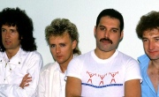

* ['39 (2 вариант)]('39%20(2%20вариант))
* ['39]('39)
* [A Kind Of Magic](A%20Kind%20Of%20Magic)
* [A Winter's Tale](A%20Winter's%20Tale)
* [All Dead, All Dead](All%20Dead,%20All%20Dead)
* [Another One Bites The Dust](Another%20One%20Bites%20The%20Dust)
* [Back Chat](Back%20Chat)
* [Bicycle Race (2 вариант)](Bicycle%20Race%20(2%20вариант))
* [Bicycle Race](Bicycle%20Race)
* [Bohemian Rhapsody (2 вариант)](Bohemian%20Rhapsody%20(2%20вариант))
* [Bohemian Rhapsody](Bohemian%20Rhapsody)
* [Breakthru](Breakthru)
* [Breaktrough](Breaktrough)
* [Brighton Rock](Brighton%20Rock)
* [Bring Back That Leroy Brown](Bring%20Back%20That%20Leroy%20Brown)
* [Coming Soon](Coming%20Soon)
* [Crazy Little Thing Called Love (2 вариант)](Crazy%20Little%20Thing%20Called%20Love%20(2%20вариант))
* [Crazy Little Thing Called Love](Crazy%20Little%20Thing%20Called%20Love)
* [Dead On Time](Dead%20On%20Time)
* [Dear Friends](Dear%20Friends)
* [Death On Two Legs](Death%20On%20Two%20Legs)
* [Doing All Right](Doing%20All%20Right)
* [Don't Stop Me Now (2 вариант)](Don't%20Stop%20Me%20Now%20(2%20вариант))
* [Don't Stop Me Now (3 вариант)](Don't%20Stop%20Me%20Now%20(3%20вариант))
* [Don't Stop Me Now](Don't%20Stop%20Me%20Now)
* [Don't Try Suicide](Don't%20Try%20Suicide)
* [Dragon Attack](Dragon%20Attack)
* [Dreamer's Ball](Dreamer's%20Ball)
* [Driven By You](Driven%20By%20You)
* [Fat Bottomed Girls](Fat%20Bottomed%20Girls)
* [Fight From The Inside](Fight%20From%20The%20Inside)
* [Flash To The Rescue](Flash%20To%20The%20Rescue)
* [Flash To The Resque](Flash%20To%20The%20Resque)
* [Friends Will Be Friends (2 вариант)](Friends%20Will%20Be%20Friends%20(2%20вариант))
* [Friends Will Be Friends](Friends%20Will%20Be%20Friends)
* [Fun It](Fun%20It)
* [God Save The Queen](God%20Save%20The%20Queen)
* [Good Company](Good%20Company)
* [Good Old-Fashioned Lover Boy](Good%20Old-Fashioned%20Lover%20Boy)
* [Great King Rat](Great%20King%20Rat)
* [Hammer to Fall](Hammer%20to%20Fall)
* [Headlong](Headlong)
* [Heaven For Everyone](Heaven%20For%20Everyone)
* [I Want It All](I%20Want%20It%20All)
* [I Want to Break Free](I%20Want%20to%20Break%20Free)
* [I Was Born To Love You](I%20Was%20Born%20To%20Love%20You)
* [I'm Going Slightly Mad](I'm%20Going%20Slightly%20Mad)
* [I'm In Love With My Car](I'm%20In%20Love%20With%20My%20Car)
* [If You Can't Beat Them](If%20You%20Can't%20Beat%20Them)
* [In Only Seven Days](In%20Only%20Seven%20Days)
* [In The Lap Of The Gods... revisited](In%20The%20Lap%20Of%20The%20Gods...%20revisited)
* [Innuendo](Innuendo)
* [Is This The World We Created](Is%20This%20The%20World%20We%20Created)
* [Is This the World We Created...](Is%20This%20the%20World%20We%20Created...)
* [It's Late](It's%20Late)
* [It's a Hard Life](It's%20a%20Hard%20Life)
* [Jealousy](Jealousy)
* [Jesus](Jesus)
* [Keep Yourself Alive](Keep%20Yourself%20Alive)
* [Killer Queen](Killer%20Queen)
* [Las Palabras De Amor](Las%20Palabras%20De%20Amor)
* [Lazing On A Sunday Afternoon](Lazing%20On%20A%20Sunday%20Afternoon)
* [Lazing On The Sunday Afternoon](Lazing%20On%20The%20Sunday%20Afternoon)
* [Leaving Home Ain't Easy](Leaving%20Home%20Ain't%20Easy)
* [Let Me Entertain You](Let%20Me%20Entertain%20You)
* [Let Me Live](Let%20Me%20Live)
* [Liar](Liar)
* [Lily Of The Valley](Lily%20Of%20The%20Valley)
* [Living On My Own](Living%20On%20My%20Own)
* [Long Away](Long%20Away)
* [Lost Opportunity](Lost%20Opportunity)
* [Love Of My Life](Love%20Of%20My%20Life)
* [Made In Heaven](Made%20In%20Heaven)
* [Modern Times Rock 'n' Roll](Modern%20Times%20Rock%20'n'%20Roll)
* [Modern Times Rock'N'Roll](Modern%20Times%20Rock'N'Roll)
* [More Of That Jazz](More%20Of%20That%20Jazz)
* [Mother Love](Mother%20Love)
* [Mustapha](Mustapha)
* [My Baby Does Me](My%20Baby%20Does%20Me)
* [My Melancholy Blues](My%20Melancholy%20Blues)
* [Need Your Loving Tonight](Need%20Your%20Loving%20Tonight)
* [Nothin' But Blue](Nothin'%20But%20Blue)
* [Now I'm Here](Now%20I'm%20Here)
* [Ogre Battle](Ogre%20Battle)
* [One Vision](One%20Vision)
* [One Year Of Love](One%20Year%20Of%20Love)
* [Party](Party)
* [Play The Game](Play%20The%20Game)
* [Princes Of The Universe](Princes%20Of%20The%20Universe)
* [Procession](Procession)
* [Radio Ga Ga](Radio%20Ga%20Ga)
* [Rain Must Fall](Rain%20Must%20Fall)
* [Rock It (prime jive)](Rock%20It%20(prime%20jive))
* [Rock It](Rock%20It)
* [Sail Away Sweet Sister (2 вариант)](Sail%20Away%20Sweet%20Sister%20(2%20вариант))
* [Sail Away Sweet Sister](Sail%20Away%20Sweet%20Sister)
* [Save Me](Save%20Me)
* [Scandal](Scandal)
* [Seaside Rendezvous](Seaside%20Rendezvous)
* [Seven Seas Of Rhye](Seven%20Seas%20Of%20Rhye)
* [She Makes Me (2 вариант)](She%20Makes%20Me%20(2%20вариант))
* [She Makes Me](She%20Makes%20Me)
* [Sheer Heart Attack](Sheer%20Heart%20Attack)
* [Sleeping On The Sidewalk (2 вариант)](Sleeping%20On%20The%20Sidewalk%20(2%20вариант))
* [Sleeping On The Sidewalk](Sleeping%20On%20The%20Sidewalk)
* [Somebody To Love (перевод)](Somebody%20To%20Love%20(перевод))
* [Somebody To Love](Somebody%20To%20Love)
* [Son And Daughter](Son%20And%20Daughter)
* [Spread Your Wings](Spread%20Your%20Wings)
* [Stone Cold Crazy (2 вариант)](Stone%20Cold%20Crazy%20(2%20вариант))
* [Stone Cold Crazy](Stone%20Cold%20Crazy)
* [Tenement Funster](Tenement%20Funster)
* [Teo Torriate (Let Us Cling Together)](Teo%20Torriate%20(Let%20Us%20Cling%20Together))
* [Teo Torriatte](Teo%20Torriatte)
* [The Fairy Feller's Master Stroke](The%20Fairy%20Feller's%20Master%20Stroke)
* [The Fairy Feller's Master-Stroke](The%20Fairy%20Feller's%20Master-Stroke)
* [The Great Pretender](The%20Great%20Pretender)
* [The Invisible Man](The%20Invisible%20Man)
* [The March Of The Black Queen](The%20March%20Of%20The%20Black%20Queen)
* [The Millionaire Waltz](The%20Millionaire%20Waltz)
* [The Miracle](The%20Miracle)
* [The Night Comes Down (2 вариант)](The%20Night%20Comes%20Down%20(2%20вариант))
* [The Night Comes Down](The%20Night%20Comes%20Down)
* [The Prophet's Song](The%20Prophet's%20Song)
* [The Show Must Go On (2 вариант)](The%20Show%20Must%20Go%20On%20(2%20вариант))
* [The Show Must Go On](The%20Show%20Must%20Go%20On)
* [These Are The Days Of Our Lives (2 вариант)](These%20Are%20The%20Days%20Of%20Our%20Lives%20(2%20вариант))
* [These Are The Days Of Our Lives](These%20Are%20The%20Days%20Of%20Our%20Lives)
* [Tie Your Mother Down](Tie%20Your%20Mother%20Down)
* [Too Much Love Will Kill You](Too%20Much%20Love%20Will%20Kill%20You)
* [Under Pressure](Under%20Pressure)
* [Was It All Worth It](Was%20It%20All%20Worth%20It)
* [We Are The Champions](We%20Are%20The%20Champions)
* [We Will Rock You](We%20Will%20Rock%20You)
* [White Queen (As It Began)](White%20Queen%20(As%20It%20Began))
* [White Queen](White%20Queen)
* [Who Needs You](Who%20Needs%20You)
* [Who Wants To Live Forever (2 вариант)](Who%20Wants%20To%20Live%20Forever%20(2%20вариант))
* [Who Wants To Live Forever](Who%20Wants%20To%20Live%20Forever)
* [You And I](You%20And%20I)
* [You're My Best Friend](You're%20My%20Best%20Friend)