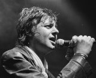

Одна из первых советских, позже российских панк-рок-групп.  
Существовала до 1998 года, распалась после смерти лидера группы Андея Панова.

* [Асса](Асса)
* [Дeльтaплaн](Дeльтaплaн)
* [Огуречный лосьон](Огуречный%20лосьон)