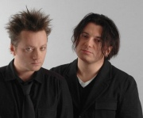

Популярная в 90-е годы российская рок-группа, основанная братьями Вадимом и Глебом Самойловами.

* [Ein Zwei Drei Waltz](Ein%20Zwei%20Drei%20Waltz)
* [Ein-Zwei-Drei-Waltz](Ein-Zwei-Drei-Waltz)
* [I love You](I%20love%20You)
* [Viva Kalman](Viva%20Kalman)
* [Viva Кальман](Viva%20Кальман)
* [Абордаж](Абордаж)
* [Айлавью](Айлавью)
* [Аллеpгия](Аллеpгия)
* [Аллергия](Аллергия)
* [Альрауне](Альрауне)
* [Аусвайс на небо](Аусвайс%20на%20небо)
* [Афpиканка](Афpиканка)
* [Африканка](Африканка)
* [Беглец](Беглец)
* [Ближе](Ближе)
* [Бэсса ме](Бэсса%20ме)
* [Бэсса мэ](Бэсса%20мэ)
* [В интересах революции](В%20интересах%20революции)
* [Веpвольф](Веpвольф)
* [Вервольф](Вервольф)
* [Веселый мир](Веселый%20мир)
* [Ветер](Ветер)
* [Вечная любовь](Вечная%20любовь)
* [Вольно](Вольно)
* [Второй фронт](Второй%20фронт)
* [Выпить море](Выпить%20море)
* [Гетеросексуалист](Гетеросексуалист)
* [Гитлер](Гитлер)
* [Глюки](Глюки)
* [Гномы-каннибалы](Гномы-каннибалы)
* [Грязь](Грязь)
* [Два корабля](Два%20корабля)
* [Дворник](Дворник)
* [Дезертир](Дезертир)
* [Декаданс](Декаданс)
* [Детка-конфетка](Детка-конфетка)
* [Джиги Дзаги](Джиги%20Дзаги)
* [Джиги-Дзаги](Джиги-Дзаги)
* [Днем и ночью](Днем%20и%20ночью)
* [Доpога паука](Доpога%20паука)
* [Дорога Паука](Дорога%20Паука)
* [Его там не было](Его%20там%20не%20было)
* [Звездное гестапо](Звездное%20гестапо)
* [Звездочет](Звездочет)
* [Извращение](Извращение)
* [Инспектоp По...](Инспектоp%20По...)
* [Инспектор по...](Инспектор%20по...)
* [Искушение Маленького Фрица](Искушение%20Маленького%20Фрица)
* [Истерика](Истерика)
* [Как на войне](Как%20на%20войне)
* [Канкан](Канкан)
* [Ковер-вертолет](Ковер-вертолет)
* [Командир](Командир)
* [Коммунальный блюз](Коммунальный%20блюз)
* [Кондуктор](Кондуктор)
* [Корвет уходит в небеса](Корвет%20уходит%20в%20небеса)
* [Кошка](Кошка)
* [Красная Шапочка](Красная%20Шапочка)
* [Красный петух](Красный%20петух)
* [Крошка](Крошка)
* [Кто украл мою звезду](Кто%20украл%20мою%20звезду)
* [Легион](Легион)
* [Любовь идет на дело](Любовь%20идет%20на%20дело)
* [Месяц](Месяц)
* [Молитва](Молитва)
* [Моряк](Моряк)
* [Мотоциклетка](Мотоциклетка)
* [На войне](На%20войне)
* [На дне](На%20дне)
* [На краю у неба](На%20краю%20у%20неба)
* [Навеселе](Навеселе)
* [Насилие](Насилие)
* [Наша семья](Наша%20семья)
* [Неживая вода](Неживая%20вода)
* [Немного земли](Немного%20земли)
* [Ни там ни тут](Ни%20там%20ни%20тут)
* [Никогда](Никогда)
* [Нисхождение](Нисхождение)
* [Новый Год](Новый%20Год)
* [Огоньки](Огоньки)
* [Они летят](Они%20летят)
* [Опиум для никого](Опиум%20для%20никого)
* [Пантеpа](Пантеpа)
* [Пантера](Пантера)
* [Партизаны](Партизаны)
* [Пиpат](Пиpат)
* [Пинкертон](Пинкертон)
* [Пират](Пират)
* [Позови меня, небо](Позови%20меня,%20небо)
* [Позорная звезда](Позорная%20звезда)
* [Пока-пока](Пока-пока)
* [Покрышкин](Покрышкин)
* [Полетаем](Полетаем)
* [Ползёт](Ползёт)
* [Последний подвиг Евы Браун](Последний%20подвиг%20Евы%20Браун)
* [Поход](Поход)
* [Праздник семьи](Праздник%20семьи)
* [Пролог. Убитая любовь.](Пролог.%20Убитая%20любовь.)
* [Пролог. Убитая любовь](Пролог.%20Убитая%20любовь)
* [Пулемет Максим](Пулемет%20Максим)
* [Пулемёт Максим](Пулемёт%20Максим)
* [Пуля](Пуля)
* [Розовый бинт](Розовый%20бинт)
* [Садо-мазо](Садо-мазо)
* [Секрет](Секрет)
* [Серое небо](Серое%20небо)
* [Серый траур](Серый%20траур)
* [Сирота](Сирота)
* [Сказочная тайга](Сказочная%20тайга)
* [Снайпер](Снайпер)
* [Сны](Сны)
* [Со щитом иль на щите](Со%20щитом%20иль%20на%20щите)
* [Собачье сердце](Собачье%20сердце)
* [Споем о сексе](Споем%20о%20сексе)
* [Споемте о сексе](Споемте%20о%20сексе)
* [Странное рождество](Странное%20рождество)
* [Сытая свинья](Сытая%20свинья)
* [Танго с дельтапланом](Танго%20с%20дельтапланом)
* [Телесудьбы](Телесудьбы)
* [Тоска без конца](Тоска%20без%20конца)
* [Трансильвания](Трансильвания)
* [Триллер](Триллер)
* [Ты и я](Ты%20и%20я)
* [Ты уходишь](Ты%20уходишь)
* [Убитая любовь](Убитая%20любовь)
* [Ураган](Ураган)
* [Фрау его мечты](Фрау%20его%20мечты)
* [ХалиГалиКришна](ХалиГалиКришна)
* [Холодная любовь](Холодная%20любовь)
* [Черная луна](Черная%20луна)
* [Черные волки](Черные%20волки)
* [Четыре слова](Четыре%20слова)
* [Чудеса](Чудеса)
* [Чёрная луна](Чёрная%20луна)
* [Шпала](Шпала)
* [Щекотно](Щекотно)
* [Эксперимент](Эксперимент)
* [Эпидемия](Эпидемия)
* [Эпилог. На краю](Эпилог.%20На%20краю)
* [Я буду там](Я%20буду%20там)
* [Я вернусь](Я%20вернусь)
* [Я на тебе, как на войне](Я%20на%20тебе,%20как%20на%20войне)
* [Я убегаю](Я%20убегаю)