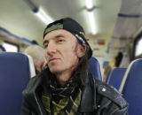

Московская панк-рок-группа, образованная в 1994 году Олегом Липовичем.

* [Бардак](Бардак)
* [В голове моей зажёгся свет](В%20голове%20моей%20зажёгся%20свет)
* [Ваши законы](Ваши%20законы)
* [Восхождение](Восхождение)
* [Гопники](Гопники)
* [Дайте мне пулемет](Дайте%20мне%20пулемет)
* [До весны](До%20весны)
* [Думка](Думка)
* [Игрок](Игрок)
* [Лезвие радуги](Лезвие%20радуги)
* [Мастурбатор](Мастурбатор)
* [Месть](Месть)
* [Мир через призму черных очков](Мир%20через%20призму%20черных%20очков)
* [Мне надоела Америка](Мне%20надоела%20Америка)
* [Москва не Сочи](Москва%20не%20Сочи)
* [Не спеши гнать его](Не%20спеши%20гнать%20его)
* [Небо цвета потертых джинсов](Небо%20цвета%20потертых%20джинсов)
* [Ни одной живой души](Ни%20одной%20живой%20души)
* [Под флагом нищеты](Под%20флагом%20нищеты)
* [Приговор](Приговор)
* [Продавец воздушных комнат](Продавец%20воздушных%20комнат)
* [Рай](Рай)
* [Собаки луны](Собаки%20луны)
* [Сон исчезает от болезни](Сон%20исчезает%20от%20болезни)
* [Уход](Уход)
* [Чужие мы](Чужие%20мы)