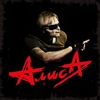

Одна из старейших российских и советских рок-групп. Основана в Ленинграде в 1983 году. Лидер группы Константин Кинчев.

* [Rock-n-Roll - это не работа](Rock-n-Roll%20-%20это%20не%20работа)
* [Rock-n-Roll](Rock-n-Roll)
* [Rock-n-roll крест](Rock-n-roll%20крест)
* [А мы танцуем на палубе тонущего корабля](А%20мы%20танцуем%20на%20палубе%20тонущего%20корабля)
* [Аккумулятор](Аккумулятор)
* [Акселерация](Акселерация)
* [Антиромантика](Антиромантика)
* [Антихрист](Антихрист)
* [Армия жизни](Армия%20жизни)
* [Атеист](Атеист)
* [Аэробика (2 вариант)](Аэробика%20(2%20вариант))
* [Аэробика](Аэробика)
* [Без креста](Без%20креста)
* [Белая невеста (2 вариант)](Белая%20невеста%20(2%20вариант))
* [Белая невеста](Белая%20невеста)
* [Бес паники](Бес%20паники)
* [Блондинка](Блондинка)
* [Бойся, проси и верь](Бойся,%20проси%20и%20верь)
* [Большое ружьё](Большое%20ружьё)
* [Бродячий цирк](Бродячий%20цирк)
* [Веретено](Веретено)
* [Ветер водит хоровод](Ветер%20водит%20хоровод)
* [Ветер перемен](Ветер%20перемен)
* [Ветер](Ветер)
* [Вечер](Вечер)
* [Вечный шут](Вечный%20шут)
* [Воздух](Воздух)
* [Война](Война)
* [Волна (2 вариант)](Волна%20(2%20вариант))
* [Волна](Волна)
* [Вор да палач (2 вариант)](Вор%20да%20палач%20(2%20вариант))
* [Вор да палач](Вор%20да%20палач)
* [Вот так (2 вариант)](Вот%20так%20(2%20вариант))
* [Вот так](Вот%20так)
* [Время менять имена](Время%20менять%20имена)
* [Всадник](Всадник)
* [Все в наших руках](Все%20в%20наших%20руках)
* [Все решено (2 вариант)](Все%20решено%20(2%20вариант))
* [Все решено](Все%20решено)
* [Все это рок-н-ролл](Все%20это%20рок-н-ролл)
* [Всё это Rock'n'Roll](Всё%20это%20Rock'n'Roll)
* [Где твой билет](Где%20твой%20билет)
* [Голубой банщик](Голубой%20банщик)
* [Горизонт (2 вариант)](Горизонт%20(2%20вариант))
* [Горизонт](Горизонт)
* [Город](Город)
* [Гость](Гость)
* [Готовы ли мы отвечать](Готовы%20ли%20мы%20отвечать)
* [Грязь](Грязь)
* [Гуталиновый ангел](Гуталиновый%20ангел)
* [Движение вспять](Движение%20вспять)
* [День открытых дверей](День%20открытых%20дверей)
* [Для тех, кто свалился с луны](Для%20тех,%20кто%20свалился%20с%20луны)
* [Доброе утро](Доброе%20утро)
* [Дождь](Дождь)
* [Доктор Буги (2 вариант)](Доктор%20Буги%20(2%20вариант))
* [Доктор Буги](Доктор%20Буги)
* [Доктор Франкенштейн](Доктор%20Франкенштейн)
* [Дорога в небо](Дорога%20в%20небо)
* [Дружеское напутствие альпинисту](Дружеское%20напутствие%20альпинисту)
* [Дудочник](Дудочник)
* [Дурак (2 вариант)](Дурак%20(2%20вариант))
* [Дурак и Солнце](Дурак%20и%20Солнце)
* [Дурак](Дурак)
* [Душа](Душа)
* [Дым](Дым)
* [Дятел](Дятел)
* [Жар Бог Шуга](Жар%20Бог%20Шуга)
* [Жар бог Шуга (2 вариант)](Жар%20бог%20Шуга%20(2%20вариант))
* [Жги-гуляй (2 вариант)](Жги-гуляй%20(2%20вариант))
* [Жги-гуляй](Жги-гуляй)
* [Жизнь струны](Жизнь%20струны)
* [Завтра может быть поздно (2 вариант)](Завтра%20может%20быть%20поздно%20(2%20вариант))
* [Завтра может быть поздно](Завтра%20может%20быть%20поздно)
* [Званые](Званые)
* [Звезда по имени Рок](Звезда%20по%20имени%20Рок)
* [Звезда свиней](Звезда%20свиней)
* [Звери](Звери)
* [Земля](Земля)
* [Знак](Знак)
* [Знаки (Осень)](Знаки%20(Осень))
* [Иго Любви](Иго%20Любви)
* [Изгой](Изгой)
* [Инвалид рока](Инвалид%20рока)
* [Инок, воин и шут](Инок,%20воин%20и%20шут)
* [Каждую ночь](Каждую%20ночь)
* [Камикадзе](Камикадзе)
* [Камнепад](Камнепад)
* [Карантин](Карантин)
* [Картонный дом (2 вариант)](Картонный%20дом%20(2%20вариант))
* [Картонный дом](Картонный%20дом)
* [Кибитка](Кибитка)
* [Ко мне (2 вариант)](Ко%20мне%20(2%20вариант))
* [Ко мне (3 вариант)](Ко%20мне%20(3%20вариант))
* [Ко мне](Ко%20мне)
* [Кода](Кода)
* [Колыбельная](Колыбельная)
* [Компромисс](Компромисс)
* [Кошке хочется спать](Кошке%20хочется%20спать)
* [Красная книга](Красная%20книга)
* [Красное на черном (2 вариант)](Красное%20на%20черном%20(2%20вариант))
* [Красное на черном (3 вариант)](Красное%20на%20черном%20(3%20вариант))
* [Красное на черном](Красное%20на%20черном)
* [Красное на чёрном](Красное%20на%20чёрном)
* [Красные Горы](Красные%20Горы)
* [Красные горы (2 вариант)](Красные%20горы%20(2%20вариант))
* [Крещение](Крещение)
* [Кривозеркалье](Кривозеркалье)
* [Кто ты](Кто%20ты)
* [Купи танк](Купи%20танк)
* [Лень](Лень)
* [Лодка (2 вариант)](Лодка%20(2%20вариант))
* [Лодка (3 вариант)](Лодка%20(3%20вариант))
* [Лодка (Весла)](Лодка%20(Весла))
* [Лодка](Лодка)
* [Лунный вальс](Лунный%20вальс)
* [Любовь](Любовь)
* [Маленький театр (Лунный вальс)](Маленький%20театр%20(Лунный%20вальс))
* [Маленький театр (Лунный вальс2)](Маленький%20театр%20(Лунный%20вальс2))
* [Мама](Мама)
* [Манекен](Манекен)
* [Меломан](Меломан)
* [Металл](Металл)
* [Минус-плюс](Минус-плюс)
* [Мое поколение (2 вариант)](Мое%20поколение%20(2%20вариант))
* [Мое поколение](Мое%20поколение)
* [Мой Город](Мой%20Город)
* [Мой театр (2 вариант)](Мой%20театр%20(2%20вариант))
* [Мой театр](Мой%20театр)
* [Моя война](Моя%20война)
* [Мужчина - машина, женщина - лёд](Мужчина%20-%20машина,%20женщина%20-%20лёд)
* [Мы вместе (2вариант)](Мы%20вместе%20(2вариант))
* [Мы вместе (3 вариант)](Мы%20вместе%20(3%20вариант))
* [Мы вместе](Мы%20вместе)
* [Мы держим путь в сторону леса](Мы%20держим%20путь%20в%20сторону%20леса)
* [Мышиный цирк](Мышиный%20цирк)
* [На пороге неба](На%20пороге%20неба)
* [Нахал](Нахал)
* [Небо Славян](Небо%20Славян)
* [Небо славян (2 вариант)](Небо%20славян%20(2%20вариант))
* [Непокорные](Непокорные)
* [Нет войне (2 вариант)](Нет%20войне%20(2%20вариант))
* [Нет войне](Нет%20войне)
* [Новая кровь (2 вариант)](Новая%20кровь%20(2%20вариант))
* [Новая кровь](Новая%20кровь)
* [Новый метод](Новый%20метод)
* [Ночные окна](Ночные%20окна)
* [Ночь](Ночь)
* [Одноразовая любовь](Одноразовая%20любовь)
* [Ой я тебя люблю Алла](Ой%20я%20тебя%20люблю%20Алла)
* [Ой, я люблю тебя, Алла](Ой,%20я%20люблю%20тебя,%20Алла)
* [Осеннее солнце](Осеннее%20солнце)
* [Падал снег](Падал%20снег)
* [Папа Тани](Папа%20Тани)
* [Папуас Рэп](Папуас%20Рэп)
* [Паруса звездолова](Паруса%20звездолова)
* [Паскуда (2 вариант)](Паскуда%20(2%20вариант))
* [Паскуда](Паскуда)
* [Пасынок звезд (2 вариант)](Пасынок%20звезд%20(2%20вариант))
* [Пасынок звезд](Пасынок%20звезд)
* [Перекресток (2 вариант)](Перекресток%20(2%20вариант))
* [Перекресток](Перекресток)
* [Перекрёсток](Перекрёсток)
* [Песня без слов](Песня%20без%20слов)
* [Печаль](Печаль)
* [Печать зверя](Печать%20зверя)
* [Плач](Плач)
* [Плод](Плод)
* [Плохой рок-н-ролл](Плохой%20рок-н-ролл)
* [Плюс-минус](Плюс-минус)
* [Пляж (2 вариант)](Пляж%20(2%20вариант))
* [Пляж](Пляж)
* [Пляс Сибири (2 вариант)](Пляс%20Сибири%20(2%20вариант))
* [Пляс Сибири](Пляс%20Сибири)
* [По Барабану](По%20Барабану)
* [По лабиринтам](По%20лабиринтам)
* [Повелитель Блох](Повелитель%20Блох)
* [Повелитель блох (2 вариант)](Повелитель%20блох%20(2%20вариант))
* [Поезд](Поезд)
* [Поколение Х](Поколение%20Х)
* [Поллюционный сон](Поллюционный%20сон)
* [Понедельник](Понедельник)
* [Посторонний](Посторонний)
* [Православные](Православные)
* [Прозаик](Прозаик)
* [Птица Марабу](Птица%20Марабу)
* [Путь в сторону леса](Путь%20в%20сторону%20леса)
* [Радости печаль](Радости%20печаль)
* [Республика](Республика)
* [Родина](Родина)
* [Рождество](Рождество)
* [Рок-н-ролл крест](Рок-н-ролл%20крест)
* [Самогон рок](Самогон%20рок)
* [Света](Света)
* [Северная Быль](Северная%20Быль)
* [Сильные идут вперёд](Сильные%20идут%20вперёд)
* [Синий дым](Синий%20дым)
* [Синий предел](Синий%20предел)
* [Синтезатор сладострастия](Синтезатор%20сладострастия)
* [Скоро зима](Скоро%20зима)
* [Слезы звезд](Слезы%20звезд)
* [Слово](Слово)
* [Смерть](Смерть)
* [Смутные дни](Смутные%20дни)
* [Снег](Снег)
* [Снова в Америке](Снова%20в%20Америке)
* [Соковыжиматель](Соковыжиматель)
* [Солнце встает](Солнце%20встает)
* [Солнце за нас](Солнце%20за%20нас)
* [Солнце-Иерусалим](Солнце-Иерусалим)
* [Солнцеворот](Солнцеворот)
* [Спокойная Ночь](Спокойная%20Ночь)
* [Старые раны](Старые%20раны)
* [Стать Севера](Стать%20Севера)
* [Стерх (2 вариант)](Стерх%20(2%20вариант))
* [Стерх](Стерх)
* [Странная игра](Странная%20игра)
* [Суд (2 вариант)](Суд%20(2%20вариант))
* [Суд (3 вариант)](Суд%20(3%20вариант))
* [Суд](Суд)
* [Сумасшедший дом](Сумасшедший%20дом)
* [Сумасшедший твист](Сумасшедший%20твист)
* [Сумерки (2 вариант)](Сумерки%20(2%20вариант))
* [Сумерки](Сумерки)
* [Такие дела, хозяин](Такие%20дела,%20хозяин)
* [Такие дела](Такие%20дела)
* [Танец на палубе тонущего корабля (2 вариант)](Танец%20на%20палубе%20тонущего%20корабля%20(2%20вариант))
* [Танец на палубе тонущего корабля](Танец%20на%20палубе%20тонущего%20корабля)
* [Танцевать](Танцевать)
* [Театр теней](Театр%20теней)
* [Театр](Театр)
* [Тигалагалоба (Брэкдэнсгопак)](Тигалагалоба%20(Брэкдэнсгопак))
* [То ли про любовь, то ли про беду](То%20ли%20про%20любовь,%20то%20ли%20про%20беду)
* [Только этот день (2 вариант)](Только%20этот%20день%20(2%20вариант))
* [Только этот день](Только%20этот%20день)
* [Тоталитарный рэп](Тоталитарный%20рэп)
* [Трасса Е-95 (2 вариант)](Трасса%20Е-95%20(2%20вариант))
* [Трасса Е-95](Трасса%20Е-95)
* [Три Дороги](Три%20Дороги)
* [Три дороги (2 вариант)](Три%20дороги%20(2%20вариант))
* [Тыр, тыр, тыр](Тыр,%20тыр,%20тыр)
* [Тыр-тыр-тыр (2 вариант)](Тыр-тыр-тыр%20(2%20вариант))
* [Тыр-тыр-тыр](Тыр-тыр-тыр)
* [У истока голубой реки](У%20истока%20голубой%20реки)
* [У истоков голубой реки](У%20истоков%20голубой%20реки)
* [Умереть молодым](Умереть%20молодым)
* [Формула власти (Бойся, проси и верь)](Формула%20власти%20(Бойся,%20проси%20и%20верь))
* [Хозяин](Хозяин)
* [Черная Rock'N'Roll мама](Черная%20Rock'N'Roll%20мама)
* [Черная метка](Черная%20метка)
* [Черная рок-н-ролл мама (2 вариант)](Черная%20рок-н-ролл%20мама%20(2%20вариант))
* [Черная рок-н-ролл мама (3 вариант)](Черная%20рок-н-ролл%20мама%20(3%20вариант))
* [Черная рок-н-ролл мама](Черная%20рок-н-ролл%20мама)
* [Черта (2 вариант)](Черта%20(2%20вариант))
* [Черта](Черта)
* [Чик-чик-чик](Чик-чик-чик)
* [Чунга-чанга (2 вариант)](Чунга-чанга%20(2%20вариант))
* [Чунга-чанга](Чунга-чанга)
* [Чую гибель](Чую%20гибель)
* [Чёрная метка](Чёрная%20метка)
* [Чёрный](Чёрный)
* [Шабаш 2](Шабаш%202)
* [Шабаш-2](Шабаш-2)
* [Шабаш](Шабаш)
* [Шанс](Шанс)
* [Шестой лесничий](Шестой%20лесничий)
* [Шпиономания](Шпиономания)
* [Эй, ты, там, на том берегу](Эй,%20ты,%20там,%20на%20том%20берегу)
* [Экспериментатор (2 вариант)](Экспериментатор%20(2%20вариант))
* [Экспериментатор](Экспериментатор)
* [Энергия](Энергия)
* [Я вижу то, что вижу (Красная книга)](Я%20вижу%20то,%20что%20вижу%20(Красная%20книга))
* [Я вижу то, что вижу](Я%20вижу%20то,%20что%20вижу)
* [Я дышал синевой...](Я%20дышал%20синевой...)
* [Я играю в войну](Я%20играю%20в%20войну)
* [Ямщик](Ямщик)