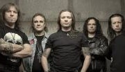

Советская и российская рок-группа, играющая в жанре хеви-метал. Одна из старейших и самых успешных русских рок-групп, при этом это одна из немногих российских групп, достигших серьёзного коммерческого и творческого успехов и популярности за пределами поклонников хэви-метала. 

* [1100 (2 вариант)](1100%20(2%20вариант))
* [1100](1100)
* [Castlevania (2 вариант)](Castlevania%20(2%20вариант))
* [Castlevania](Castlevania)
* [You'd Better Believe Me](You'd%20Better%20Believe%20Me)
* [Ангельская пыль (2 вариант)](Ангельская%20пыль%20(2%20вариант))
* [Ангельская пыль (3 вариант)](Ангельская%20пыль%20(3%20вариант))
* [Ангельская пыль (4 вариант)](Ангельская%20пыль%20(4%20вариант))
* [Ангельская пыль](Ангельская%20пыль)
* [Антихрист](Антихрист)
* [Бал у Князя Тьмы (2 вариант)](Бал%20у%20Князя%20Тьмы%20(2%20вариант))
* [Бал у Князя Тьмы](Бал%20у%20Князя%20Тьмы)
* [Баллада о древнерусском воине (2 вариант)](Баллада%20о%20древнерусском%20воине%20(2%20вариант))
* [Баллада о древнерусском воине (3 вариант)](Баллада%20о%20древнерусском%20воине%20(3%20вариант))
* [Баллада о древнерусском воине (4 вариант)](Баллада%20о%20древнерусском%20воине%20(4%20вариант))
* [Баллада о древнерусском воине](Баллада%20о%20древнерусском%20воине)
* [Беги за солнцем](Беги%20за%20солнцем)
* [Без тебя (2 вариант)](Без%20тебя%20(2%20вариант))
* [Без тебя (3 вариант)](Без%20тебя%20(3%20вариант))
* [Без тебя](Без%20тебя)
* [Белый флаг (2 вариант)](Белый%20флаг%20(2%20вариант))
* [Белый флаг](Белый%20флаг)
* [Беспечный ангел (2 вариант)](Беспечный%20ангел%20(2%20вариант))
* [Беспечный ангел (3 вариант)](Беспечный%20ангел%20(3%20вариант))
* [Беспечный ангел (4 вариант)](Беспечный%20ангел%20(4%20вариант))
* [Беспечный ангел](Беспечный%20ангел)
* [Бесы (2 вариант)](Бесы%20(2%20вариант))
* [Бесы](Бесы)
* [Бивни черных скал](Бивни%20черных%20скал)
* [Битва](Битва)
* [Блики Солнца на воде](Блики%20Солнца%20на%20воде)
* [Бой продолжается](Бой%20продолжается)
* [Будем жить мать Россия](Будем%20жить%20мать%20Россия)
* [Будем жить, мать Россия (2 вариант)](Будем%20жить,%20мать%20Россия%20(2%20вариант))
* [Будем жить, мать Россия](Будем%20жить,%20мать%20Россия)
* [Вавилон](Вавилон)
* [Вампир (2 вариант)](Вампир%20(2%20вариант))
* [Вампир (3 вариант)](Вампир%20(3%20вариант))
* [Вампир](Вампир)
* [Викинг](Викинг)
* [Возьми мое сердце (2 вариант)](Возьми%20мое%20сердце%20(2%20вариант))
* [Возьми мое сердце (3 вариант)](Возьми%20мое%20сердце%20(3%20вариант))
* [Возьми мое сердце (4 вариант)](Возьми%20мое%20сердце%20(4%20вариант))
* [Возьми мое сердце](Возьми%20мое%20сердце)
* [Возьми моё сердце](Возьми%20моё%20сердце)
* [Волонтер](Волонтер)
* [Волонтёр](Волонтёр)
* [Воля и разум (2 вариант)](Воля%20и%20разум%20(2%20вариант))
* [Воля и разум](Воля%20и%20разум)
* [Ворон (2 вариант)](Ворон%20(2%20вариант))
* [Ворон](Ворон)
* [Вот и все дела (2 вариант)](Вот%20и%20все%20дела%20(2%20вариант))
* [Вот и все дела](Вот%20и%20все%20дела)
* [Все что было](Все%20что%20было)
* [Все, что было (2 вариант)](Все,%20что%20было%20(2%20вариант))
* [Все, что было](Все,%20что%20было)
* [Встань, страх преодолей (2 вариант)](Встань,%20страх%20преодолей%20(2%20вариант))
* [Встань, страх преодолей (3 вариант)](Встань,%20страх%20преодолей%20(3%20вариант))
* [Встань, страх преодолей](Встань,%20страх%20преодолей)
* [Всё, что было](Всё,%20что%20было)
* [Выпьем ещё](Выпьем%20ещё)
* [Герой асфальта (2 вариант)](Герой%20асфальта%20(2%20вариант))
* [Герой асфальта (3 вариант)](Герой%20асфальта%20(3%20вариант))
* [Герой асфальта](Герой%20асфальта)
* [Горящая стрела (2 вариант)](Горящая%20стрела%20(2%20вариант))
* [Горящая стрела](Горящая%20стрела)
* [Грязь (2 вариант)](Грязь%20(2%20вариант))
* [Грязь](Грязь)
* [Дай жару (2 вариант)](Дай%20жару%20(2%20вариант))
* [Дай жару](Дай%20жару)
* [Дай руку мне (2 вариант)](Дай%20руку%20мне%20(2%20вариант))
* [Дай руку мне](Дай%20руку%20мне)
* [Дезертир (2 вариант)](Дезертир%20(2%20вариант))
* [Дезертир](Дезертир)
* [Дух войны](Дух%20войны)
* [Дьявольский зной](Дьявольский%20зной)
* [Жизнь задаром](Жизнь%20задаром)
* [Закат (2 вариант)](Закат%20(2%20вариант))
* [Закат (3 вариант)](Закат%20(3%20вариант))
* [Закат](Закат)
* [Замкнутый круг (2 вариант)](Замкнутый%20круг%20(2%20вариант))
* [Замкнутый круг](Замкнутый%20круг)
* [Зверь (2 вариант)](Зверь%20(2%20вариант))
* [Зверь](Зверь)
* [Здесь куют металл (2 вариант)](Здесь%20куют%20металл%20(2%20вариант))
* [Здесь куют металл](Здесь%20куют%20металл)
* [Зомби (2 вариант)](Зомби%20(2%20вариант))
* [Зомби](Зомби)
* [Игра с огнем](Игра%20с%20огнем)
* [Игра с огнём (2 вариант)](Игра%20с%20огнём%20(2%20вариант))
* [Игра с огнём](Игра%20с%20огнём)
* [Игры не для нас (2 вариант)](Игры%20не%20для%20нас%20(2%20вариант))
* [Игры не для нас](Игры%20не%20для%20нас)
* [Икар](Икар)
* [Искушение (2 вариант)](Искушение%20(2%20вариант))
* [Искушение](Искушение)
* [Кода](Кода)
* [Колизей (2 вариант)](Колизей%20(2%20вариант))
* [Колизей](Колизей)
* [Король дороги (2 вариант)](Король%20дороги%20(2%20вариант))
* [Король дороги (3 вариант)](Король%20дороги%20(3%20вариант))
* [Король дороги](Король%20дороги)
* [Крещение огнём (2 вариант)](Крещение%20огнём%20(2%20вариант))
* [Крещение огнём](Крещение%20огнём)
* [Кровь за кровь](Кровь%20за%20кровь)
* [Кровь королей](Кровь%20королей)
* [Кто Ты (2 вариант)](Кто%20Ты%20(2%20вариант))
* [Кто Ты (3 вариант)](Кто%20Ты%20(3%20вариант))
* [Кто Ты](Кто%20Ты)
* [Мания величия](Мания%20величия)
* [Машина смерти (2 вариант)](Машина%20смерти%20(2%20вариант))
* [Машина смерти (3 вариант)](Машина%20смерти%20(3%20вариант))
* [Машина смерти](Машина%20смерти)
* [Мертвая зона](Мертвая%20зона)
* [Мессия](Мессия)
* [Меченый злом](Меченый%20злом)
* [Мечты (2 вариант)](Мечты%20(2%20вариант))
* [Мечты](Мечты)
* [Мёртвая зона](Мёртвая%20зона)
* [На службе силы зла](На%20службе%20силы%20зла)
* [Не хочешь - не верь мне](Не%20хочешь%20-%20не%20верь%20мне)
* [Небо тебя найдёт (2 вариант)](Небо%20тебя%20найдёт%20(2%20вариант))
* [Небо тебя найдёт (3 вариант)](Небо%20тебя%20найдёт%20(3%20вариант))
* [Небо тебя найдёт (4 вариант)](Небо%20тебя%20найдёт%20(4%20вариант))
* [Небо тебя найдёт](Небо%20тебя%20найдёт)
* [Новый крестовый поход](Новый%20крестовый%20поход)
* [Ночь в июле (2 вариант)](Ночь%20в%20июле%20(2%20вариант))
* [Ночь в июле](Ночь%20в%20июле)
* [Ночь короче дня (2 вариант)](Ночь%20короче%20дня%20(2%20вариант))
* [Ночь короче дня (3 вариант)](Ночь%20короче%20дня%20(3%20вариант))
* [Ночь короче дня](Ночь%20короче%20дня)
* [Обман](Обман)
* [Осколок льда (2 вариант)](Осколок%20льда%20(2%20вариант))
* [Осколок льда (3 вариант)](Осколок%20льда%20(3%20вариант))
* [Осколок льда (4 вариант)](Осколок%20льда%20(4%20вариант))
* [Осколок льда](Осколок%20льда)
* [Отшельник](Отшельник)
* [Палач (2 вариант)](Палач%20(2%20вариант))
* [Палач](Палач)
* [Память о...](Память%20о...)
* [Паранойя (2 вариант)](Паранойя%20(2%20вариант))
* [Паранойя](Паранойя)
* [Патриот (2 вариант)](Патриот%20(2%20вариант))
* [Патриот](Патриот)
* [Позади Америка (2 вариант)](Позади%20Америка%20(2%20вариант))
* [Позади Америка](Позади%20Америка)
* [Последний закат](Последний%20закат)
* [Потерянный рай (2 вариант)](Потерянный%20рай%20(2%20вариант))
* [Потерянный рай (3 вариант)](Потерянный%20рай%20(3%20вариант))
* [Потерянный рай](Потерянный%20рай)
* [Пробил час (2 вариант)](Пробил%20час%20(2%20вариант))
* [Пробил час](Пробил%20час)
* [Прощай Норфолк](Прощай%20Норфолк)
* [Прощай, Норфолк (2 вариант)](Прощай,%20Норфолк%20(2%20вариант))
* [Прощай, Норфолк](Прощай,%20Норфолк)
* [Путь в никуда](Путь%20в%20никуда)
* [Путь наверх](Путь%20наверх)
* [Пытка тишиной](Пытка%20тишиной)
* [Раб страха (2 вариант)](Раб%20страха%20(2%20вариант))
* [Раб страха](Раб%20страха)
* [Рабство иллюзий (2 вариант)](Рабство%20иллюзий%20(2%20вариант))
* [Рабство иллюзий](Рабство%20иллюзий)
* [Раскачаем этот мир (2 вариант)](Раскачаем%20этот%20мир%20(2%20вариант))
* [Раскачаем этот мир](Раскачаем%20этот%20мир)
* [С кем ты (2 вариант)](С%20кем%20ты%20(2%20вариант))
* [С кем ты](С%20кем%20ты)
* [Свет былой любви](Свет%20былой%20любви)
* [Свет дневной иссяк...](Свет%20дневной%20иссяк...)
* [Свобода (2 вариант)](Свобода%20(2%20вариант))
* [Свобода](Свобода)
* [Следуй за мной](Следуй%20за%20мной)
* [Смотри (2 вариант)](Смотри%20(2%20вариант))
* [Смотри](Смотри)
* [Смутное время (2 вариант)](Смутное%20время%20(2%20вариант))
* [Смутное время (3 вариант)](Смутное%20время%20(3%20вариант))
* [Смутное время](Смутное%20время)
* [Страж империи](Страж%20империи)
* [Такая вот печаль (2 вариант)](Такая%20вот%20печаль%20(2%20вариант))
* [Такая вот печаль...](Такая%20вот%20печаль...)
* [Такая вот печаль](Такая%20вот%20печаль)
* [Там высоко (2 вариант)](Там%20высоко%20(2%20вариант))
* [Там высоко (3 вариант)](Там%20высоко%20(3%20вариант))
* [Там высоко](Там%20высоко)
* [Твой день](Твой%20день)
* [Твой новый мир (2 вариант)](Твой%20новый%20мир%20(2%20вариант))
* [Твой новый мир](Твой%20новый%20мир)
* [Тебе дадут знак (2 вариант)](Тебе%20дадут%20знак%20(2%20вариант))
* [Тебе дадут знак (3 вариант)](Тебе%20дадут%20знак%20(3%20вариант))
* [Тебе дадут знак](Тебе%20дадут%20знак)
* [Тореро (2 вариант)](Тореро%20(2%20вариант))
* [Тореро (3 вариант)](Тореро%20(3%20вариант))
* [Тореро (4 вариант)](Тореро%20(4%20вариант))
* [Тореро (5 вариант)](Тореро%20(5%20вариант))
* [Тореро (6 вариант)](Тореро%20(6%20вариант))
* [Тореро (7 вариант)](Тореро%20(7%20вариант))
* [Тореро](Тореро)
* [Торреро](Торреро)
* [Тысяча сто](Тысяча%20сто)
* [Ужас и страх](Ужас%20и%20страх)
* [Улица роз (2 вариант)](Улица%20роз%20(2%20вариант))
* [Улица роз (3 вариант)](Улица%20роз%20(3%20вариант))
* [Улица роз (4 вариант)](Улица%20роз%20(4%20вариант))
* [Улица роз](Улица%20роз)
* [Уходи, и не возвращайсся](Уходи,%20и%20не%20возвращайсся)
* [Уходи, и не возвращайся](Уходи,%20и%20не%20возвращайся)
* [Химера (2 вариант)](Химера%20(2%20вариант))
* [Химера](Химера)
* [Что вы сделали с вашей мечтой](Что%20вы%20сделали%20с%20вашей%20мечтой)
* [Чужой](Чужой)
* [Штиль (2 вариант)](Штиль%20(2%20вариант))
* [Штиль (3 вариант)](Штиль%20(3%20вариант))
* [Штиль (4 вариант)](Штиль%20(4%20вариант))
* [Штиль (5 вариант)](Штиль%20(5%20вариант))
* [Штиль](Штиль)
* [Это рок (2 вариант)](Это%20рок%20(2%20вариант))
* [Это рок](Это%20рок)
* [Я не сошел с ума (2 вариант)](Я%20не%20сошел%20с%20ума%20(2%20вариант))
* [Я не сошел с ума](Я%20не%20сошел%20с%20ума)
* [Я свободен (2 вариант)](Я%20свободен%20(2%20вариант))
* [Я свободен (3 вариант)](Я%20свободен%20(3%20вариант))
* [Я свободен (4 вариант)](Я%20свободен%20(4%20вариант))
* [Я свободен (5 вариант)](Я%20свободен%20(5%20вариант))
* [Я свободен](Я%20свободен)