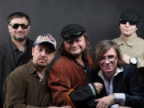

Советская и российская музыкальная группа, лидером является музыкант и поэт Вадим Степанцов.

* [8-е марта](8-е%20марта)
* [Анархистка](Анархистка)
* [Бухгалтер Иванов](Бухгалтер%20Иванов)
* [В Ростове у рынка центрального](В%20Ростове%20у%20рынка%20центрального)
* [Дьявольская месса](Дьявольская%20месса)
* [Есть только миг (2 вариант)](Есть%20только%20миг%20(2%20вариант))
* [Есть только миг](Есть%20только%20миг)
* [Импepия](Импepия)
* [Империя](Империя)
* [Клинический Рок-н-Ролл](Клинический%20Рок-н-Ролл)
* [Козаче](Козаче)
* [Лола](Лола)
* [Нeвecтa Cepeжинa](Нeвecтa%20Cepeжинa)
* [Невеста Сережина](Невеста%20Сережина)
* [Осень в поле рыскает](Осень%20в%20поле%20рыскает)
* [Пионервожатая](Пионервожатая)
* [Раздень меня по телефону](Раздень%20меня%20по%20телефону)
* [Таня, Танюша](Таня,%20Танюша)
* [Хуанита](Хуанита)
* [Чесотка](Чесотка)