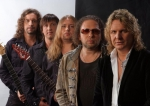

Российская музыкальная группа, основанная в 1997 году. Исполняет песни в стиле романса. Основатель группы и первый исполнитель бизнесмен Владимир Жечков.

* [А в чистом поле](А%20в%20чистом%20поле)
* [Без тебя не могу](Без%20тебя%20не%20могу)
* [Горький мед](Горький%20мед)
* [Как упоительны в России вечера](Как%20упоительны%20в%20России%20вечера)
* [Когда ты вернешься](Когда%20ты%20вернешься)
* [Любовь такая](Любовь%20такая)
* [Потому что нельзя...](Потому%20что%20нельзя...)
* [Слепой сын](Слепой%20сын)