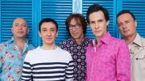

Советская и российская поп-рок группа из Москвы, образованная в 1983 гитаристом и композитором Евгением Хавтаном.

* [20-й век](20-й%20век)
* [2х2=4](2х2=4)
* [7 тысяч над землей](7%20тысяч%20над%20землей)
* [Автомобиль](Автомобиль)
* [Ах, эта девчонка... (2 вариант)](Ах,%20эта%20девчонка...%20(2%20вариант))
* [Ах, эта девчонка... (3 вариант)](Ах,%20эта%20девчонка...%20(3%20вариант))
* [Ах, эта девчонка...](Ах,%20эта%20девчонка...)
* [Аэроплан](Аэроплан)
* [Блюз голубой луны](Блюз%20голубой%20луны)
* [Буги-автостоп](Буги-автостоп)
* [Будь со мной](Будь%20со%20мной)
* [В логичном мире](В%20логичном%20мире)
* [В пятницу вечером](В%20пятницу%20вечером)
* [В чем дело](В%20чем%20дело)
* [Вася](Вася)
* [Вера, Наджеда, Любовь](Вера,%20Наджеда,%20Любовь)
* [Верю я](Верю%20я)
* [Ветер знает](Ветер%20знает)
* [Вот и все (2 вариант)](Вот%20и%20все%20(2%20вариант))
* [Вот и все](Вот%20и%20все)
* [Вот и всё](Вот%20и%20всё)
* [Выше всех](Выше%20всех)
* [Гангстер любви](Гангстер%20любви)
* [Девочка](Девочка)
* [Девчонка 16-ти лет](Девчонка%2016-ти%20лет)
* [Держись, пижон](Держись,%20пижон)
* [Джамайка (Giamaica)](Джамайка%20(Giamaica))
* [До свидания](До%20свидания)
* [Добрый вечер, Москва](Добрый%20вечер,%20Москва)
* [Дождь и ладонь](Дождь%20и%20ладонь)
* [Доктор ночь](Доктор%20ночь)
* [Дорога в облака (2 вариант)](Дорога%20в%20облака%20(2%20вариант))
* [Дорога в облака (3 вариант)](Дорога%20в%20облака%20(3%20вариант))
* [Дорога в облака](Дорога%20в%20облака)
* [Если бы на Марсе](Если%20бы%20на%20Марсе)
* [Жар-птица (2 вариант)](Жар-птица%20(2%20вариант))
* [Жар-птица](Жар-птица)
* [Желтые ботинки](Желтые%20ботинки)
* [Замок из песка](Замок%20из%20песка)
* [Заполярный твист](Заполярный%20твист)
* [Зачем родился ты](Зачем%20родился%20ты)
* [Звездный каталог](Звездный%20каталог)
* [Звёздный шейк](Звёздный%20шейк)
* [Как быть](Как%20быть)
* [Как жаль, что ты сегодня не со мной](Как%20жаль,%20что%20ты%20сегодня%20не%20со%20мной)
* [Как жаль](Как%20жаль)
* [Клоун](Клоун)
* [Ключ на старт](Ключ%20на%20старт)
* [Король Оранжевое Лето](Король%20Оранжевое%20Лето)
* [Король курорта](Король%20курорта)
* [Космический рок-н-ролл](Космический%20рок-н-ролл)
* [Кошки](Кошки)
* [Красная стрела](Красная%20стрела)
* [Красный свет](Красный%20свет)
* [Крепко спит город](Крепко%20спит%20город)
* [Кто знает](Кто%20знает)
* [Ленинградский рок-н-ролл](Ленинградский%20рок-н-ролл)
* [Лунатик](Лунатик)
* [Лучший город Земли](Лучший%20город%20Земли)
* [Любите, девушки... (2 вариант)](Любите,%20девушки...%20(2%20вариант))
* [Любите, девушки... (3 вариант)](Любите,%20девушки...%20(3%20вариант))
* [Любите, девушки... (4 вариант)](Любите,%20девушки...%20(4%20вариант))
* [Любите, девушки...](Любите,%20девушки...)
* [Любовь не горит](Любовь%20не%20горит)
* [Маленький помощник весны](Маленький%20помощник%20весны)
* [Марсианка](Марсианка)
* [Мауна Лоа](Мауна%20Лоа)
* [Медицинский институт](Медицинский%20институт)
* [Мне грустно и легко](Мне%20грустно%20и%20легко)
* [Молодость](Молодость)
* [Московский бит](Московский%20бит)
* [На планете Гамма](На%20планете%20Гамма)
* [На шелковом парашюте](На%20шелковом%20парашюте)
* [Надо спешить туда](Надо%20спешить%20туда)
* [Наташа](Наташа)
* [Не с тобой](Не%20с%20тобой)
* [Небо](Небо)
* [Незнакомка](Незнакомка)
* [Неспящие](Неспящие)
* [Новый герой](Новый%20герой)
* [Ночной Экспресс](Ночной%20Экспресс)
* [О любви моей](О%20любви%20моей)
* [Однажды](Однажды)
* [Оранжевый галстук](Оранжевый%20галстук)
* [Останься ещё на час](Останься%20ещё%20на%20час)
* [Открытие](Открытие)
* [Парень в лиловом Сомбреро](Парень%20в%20лиловом%20Сомбреро)
* [Перо Жар-птицы](Перо%20Жар-птицы)
* [Песня облаков](Песня%20облаков)
* [Пижон](Пижон)
* [Пилот 12-45](Пилот%2012-45)
* [По волнам](По%20волнам)
* [Под куполом звёзд](Под%20куполом%20звёзд)
* [Полет](Полет)
* [Просто так](Просто%20так)
* [Пусть не кончается дождь](Пусть%20не%20кончается%20дождь)
* [Рио](Рио)
* [Розы](Розы)
* [С днём рождения](С%20днём%20рождения)
* [Север и Юг](Север%20и%20Юг)
* [Северный полюс](Северный%20полюс)
* [Серенада 2000](Серенада%202000)
* [Синеглазый мальчик](Синеглазый%20мальчик)
* [Синее, синее небо (2 вариант)](Синее,%20синее%20небо%20(2%20вариант))
* [Синее, синее небо](Синее,%20синее%20небо)
* [Скорый поезд](Скорый%20поезд)
* [Сны](Сны)
* [Сон-обман](Сон-обман)
* [Старый отель](Старый%20отель)
* [Стильный оранжевый галстук](Стильный%20оранжевый%20галстук)
* [Страна цветов](Страна%20цветов)
* [Стрижи](Стрижи)
* [Там, где сбываются сны](Там,%20где%20сбываются%20сны)
* [Там, так далеко](Там,%20так%20далеко)
* [Тише, послушай](Тише,%20послушай)
* [Тот, кто верит](Тот,%20кто%20верит)
* [Ты, с высоты...](Ты,%20с%20высоты...)
* [Хмурые серые тучи](Хмурые%20серые%20тучи)
* [Черный кот (2 вариант)](Черный%20кот%20(2%20вариант))
* [Черный кот](Черный%20кот)
* [Чудесная страна](Чудесная%20страна)
* [Это за окном рассвет](Это%20за%20окном%20рассвет)
* [Этот город](Этот%20город)
* [Я вернусь](Я%20вернусь)
* [Я то, что надо](Я%20то,%20что%20надо)
* [Я хотел бы ветpом быть 2](Я%20хотел%20бы%20ветpом%20быть%202)