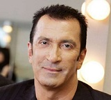

Советский и российский певец, артист, актёр, музыкант, композитор. Народный артист Российской Федерации. Бывший участник группы "Веселые ребята".

* [В Париже ночь (2)](В%20Париже%20ночь%20(2))
* [В Париже ночь](В%20Париже%20ночь)
* [Горький мед](Горький%20мед)
* [Гостиница](Гостиница)
* [Любoвь нa двoиx](Любoвь%20нa%20двoиx)
* [Нe в тoм вaгoнe](Нe%20в%20тoм%20вaгoнe)
* [Пaдaют лиcтья](Пaдaют%20лиcтья)
* [Потанцуй со мной](Потанцуй%20со%20мной)
* [Пустой бамбук](Пустой%20бамбук)
* [Я скучаю по Москве](Я%20скучаю%20по%20Москве)