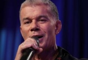

Российский популярный эстрадный певец. Народный артист России.

* [Белый снег](Белый%20снег)
* [Вперед Россия](Вперед%20Россия)
* [Детство мое](Детство%20мое)
* [Дождись меня (2)](Дождись%20меня%20(2))
* [Дождись меня](Дождись%20меня)
* [Доля](Доля)
* [Мама](Мама)
* [Мои ясные дни (2)](Мои%20ясные%20дни%20(2))
* [Мои ясные дни](Мои%20ясные%20дни)
* [Мой храм](Мой%20храм)
* [На заре](На%20заре)
* [Офицеры](Офицеры)
* [Петербург](Петербург)
* [Прощай](Прощай)
* [Путана](Путана)
* [Родники](Родники)
* [Свежий ветер](Свежий%20ветер)
* [Туман](Туман)
* [Эскадрон](Эскадрон)