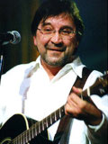

Советская и российская рок-группа Юрия Шевчука.

* [180 сантиметров назад](180%20сантиметров%20назад)
* [180 см](180%20см)
* [2020](2020)
* [25](25)
* [Ignatius Song (Это твоя Родина, сынок)](Ignatius%20Song%20(Это%20твоя%20Родина,%20сынок))
* [Styx (Время начало рок-н-ролла ушло)](Styx%20(Время%20начало%20рок-н-ролла%20ушло))
* [Styх](Styх)
* [While my guitar gently weeps](While%20my%20guitar%20gently%20weeps)
* [Агидель (Белая река)](Агидель%20(Белая%20река))
* [Адам и Ева](Адам%20и%20Ева)
* [Актриса Весна](Актриса%20Весна)
* [Антонина обернулась](Антонина%20обернулась)
* [Апокалипсис](Апокалипсис)
* [Башкирский мед](Башкирский%20мед)
* [Беги туда](Беги%20туда)
* [Беда](Беда)
* [Безжизненный край](Безжизненный%20край)
* [Белая Птица](Белая%20Птица)
* [Белая ночь](Белая%20ночь)
* [Белая река](Белая%20река)
* [Блок Rak'In Roллоув](Блок%20Rak'In%20Roллоув)
* [Блюз](Блюз)
* [Большая женщина](Большая%20женщина)
* [Бродяга и любовь](Бродяга%20и%20любовь)
* [Бродяга](Бродяга)
* [В бой](В%20бой)
* [В поисках счастья](В%20поисках%20счастья)
* [В последнюю осень](В%20последнюю%20осень)
* [В ресторане](В%20ресторане)
* [В час, когда усну](В%20час,%20когда%20усну)
* [В это](В%20это)
* [Вальс](Вальс)
* [Век](Век)
* [Ветер](Ветер)
* [Ветры с тобой](Ветры%20с%20тобой)
* [Ветры](Ветры)
* [Вечер](Вечер)
* [Война бывает разная](Война%20бывает%20разная)
* [Вороны](Вороны)
* [Вот сижу я у окна](Вот%20сижу%20я%20у%20окна)
* [Время](Время)
* [Все идет своим чередом](Все%20идет%20своим%20чередом)
* [Всё хорошо](Всё%20хорошо)
* [Всё, хватит](Всё,%20хватит)
* [Герой](Герой)
* [Глазища](Глазища)
* [Гляди пешком](Гляди%20пешком)
* [Гори, Гори Моя Звезда](Гори,%20Гори%20Моя%20Звезда)
* [Гори, гори, моя звезда](Гори,%20гори,%20моя%20звезда)
* [Город без окон](Город%20без%20окон)
* [Господь нас уважает](Господь%20нас%20уважает)
* [Гражданка](Гражданка)
* [Давайте что-нибудь придумаем](Давайте%20что-нибудь%20придумаем)
* [Дай хоть на секунду испытать святую милость (О творчестве)](Дай%20хоть%20на%20секунду%20испытать%20святую%20милость%20(О%20творчестве))
* [Далеко, далеко](Далеко,%20далеко)
* [Далеко-далеко](Далеко-далеко)
* [Далёко от мест незнакомых](Далёко%20от%20мест%20незнакомых)
* [Демон](Демон)
* [Депутат Прокопенко](Депутат%20Прокопенко)
* [Деревенщина](Деревенщина)
* [Дождь](Дождь)
* [Дом](Дом)
* [Донести синь](Донести%20синь)
* [Дорога, ты дорога](Дорога,%20ты%20дорога)
* [Дорога](Дорога)
* [Дороги](Дороги)
* [Дорожная](Дорожная)
* [Дохлая собака](Дохлая%20собака)
* [Духи](Духи)
* [Дым](Дым)
* [Если я заболею](Если%20я%20заболею)
* [Железнодорожник](Железнодорожник)
* [Живой](Живой)
* [Живу в назойливом мире](Живу%20в%20назойливом%20мире)
* [Жизнь на месте](Жизнь%20на%20месте)
* [За 50 копеек](За%2050%20копеек)
* [За высокой горой](За%20высокой%20горой)
* [Забери эту ночь](Забери%20эту%20ночь)
* [Закопали штыки](Закопали%20штыки)
* [Звезда](Звезда)
* [Змей Петров](Змей%20Петров)
* [И не думал я с ней танцевать...](И%20не%20думал%20я%20с%20ней%20танцевать...)
* [Инопланетянин](Инопланетянин)
* [Интервью](Интервью)
* [История](История)
* [К чему реке...](К%20чему%20реке...)
* [К черту](К%20черту)
* [Казачья](Казачья)
* [Капитан Колесников](Капитан%20Колесников)
* [Кладбище](Кладбище)
* [Когда един](Когда%20един)
* [Когда закончится нефть](Когда%20закончится%20нефть)
* [Компромисс](Компромисс)
* [Конвейер](Конвейер)
* [Конец света](Конец%20света)
* [Контрреволюция](Контрреволюция)
* [Коронована луной](Коронована%20луной)
* [Крыса](Крыса)
* [Ларек (Бородино)](Ларек%20(Бородино))
* [Ледниковый Период](Ледниковый%20Период)
* [Ленинград](Ленинград)
* [Летели облака](Летели%20облака)
* [Лихо](Лихо)
* [Любовь в мире есть (Игра)](Любовь%20в%20мире%20есть%20(Игра))
* [Любовь, подумай обо мне](Любовь,%20подумай%20обо%20мне)
* [Любовь](Любовь)
* [Мальчик-слепой](Мальчик-слепой)
* [Мальчики-мажоры](Мальчики-мажоры)
* [Мама, Это Рок-н-ролл](Мама,%20Это%20Рок-н-ролл)
* [Мама, разбуди меня вечером](Мама,%20разбуди%20меня%20вечером)
* [Мама, я любера люблю](Мама,%20я%20любера%20люблю)
* [Марина](Марина)
* [Мертвый город. Рождество...](Мертвый%20город.%20Рождество...)
* [Мертвый город. Рождество.](Мертвый%20город.%20Рождество.)
* [Мертвый город. Рождество](Мертвый%20город.%20Рождество)
* [Метель (2)](Метель%20(2))
* [Метель (Коронована луной)](Метель%20(Коронована%20луной))
* [Метель Августа (Новое сердце)](Метель%20Августа%20(Новое%20сердце))
* [Метель августа](Метель%20августа)
* [Метель](Метель)
* [Милиционер в рок-клубе](Милиционер%20в%20рок-клубе)
* [Мир номер ноль](Мир%20номер%20ноль)
* [Мир тесен](Мир%20тесен)
* [Мне обычно ночами не спится](Мне%20обычно%20ночами%20не%20спится)
* [Мог бы](Мог%20бы)
* [Монолог в ванной](Монолог%20в%20ванной)
* [Монолог в пивной](Монолог%20в%20пивной)
* [Москва - жара](Москва%20-%20жара)
* [Московская Барыня](Московская%20Барыня)
* [Мы из Уфы](Мы%20из%20Уфы)
* [Мы](Мы)
* [На небе вороны](На%20небе%20вороны)
* [На фестивале...](На%20фестивале...)
* [Наполним небо добротой](Наполним%20небо%20добротой)
* [Нас с ним в аду война свела... (Господь нас уважает)](Нас%20с%20ним%20в%20аду%20война%20свела...%20(Господь%20нас%20уважает))
* [Не Стреляй](Не%20Стреляй)
* [Небо на земле](Небо%20на%20земле)
* [Небо над озером](Небо%20над%20озером)
* [Нежность](Нежность)
* [Ни шагу назад](Ни%20шагу%20назад)
* [Новая жизнь](Новая%20жизнь)
* [Новое сердце](Новое%20сердце)
* [Новые блокадники](Новые%20блокадники)
* [Ночная пьеса](Ночная%20пьеса)
* [Ночь Людмила](Ночь%20Людмила)
* [Ночь-Людмила](Ночь-Людмила)
* [Ночь](Ночь)
* [Обдолбанный Вася](Обдолбанный%20Вася)
* [Облом](Облом)
* [Одноразовая жизнь](Одноразовая%20жизнь)
* [Он](Он)
* [Она](Она)
* [Онанист](Онанист)
* [Они играют жесткий рок (Монолог в Сайгоне)](Они%20играют%20жесткий%20рок%20(Монолог%20в%20Сайгоне))
* [Осенняя](Осенняя)
* [Осень - мертвые дожди](Осень%20-%20мертвые%20дожди)
* [Осень](Осень)
* [Открылся у нас новый бар](Открылся%20у%20нас%20новый%20бар)
* [Памятник (Пушкину)](Памятник%20(Пушкину))
* [Париж](Париж)
* [Пасха](Пасха)
* [Пацаны](Пацаны)
* [Перестроище](Перестроище)
* [Периферия (bonus track)](Периферия%20(bonus%20track))
* [Периферия](Периферия)
* [Песня невеселая](Песня%20невеселая)
* [Песня о людях героических профессий](Песня%20о%20людях%20героических%20профессий)
* [Питер](Питер)
* [Пластун](Пластун)
* [Победа](Победа)
* [Подарок](Подарок)
* [Поколение Pepsi](Поколение%20Pepsi)
* [Поколение](Поколение)
* [Полная Луна](Полная%20Луна)
* [Получите по награде](Получите%20по%20награде)
* [Понедельник](Понедельник)
* [Понимающее сердце](Понимающее%20сердце)
* [Попса](Попса)
* [Посвящение Сергею Есенину](Посвящение%20Сергею%20Есенину)
* [Последний Адам](Последний%20Адам)
* [Последняя осень](Последняя%20осень)
* [Пост-интеллигент](Пост-интеллигент)
* [Потолок](Потолок)
* [Поэт](Поэт)
* [Правда на правду](Правда%20на%20правду)
* [Предчувствие Гражданской войны](Предчувствие%20Гражданской%20войны)
* [Прекpасная любовь](Прекpасная%20любовь)
* [Прекрасная любовь](Прекрасная%20любовь)
* [Привет М...](Привет%20М...)
* [Пропавший без вести](Пропавший%20без%20вести)
* [Просвистела](Просвистела)
* [Псалм (12-й век)](Псалм%20(12-й%20век))
* [Работал долго я и вот... (История)](Работал%20долго%20я%20и%20вот...%20(История))
* [Рабочий квартал](Рабочий%20квартал)
* [Разговор на войне](Разговор%20на%20войне)
* [Расстреляли рассветами](Расстреляли%20рассветами)
* [Революция](Революция)
* [Реклама Каратэ](Реклама%20Каратэ)
* [Родина](Родина)
* [Рожденный в СССР](Рожденный%20в%20СССР)
* [Рождественская](Рождественская)
* [Рождество](Рождество)
* [Рок-н-ролл дядя Миша](Рок-н-ролл%20дядя%20Миша)
* [Российское танго](Российское%20танго)
* [Россия](Россия)
* [Россияне](Россияне)
* [Русский рок](Русский%20рок)
* [Рыба](Рыба)
* [С рождеством](С%20рождеством)
* [Свинья на радуге](Свинья%20на%20радуге)
* [Свобода](Свобода)
* [Север (Безжизненный край)](Север%20(Безжизненный%20край))
* [Седьмая глава](Седьмая%20глава)
* [Сижу на жестком табурете](Сижу%20на%20жестком%20табурете)
* [Сказка](Сказка)
* [Сны (Похороны войны)](Сны%20(Похороны%20войны))
* [Спой, БГ](Спой,%20БГ)
* [Страна-лейтенант](Страна-лейтенант)
* [Счастливый день](Счастливый%20день)
* [Там где тьма стоит](Там%20где%20тьма%20стоит)
* [Танго войны](Танго%20войны)
* [Террорист](Террорист)
* [Третьи сутки воет собака](Третьи%20сутки%20воет%20собака)
* [Три черные кошки](Три%20черные%20кошки)
* [Тусовщик](Тусовщик)
* [Ты будишь вечно со мной...](Ты%20будишь%20вечно%20со%20мной...)
* [Ты не один](Ты%20не%20один)
* [У тебя есть сын](У%20тебя%20есть%20сын)
* [Фестиваль](Фестиваль)
* [Фома](Фома)
* [Фонограммщик](Фонограммщик)
* [Фонограмщик](Фонограмщик)
* [Харакири](Харакири)
* [Хиппаны](Хиппаны)
* [Хич (Дорога)](Хич%20(Дорога))
* [Хоровая народная](Хоровая%20народная)
* [Храм](Храм)
* [Церковь](Церковь)
* [Частушки](Частушки)
* [Черно-белые танцы](Черно-белые%20танцы)
* [Черный пес Петербург](Черный%20пес%20Петербург)
* [Четыре окна](Четыре%20окна)
* [Что такое осень](Что%20такое%20осень)
* [Чудеса](Чудеса)
* [Чёрное солнце](Чёрное%20солнце)
* [Это вам (В час, когда усну)](Это%20вам%20(В%20час,%20когда%20усну))
* [Это вам (Черным вечером)](Это%20вам%20(Черным%20вечером))
* [Это все](Это%20все)
* [Эх, ночь...](Эх,%20ночь...)
* [Юго-западный ветер](Юго-западный%20ветер)
* [Я еду к тебе](Я%20еду%20к%20тебе)
* [Я завтра брошу пить](Я%20завтра%20брошу%20пить)
* [Я зажег в церквях все свечи](Я%20зажег%20в%20церквях%20все%20свечи)
* [Я остановил время](Я%20остановил%20время)
* [Я пил вчера у генерала ФСБ](Я%20пил%20вчера%20у%20генерала%20ФСБ)
* [Я получил эту роль](Я%20получил%20эту%20роль)
* [Я у вас](Я%20у%20вас)