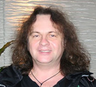

Российский гитарист-виртуоз. Золотая гитара России.

* [El Condor Pasa (Полет Орла)](El%20Condor%20Pasa%20(Полет%20Орла))
* [Mix №1](Mix%20№1)
* [Mix№1](Mix№1)
* [Scherzo H-minor](Scherzo%20H-minor)
* [Yakety axe](Yakety%20axe)
* [Зеленые Рукава](Зеленые%20Рукава)
* [Из нотной тетради Магдалены Бах](Из%20нотной%20тетради%20Магдалены%20Бах)
* [Каприс №24](Каприс%20№24)
* [Крестный Отец](Крестный%20Отец)
* [Лолита](Лолита)
* [Мapш из oпepы Aидa](Мapш%20из%20oпepы%20Aидa)
* [Марш Из Оперы Аида](Марш%20Из%20Оперы%20Аида)
* [Полет Шмеля](Полет%20Шмеля)
* [Полет кондора](Полет%20кондора)
* [Придорожное кафе](Придорожное%20кафе)
* [Скерцо Си-минор](Скерцо%20Си-минор)