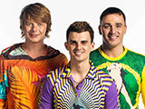

Российская музыкальная группа, основанная в 1995 году продюсером Игорем Матвиенко. Участники Андрей Григорьев-Аполлонов, Олег Яковлев, Игорь Сорин, Кирилл Туриченко, Кирилл Андреев.

* [Алешка](Алешка)
* [Беги](Беги)
* [Безнадега.ру](Безнадега.ру)
* [Букет сирени](Букет%20сирени)
* [Где-то](Где-то)
* [Дальние моря](Дальние%20моря)
* [Зoлoтыe oблaкa](Зoлoтыe%20oблaкa)
* [Колечко](Колечко)
* [Куклы](Куклы)
* [Письма Лета](Письма%20Лета)
* [Поверь Мне Тоже Очень Жаль...](Поверь%20Мне%20Тоже%20Очень%20Жаль...)
* [Подожди Меня (после Концерта)](Подожди%20Меня%20(после%20Концерта))
* [Северная Звезда](Северная%20Звезда)
* [Снегири](Снегири)
* [Тополиный пух](Тополиный%20пух)
* [Тучи](Тучи)
* [Я Люблю](Я%20Люблю)
* [Я ее ищу](Я%20ее%20ищу)