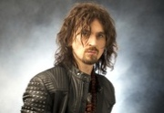

Российский музыкант, певец, композитор. Сын Игоря Талькова-старшего.

* [Братские народы](Братские%20народы)
* [Ей](Ей)
* [Зеркало](Зеркало)
* [Имею честь](Имею%20честь)
* [Свободные люди](Свободные%20люди)
* [Седьмой день](Седьмой%20день)
* [Украина и Россия](Украина%20и%20Россия)
* [Хватит](Хватит)