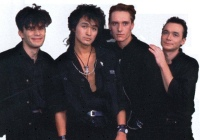

Одна из самых популярных советских рок-групп 1980-х годов.  
Лидер и автор практически всех текстов и музыки Виктор Цой.  
Кроме него в состав группы входили гитаристы Алексей Рыбин и Юрий Каспарян,  
басисты Юрий Титов и Игорь Тихомиров, барабанщик Георгий Гурьянов.

* [А мне не нpавится гоpод Москва](А%20мне%20не%20нpавится%20гоpод%20Москва)
* [Алюминиевые Огурцы (2 вариант)](Алюминиевые%20Огурцы%20(2%20вариант))
* [Алюминиевые огурцы](Алюминиевые%20огурцы)
* [Анархия](Анархия)
* [Апрель](Апрель)
* [Ария мистера Х](Ария%20мистера%20Х)
* [Асфальт](Асфальт)
* [Атаман](Атаман)
* [Без десяти (2 вариант)](Без%20десяти%20(2%20вариант))
* [Без десяти](Без%20десяти)
* [Бездельник #1](Бездельник%20#1)
* [Бездельник #2](Бездельник%20#2)
* [Бездельник-2](Бездельник-2)
* [Безъядерная зона](Безъядерная%20зона)
* [Белый День](Белый%20День)
* [Блюз Артёму Троицкому](Блюз%20Артёму%20Троицкому)
* [Бошетунмай](Бошетунмай)
* [Братская любовь](Братская%20любовь)
* [В наших глазах](В%20наших%20глазах)
* [В поисках сюжета](В%20поисках%20сюжета)
* [Вера-Надежда-Любовь](Вера-Надежда-Любовь)
* [Верь мне](Верь%20мне)
* [Весна](Весна)
* [Видели ночь](Видели%20ночь)
* [Водка искусный напиток...](Водка%20искусный%20напиток...)
* [Водка — вкусный напиток](Водка%20—%20вкусный%20напиток)
* [Война](Война)
* [Вопрос](Вопрос)
* [Восьмиклассница](Восьмиклассница)
* [Время есть, а денег нет](Время%20есть,%20а%20денег%20нет)
* [Генерал](Генерал)
* [Город](Город)
* [Городской мотылек](Городской%20мотылек)
* [Гость](Гость)
* [Группа крови](Группа%20крови)
* [Дальше действовать будем мы](Дальше%20действовать%20будем%20мы)
* [Девушка](Девушка)
* [Дерево](Дерево)
* [Дети проходных дворов](Дети%20проходных%20дворов)
* [Дождь для нас](Дождь%20для%20нас)
* [Жизнь в стеклах](Жизнь%20в%20стеклах)
* [Завтра война](Завтра%20война)
* [Закрой за мной дверь, я ухожу](Закрой%20за%20мной%20дверь,%20я%20ухожу)
* [Застоялся мой поезд...](Застоялся%20мой%20поезд...)
* [Звезда (Вера - надежда - любовь)](Звезда%20(Вера%20-%20надежда%20-%20любовь))
* [Звезда по имени Солнце](Звезда%20по%20имени%20Солнце)
* [Звезда](Звезда)
* [Звезды останутся здесь](Звезды%20останутся%20здесь)
* [Звери](Звери)
* [Игра](Игра)
* [Каждую ночь](Каждую%20ночь)
* [Камчатка](Камчатка)
* [Когда твоя девушка больна](Когда%20твоя%20девушка%20больна)
* [Когда-то ты был битником](Когда-то%20ты%20был%20битником)
* [Кончится лето](Кончится%20лето)
* [Красно-желтые дни](Красно-желтые%20дни)
* [Кукушка](Кукушка)
* [Лауреат](Лауреат)
* [Легенда](Легенда)
* [Лето](Лето)
* [Любовь - это не шутка](Любовь%20-%20это%20не%20шутка)
* [Малыш](Малыш)
* [Мама Анархия](Мама%20Анархия)
* [Мама, мы все сошли с ума](Мама,%20мы%20все%20сошли%20с%20ума)
* [Место для шага вперед](Место%20для%20шага%20вперед)
* [Мне всё равно](Мне%20всё%20равно)
* [Мне не нравится город Москва](Мне%20не%20нравится%20город%20Москва)
* [Мои друзья](Мои%20друзья)
* [Моё настроение](Моё%20настроение)
* [Музыка волн](Музыка%20волн)
* [Муравейник](Муравейник)
* [Мы хотим танцевать](Мы%20хотим%20танцевать)
* [На кухне](На%20кухне)
* [Над полями туман...](Над%20полями%20туман...)
* [Нам с тобой](Нам%20с%20тобой)
* [Начинается новый день...](Начинается%20новый%20день...)
* [Невеселая песня](Невеселая%20песня)
* [Ночной грабитель](Ночной%20грабитель)
* [Ночь](Ночь)
* [Однaжды](Однaжды)
* [Около семи утра](Около%20семи%20утра)
* [Они сказали Надо пройти](Они%20сказали%20Надо%20пройти)
* [Осень (Песня для БГ)](Осень%20(Песня%20для%20БГ))
* [Пачка сигарет (табы)](Пачка%20сигарет%20(табы))
* [Пачка сигарет](Пачка%20сигарет)
* [Перемен](Перемен)
* [Песня без слов](Песня%20без%20слов)
* [Песня для БГ](Песня%20для%20БГ)
* [Песня для МБ](Песня%20для%20МБ)
* [Песня кочегарам](Песня%20кочегарам)
* [Печаль](Печаль)
* [Подросток](Подросток)
* [Попробуй спеть вместе со мной](Попробуй%20спеть%20вместе%20со%20мной)
* [Пора](Пора)
* [Последний герой](Последний%20герой)
* [Прогулка романтика](Прогулка%20романтика)
* [Проснись](Проснись)
* [Просто хочешь ты знать](Просто%20хочешь%20ты%20знать)
* [Прохожий](Прохожий)
* [Разреши мне](Разреши%20мне)
* [Раньше в твоих глазах...](Раньше%20в%20твоих%20глазах...)
* [Растопите снег](Растопите%20снег)
* [Рядом со мной](Рядом%20со%20мной)
* [Саша](Саша)
* [Сельва](Сельва)
* [Серая тень](Серая%20тень)
* [Ситар играл](Ситар%20играл)
* [Сказка](Сказка)
* [Скоро будет зима](Скоро%20будет%20зима)
* [Скоро кончится лето](Скоро%20кончится%20лето)
* [Следи за собой](Следи%20за%20собой)
* [Словно тень бегу куда-то я...](Словно%20тень%20бегу%20куда-то%20я...)
* [Солнечные дни](Солнечные%20дни)
* [Сосны на морском берегу](Сосны%20на%20морском%20берегу)
* [Спокойная ночь](Спокойная%20ночь)
* [Стань птицей...](Стань%20птицей...)
* [Стань птицей](Стань%20птицей)
* [Странная сказка](Странная%20сказка)
* [Стук](Стук)
* [Сюжет для новой песни](Сюжет%20для%20новой%20песни)
* [Танец](Танец)
* [Танцуй со мной](Танцуй%20со%20мной)
* [Твой номер](Твой%20номер)
* [Транквилизатор](Транквилизатор)
* [Троллейбус](Троллейбус)
* [Ты был когда-то битником](Ты%20был%20когда-то%20битником)
* [Ты выглядишь так несовременно рядом со мной](Ты%20выглядишь%20так%20несовременно%20рядом%20со%20мной)
* [Ты выглядишь так несовременно](Ты%20выглядишь%20так%20несовременно)
* [Ты есть](Ты%20есть)
* [Ты играла со мной](Ты%20играла%20со%20мной)
* [Ты мог бы...](Ты%20мог%20бы...)
* [Ты обвела меня вокруг пальца](Ты%20обвела%20меня%20вокруг%20пальца)
* [Ты смотришь назад...](Ты%20смотришь%20назад...)
* [Уезжаю куда-то...](Уезжаю%20куда-то...)
* [Уходи](Уходи)
* [Фильмы](Фильмы)
* [Холодильник](Холодильник)
* [Хочу быть с тобой](Хочу%20быть%20с%20тобой)
* [Хочу перемен](Хочу%20перемен)
* [Черная река](Черная%20река)
* [Шаг вперед](Шаг%20вперед)
* [Электричка](Электричка)
* [Это - любовь](Это%20-%20любовь)
* [Это не любовь](Это%20не%20любовь)
* [Я - асфальт](Я%20-%20асфальт)
* [Я выключаю телевизор...](Я%20выключаю%20телевизор...)
* [Я иду по улице](Я%20иду%20по%20улице)
* [Я из тех](Я%20из%20тех)
* [Я объявляю свой дом](Я%20объявляю%20свой%20дом)
* [Я смотрю в окно мне дождь помыл стекло](Я%20смотрю%20в%20окно%20мне%20дождь%20помыл%20стекло)
* [Я хочу быть кочегаром](Я%20хочу%20быть%20кочегаром)
* [Я хочу быть с тобой](Я%20хочу%20быть%20с%20тобой)