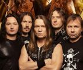

Одноименная российская рок-группа Валерия Кипелова, играющая в стиле хард-рок.

* [Castlevania](Castlevania)
* [Без Тебя](Без%20Тебя)
* [Бесы](Бесы)
* [Будем жить, мать Россия](Будем%20жить,%20мать%20Россия)
* [Вавилон](Вавилон)
* [Возьми Мое Сердце](Возьми%20Мое%20Сердце)
* [Вот и все дела](Вот%20и%20все%20дела)
* [Выпьем ещё](Выпьем%20ещё)
* [Дыханье тьмы](Дыханье%20тьмы)
* [Закат](Закат)
* [Здесь Куют Металл](Здесь%20Куют%20Металл)
* [Кто Ты](Кто%20Ты)
* [Матричный бог](Матричный%20бог)
* [Машина Смерти](Машина%20Смерти)
* [На распутье](На%20распутье)
* [Наважденье](Наважденье)
* [Не сейчас](Не%20сейчас)
* [Призрачный взвод](Призрачный%20взвод)
* [Пророк](Пророк)
* [Реки времен](Реки%20времен)
* [Свет дневной иссяк...](Свет%20дневной%20иссяк...)
* [Следуй за мной](Следуй%20за%20мной)
* [Смутное время](Смутное%20время)
* [Тореро](Тореро)
* [Я здесь](Я%20здесь)
* [Я свободен (2)](Я%20свободен%20(2))
* [Я свободен](Я%20свободен)