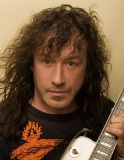

Советский и российский рок-музыкант, мультиинструменталист. Лидер группы "**Динамик**".

* [730 дней в году](730%20дней%20в%20году)
* [90-60-90](90-60-90)
* [Abracadabra](Abracadabra)
* [California Rain](California%20Rain)
* [Crazy About Rock'n'Roll](Crazy%20About%20Rock'n'Roll)
* [Dangerous World](Dangerous%20World)
* [Dirty Sounds](Dirty%20Sounds)
* [Every Little Love Songs](Every%20Little%20Love%20Songs)
* [Follow The Light](Follow%20The%20Light)
* [How Are You Doing Without Me](How%20Are%20You%20Doing%20Without%20Me)
* [I Don't Have To Look For You](I%20Don't%20Have%20To%20Look%20For%20You)
* [Kiss It Away](Kiss%20It%20Away)
* [Lonely Blues](Lonely%20Blues)
* [Loverguy](Loverguy)
* [Loving Any Time](Loving%20Any%20Time)
* [Mama (Tell Me What To Do)](Mama%20(Tell%20Me%20What%20To%20Do))
* [Music Of Your Footsteps](Music%20Of%20Your%20Footsteps)
* [Princes Of Love](Princes%20Of%20Love)
* [Resque Me](Resque%20Me)
* [The Last Flight To Freedom](The%20Last%20Flight%20To%20Freedom)
* [White Crosses](White%20Crosses)
* [XXI век](XXI%20век)
* [Автоответчик](Автоответчик)
* [Актриса](Актриса)
* [Алкоголик](Алкоголик)
* [Ангел мой](Ангел%20мой)
* [Баллада о королеве](Баллада%20о%20королеве)
* [Белая луна](Белая%20луна)
* [Белые дикие кони](Белые%20дикие%20кони)
* [Берег, которого нет](Берег,%20которого%20нет)
* [Берега](Берега)
* [Блеск в её глазах](Блеск%20в%20её%20глазах)
* [В поисках света](В%20поисках%20света)
* [Вечная ночь](Вечная%20ночь)
* [Влюблённый в музыку](Влюблённый%20в%20музыку)
* [Возьми меня](Возьми%20меня)
* [Волшебный плот](Волшебный%20плот)
* [Вспоминай, когда наступит май](Вспоминай,%20когда%20наступит%20май)
* [Всё, что я искал](Всё,%20что%20я%20искал)
* [Всё, что я хочу](Всё,%20что%20я%20хочу)
* [Вы так невинны...](Вы%20так%20невинны...)
* [Где ты была сегодня ночью](Где%20ты%20была%20сегодня%20ночью)
* [Гитара, гитара](Гитара,%20гитара)
* [Голос](Голос)
* [Горят огни](Горят%20огни)
* [Грешный ангел](Грешный%20ангел)
* [Грустная песня (Для чего я живу)](Грустная%20песня%20(Для%20чего%20я%20живу))
* [Давай не расставаться](Давай%20не%20расставаться)
* [Давай потанцуем](Давай%20потанцуем)
* [Далеко не залетай (Воробей)](Далеко%20не%20залетай%20(Воробей))
* [Далеко не залетай](Далеко%20не%20залетай)
* [Далёкий гром](Далёкий%20гром)
* [Две звезды](Две%20звезды)
* [Девочка моя](Девочка%20моя)
* [Девушка моя](Девушка%20моя)
* [Девушка со скрипкой](Девушка%20со%20скрипкой)
* [Делай физзарядку (39-й круг)](Делай%20физзарядку%20(39-й%20круг))
* [Депрессия](Депрессия)
* [Дикие цветы](Дикие%20цветы)
* [Дикий мёд](Дикий%20мёд)
* [Дитя радуги](Дитя%20радуги)
* [Дождь за окном](Дождь%20за%20окном)
* [Долгая ночь](Долгая%20ночь)
* [Душа (2 вариант)](Душа%20(2%20вариант))
* [Душа (Невольница Желтой Земли)](Душа%20(Невольница%20Желтой%20Земли))
* [Душа](Душа)
* [Единственная](Единственная)
* [Если б была ты моей](Если%20б%20была%20ты%20моей)
* [Если бы ты знала](Если%20бы%20ты%20знала)
* [Ещё вчера](Ещё%20вчера)
* [Ещё одна блондинка](Ещё%20одна%20блондинка)
* [Желтая дорога](Желтая%20дорога)
* [Женщины и рок-н-ролл](Женщины%20и%20рок-н-ролл)
* [Жить в мечтах не запретишь](Жить%20в%20мечтах%20не%20запретишь)
* [Заколдован](Заколдован)
* [Зачем уходишь ты](Зачем%20уходишь%20ты)
* [Зачем я так люблю](Зачем%20я%20так%20люблю)
* [Золотая карусель (Эти белые цветы)](Золотая%20карусель%20(Эти%20белые%20цветы))
* [Как ты живёшь без меня](Как%20ты%20живёшь%20без%20меня)
* [Капитан](Капитан)
* [Кикимора](Кикимора)
* [Когда меня ты позовёшь](Когда%20меня%20ты%20позовёшь)
* [Когда я оживу](Когда%20я%20оживу)
* [Когда я стану другим](Когда%20я%20стану%20другим)
* [Коломбина](Коломбина)
* [Королева красоты](Королева%20красоты)
* [Кружит листва](Кружит%20листва)
* [Крыса](Крыса)
* [Кто не успел, тот опоздал](Кто%20не%20успел,%20тот%20опоздал)
* [Лед слезы льет (2 вариант)](Лед%20слезы%20льет%20(2%20вариант))
* [Лед слезы льет](Лед%20слезы%20льет)
* [Лекарство от любви](Лекарство%20от%20любви)
* [Летом и зимою](Летом%20и%20зимою)
* [Ливень](Ливень)
* [Любовь (Люболь)](Любовь%20(Люболь))
* [Любовь и деньги](Любовь%20и%20деньги)
* [Любовь](Любовь)
* [Лёд слёзы льёт](Лёд%20слёзы%20льёт)
* [Макинтош](Макинтош)
* [Маленький дьявол](Маленький%20дьявол)
* [Мама купила мне гитару](Мама%20купила%20мне%20гитару)
* [Мама, я попал в беду (2 вариант)](Мама,%20я%20попал%20в%20беду%20(2%20вариант))
* [Мама, я попал в беду](Мама,%20я%20попал%20в%20беду)
* [Мария, сладкая Мария](Мария,%20сладкая%20Мария)
* [Медовый месяц](Медовый%20месяц)
* [Мелодия любви](Мелодия%20любви)
* [Менестрели](Менестрели)
* [Мечты](Мечты)
* [Мне стены говорят](Мне%20стены%20говорят)
* [Мне тебя не надо больше искать](Мне%20тебя%20не%20надо%20больше%20искать)
* [Московский дизель](Московский%20дизель)
* [Мотоцикл](Мотоцикл)
* [Моя гитара](Моя%20гитара)
* [Моя любовь](Моя%20любовь)
* [Моя подруга Удача](Моя%20подруга%20Удача)
* [Моя соперница гитара](Моя%20соперница%20гитара)
* [Музыка в моей душе](Музыка%20в%20моей%20душе)
* [Музыка твоих шагов](Музыка%20твоих%20шагов)
* [Музыка телеграфных проводов](Музыка%20телеграфных%20проводов)
* [Музыканты (В Воскресный день)](Музыканты%20(В%20Воскресный%20день))
* [Мы вместе летали](Мы%20вместе%20летали)
* [Мячик (2 вариант)](Мячик%20(2%20вариант))
* [Мячик](Мячик)
* [На краю земли](На%20краю%20земли)
* [На пляже (Плещет волна)](На%20пляже%20(Плещет%20волна))
* [Надежда чайкой летит](Надежда%20чайкой%20летит)
* [Надо же](Надо%20же)
* [Наши дни](Наши%20дни)
* [Не грусти, не жалей](Не%20грусти,%20не%20жалей)
* [Не знаю больше я](Не%20знаю%20больше%20я)
* [Не сбивай меня с дороги](Не%20сбивай%20меня%20с%20дороги)
* [Небеса](Небеса)
* [Небесное притяжение (2 вариант)](Небесное%20притяжение%20(2%20вариант))
* [Небесное притяжение](Небесное%20притяжение)
* [Неведомая даль](Неведомая%20даль)
* [Невиновен](Невиновен)
* [Некогда](Некогда)
* [Немного веры](Немного%20веры)
* [Ненавижу тебя](Ненавижу%20тебя)
* [Нет, я не верю](Нет,%20я%20не%20верю)
* [О чём-то лучшем](О%20чём-то%20лучшем)
* [Огонь (Обойдёт стороной суета)](Огонь%20(Обойдёт%20стороной%20суета))
* [Огонь](Огонь)
* [Огонёк](Огонёк)
* [Озаренье](Озаренье)
* [Она не волшебница](Она%20не%20волшебница)
* [Она так хороша](Она%20так%20хороша)
* [Осень нашей любви](Осень%20нашей%20любви)
* [Останови](Останови)
* [Острова любви](Острова%20любви)
* [Пароход](Пароход)
* [Пионер Федотов Митя](Пионер%20Федотов%20Митя)
* [Плещет волна](Плещет%20волна)
* [По обочине](По%20обочине)
* [По прежнему вдвоем](По%20прежнему%20вдвоем)
* [По-прежнему вдвоём (Капюшон)](По-прежнему%20вдвоём%20(Капюшон))
* [Подогрей мне молока](Подогрей%20мне%20молока)
* [Позвони мне среди ночи (2 вариант)](Позвони%20мне%20среди%20ночи%20(2%20вариант))
* [Позвони мне среди ночи](Позвони%20мне%20среди%20ночи)
* [Пока не пришёл понедельник](Пока%20не%20пришёл%20понедельник)
* [Полюби меня такого, как есть](Полюби%20меня%20такого,%20как%20есть)
* [Помоги](Помоги)
* [Пороги](Пороги)
* [Потому что я - рокер](Потому%20что%20я%20-%20рокер)
* [Похожа на мечту](Похожа%20на%20мечту)
* [Похожа не мечту](Похожа%20не%20мечту)
* [Почему мы пьём вино](Почему%20мы%20пьём%20вино)
* [Примерный мальчик](Примерный%20мальчик)
* [Пристань твоей надежды](Пристань%20твоей%20надежды)
* [Присутствие любви](Присутствие%20любви)
* [Просто я люблю тебя](Просто%20я%20люблю%20тебя)
* [Простой сюжет](Простой%20сюжет)
* [Прощальный блюз](Прощальный%20блюз)
* [Проявленные лица](Проявленные%20лица)
* [Птица певчая](Птица%20певчая)
* [Пусть играет музыка](Пусть%20играет%20музыка)
* [Пять минут до дома твоего](Пять%20минут%20до%20дома%20твоего)
* [РОКовая женщина](РОКовая%20женщина)
* [Рокенрол - моя работа](Рокенрол%20-%20моя%20работа)
* [Рокер](Рокер)
* [Ромео и Джульетта](Ромео%20и%20Джульетта)
* [С тобой и без тебя](С%20тобой%20и%20без%20тебя)
* [Свежий воздух](Свежий%20воздух)
* [Светлый ангел](Светлый%20ангел)
* [Святой ручей](Святой%20ручей)
* [Сегодня в нашем клубе](Сегодня%20в%20нашем%20клубе)
* [Сегодня и завтра](Сегодня%20и%20завтра)
* [Семнадцать лет (2 вариант)](Семнадцать%20лет%20(2%20вариант))
* [Семнадцать лет](Семнадцать%20лет)
* [Семь морей](Семь%20морей)
* [Сети](Сети)
* [Сибирские морозы (2 вариант)](Сибирские%20морозы%20(2%20вариант))
* [Сибирские морозы (3)](Сибирские%20морозы%20(3))
* [Сибирские морозы](Сибирские%20морозы)
* [Симона](Симона)
* [Сказка в моей жизни (2 вариант)](Сказка%20в%20моей%20жизни%20(2%20вариант))
* [Сказка в моей жизни](Сказка%20в%20моей%20жизни)
* [След на песке](След%20на%20песке)
* [Слёзы в огне](Слёзы%20в%20огне)
* [Смотри на меня сегодня](Смотри%20на%20меня%20сегодня)
* [Снится мне маленький город](Снится%20мне%20маленький%20город)
* [Солнечные дни](Солнечные%20дни)
* [Спекулянт](Спекулянт)
* [Спи, моя Светлана](Спи,%20моя%20Светлана)
* [Спортлото](Спортлото)
* [Странные дни](Странные%20дни)
* [Струны моей души](Струны%20моей%20души)
* [Счастье не купишь](Счастье%20не%20купишь)
* [Так будь же счастлива теперь](Так%20будь%20же%20счастлива%20теперь)
* [Танцплощадка](Танцплощадка)
* [Танцуй, танцуй](Танцуй,%20танцуй)
* [Твой любимый мотив](Твой%20любимый%20мотив)
* [Твоя улыбка для меня](Твоя%20улыбка%20для%20меня)
* [Телефон](Телефон)
* [Теряю тебя](Теряю%20тебя)
* [Только дождись](Только%20дождись)
* [Только сон](Только%20сон)
* [Только ты и я](Только%20ты%20и%20я)
* [Тоска](Тоска)
* [Ты - моя женщина](Ты%20-%20моя%20женщина)
* [Ты для меня все](Ты%20для%20меня%20все)
* [Ты так заводишь меня](Ты%20так%20заводишь%20меня)
* [Ты уйми мою печаль](Ты%20уйми%20мою%20печаль)
* [Ты, ты, ты](Ты,%20ты,%20ты)
* [Упоительный джаз](Упоительный%20джаз)
* [Усталость](Усталость)
* [Фотомодель](Фотомодель)
* [Цыгане рокенрола](Цыгане%20рокенрола)
* [Четыре дня мечты](Четыре%20дня%20мечты)
* [Чудо-Остров](Чудо-Остров)
* [Чудо-сновидения](Чудо-сновидения)
* [Чёрная дыра](Чёрная%20дыра)
* [Шлифовщик](Шлифовщик)
* [Эй, красотка](Эй,%20красотка)
* [Это не любовь](Это%20не%20любовь)
* [Этот парень с гитарой](Этот%20парень%20с%20гитарой)
* [Я возвращался домой (2 вариант)](Я%20возвращался%20домой%20(2%20вариант))
* [Я возвращался домой](Я%20возвращался%20домой)
* [Я люблю тебя очень](Я%20люблю%20тебя%20очень)
* [Я не Казанова](Я%20не%20Казанова)
* [Я не забуду тебя (Сибирские морозы)](Я%20не%20забуду%20тебя%20(Сибирские%20морозы))
* [Я не звоню](Я%20не%20звоню)
* [Я не знаю, за что](Я%20не%20знаю,%20за%20что)
* [Я не могу заставить...](Я%20не%20могу%20заставить...)
* [Я не могу не летать](Я%20не%20могу%20не%20летать)
* [Я падаю вниз](Я%20падаю%20вниз)
* [Я петь не буду серенады](Я%20петь%20не%20буду%20серенады)
* [Я пью один](Я%20пью%20один)
* [Я создан для тебя](Я%20создан%20для%20тебя)
* [Я стал другим](Я%20стал%20другим)
* [Ясная звезда (Без тебя)](Ясная%20звезда%20(Без%20тебя))
* [Ясная звезда](Ясная%20звезда)