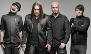

Российская рок-группа Алексея Горшенёва, младшего брата Михаила Горшенёва, основателя группы **Король и Шут**

* [9-я рота](9-я%20рота)
* [Depeche Mode](Depeche%20Mode)
* [Беспокойный](Беспокойный)
* [Вертикаль](Вертикаль)
* [Герой](Герой)
* [Города](Города)
* [Да здравствует сюрприз](Да%20здравствует%20сюрприз)
* [Движение](Движение)
* [Девятая рота](Девятая%20рота)
* [Дождь](Дождь)
* [Долгой дорогой](Долгой%20дорогой)
* [Дороги (2 вариант)](Дороги%20(2%20вариант))
* [Дороги (3 вариант)](Дороги%20(3%20вариант))
* [Дороги](Дороги)
* [Есенин](Есенин)
* [Жадное море](Жадное%20море)
* [Звезда](Звезда)
* [Знай](Знай)
* [Иллюзии](Иллюзии)
* [Кайф](Кайф)
* [Каменный гость (2 вариант)](Каменный%20гость%20(2%20вариант))
* [Каменный гость](Каменный%20гость)
* [Колдовство](Колдовство)
* [Кошмары](Кошмары)
* [Крепкий сон (2 вариант)](Крепкий%20сон%20(2%20вариант))
* [Крепкий сон](Крепкий%20сон)
* [Куда ты смотришь](Куда%20ты%20смотришь)
* [Ложь](Ложь)
* [Лунный свет](Лунный%20свет)
* [Моя родина - фотография](Моя%20родина%20-%20фотография)
* [Моя свеча](Моя%20свеча)
* [На высоких этажах](На%20высоких%20этажах)
* [На окраине земли](На%20окраине%20земли)
* [Наша музыка](Наша%20музыка)
* [Наше кино](Наше%20кино)
* [Не беда](Не%20беда)
* [Не спеши](Не%20спеши)
* [Небеса (2 вариант)](Небеса%20(2%20вариант))
* [Небеса](Небеса)
* [Невезучий](Невезучий)
* [Нежность](Нежность)
* [Ночуя над головой](Ночуя%20над%20головой)
* [Огни](Огни)
* [Падающая звезда](Падающая%20звезда)
* [Параллели](Параллели)
* [Печаль](Печаль)
* [По раскрашенной душе (2 вариант)](По%20раскрашенной%20душе%20(2%20вариант))
* [По раскрашенной душе](По%20раскрашенной%20душе)
* [Попса](Попса)
* [Последнее письмо](Последнее%20письмо)
* [Растворяясь](Растворяясь)
* [Серебряный сентябрь](Серебряный%20сентябрь)
* [Сказка](Сказка)
* [Скоро кончится лето](Скоро%20кончится%20лето)
* [Смех](Смех)
* [Солдатская печаль (2 вариант)](Солдатская%20печаль%20(2%20вариант))
* [Солдатская печаль (3 вариант)](Солдатская%20печаль%20(3%20вариант))
* [Солдатская печаль](Солдатская%20печаль)
* [Сон](Сон)
* [Спутник](Спутник)
* [Столкновение](Столкновение)
* [Странные дни](Странные%20дни)
* [Тайна](Тайна)
* [Твои счастливые глаза](Твои%20счастливые%20глаза)
* [Творец](Творец)
* [Тени в театре](Тени%20в%20театре)
* [Уходящая в ночь](Уходящая%20в%20ночь)
* [Фаворит солнца](Фаворит%20солнца)
* [Феникс](Феникс)
* [Фотография](Фотография)
* [Чужое небо](Чужое%20небо)
* [Чучело (привет КиШ)](Чучело%20(привет%20КиШ))
* [Чёрная невеста](Чёрная%20невеста)
* [Это не беда](Это%20не%20беда)
* [Этот белый свет](Этот%20белый%20свет)
* [Ясные дни](Ясные%20дни)