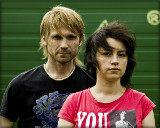

Российская музыкальная группа из Новосибирска.

* [60-е, 70-е](60-е,%2070-е)
* [F-1](F-1)
* [Автоответчик](Автоответчик)
* [Баттерфляй](Баттерфляй)
* [Бегущая по волнам](Бегущая%20по%20волнам)
* [Веснушки](Веснушки)
* [Воздушный змей](Воздушный%20змей)
* [Джим](Джим)
* [Дом на Луне](Дом%20на%20Луне)
* [Зомби](Зомби)
* [Инопланетянин](Инопланетянин)
* [Калифорния](Калифорния)
* [Кошки-мышки](Кошки-мышки)
* [Кругом одна вода](Кругом%20одна%20вода)
* [Кто ты такой](Кто%20ты%20такой)
* [Лайла](Лайла)
* [Лезвия](Лезвия)
* [Мечта](Мечта)
* [Моря по колено](Моря%20по%20колено)
* [Мы встретимся там](Мы%20встретимся%20там)
* [Не Дикаприо](Не%20Дикаприо)
* [Несчастный случай](Несчастный%20случай)
* [Падаешь вниз](Падаешь%20вниз)
* [По шоссе](По%20шоссе)
* [Подруга](Подруга)
* [Прощаюсь](Прощаюсь)
* [Пузырьки](Пузырьки)
* [Самолёты летят](Самолёты%20летят)
* [Скучаю](Скучаю)
* [Тебе](Тебе)
* [Человек человеку](Человек%20человеку)
* [Шевроле](Шевроле)
* [Шестиструнный самурай](Шестиструнный%20самурай)
* [Шива](Шива)