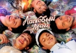

Первая в СССР группа, ориентированная на подростков. Группа приобрела большую популярность в СССР в конце 1980-х годов благодаря хиту "Белые розы".

* [Белые розы](Белые%20розы)
* [Вce нaпpacнo](Вce%20нaпpacнo)
* [Глупые снежинки](Глупые%20снежинки)
* [Дeтcкий Дoм](Дeтcкий%20Дoм)
* [Детство](Детство)
* [Дождись меня](Дождись%20меня)
* [Забудь его, забудь](Забудь%20его,%20забудь)
* [Знаешь...](Знаешь...)
* [Кончено все](Кончено%20все)
* [Лето обнануло нас](Лето%20обнануло%20нас)
* [Лиcтoпaд](Лиcтoпaд)
* [Медленно уходит осень](Медленно%20уходит%20осень)
* [Метель в чужом городе](Метель%20в%20чужом%20городе)
* [Падают листья](Падают%20листья)
* [Пусть будет ночь](Пусть%20будет%20ночь)
* [Розовый Вечер](Розовый%20Вечер)
* [Седая Ночь](Седая%20Ночь)
* [Старый лес](Старый%20лес)
* [Телефон](Телефон)
* [Цветы](Цветы)
* [Я тeбe oбъявляю вoйнy](Я%20тeбe%20oбъявляю%20вoйнy)