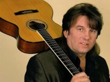

Советский и российский певец, композитор, автор песен.

* [Ах, какие ножки](Ах,%20какие%20ножки)
* [Баба Люба](Баба%20Люба)
* [Веселье новогоднее](Веселье%20новогоднее)
* [Визит](Визит)
* [Вокзальные буфеты](Вокзальные%20буфеты)
* [Гараж](Гараж)
* [Гнусная песня](Гнусная%20песня)
* [Город](Город)
* [Дeвoчкa в бape](Дeвoчкa%20в%20бape)
* [Детские глаза](Детские%20глаза)
* [Дорога](Дорога)
* [Достала](Достала)
* [Дядя-швейцар](Дядя-швейцар)
* [Есть повод для печали](Есть%20повод%20для%20печали)
* [Заповедные места](Заповедные%20места)
* [Зачем](Зачем)
* [Зима](Зима)
* [Иду в компанию](Иду%20в%20компанию)
* [Исполнительный лист](Исполнительный%20лист)
* [Итог](Итог)
* [Июльской ночью](Июльской%20ночью)
* [К тебе, Москва](К%20тебе,%20Москва)
* [Как у других](Как%20у%20других)
* [Купи мне, мама](Купи%20мне,%20мама)
* [Лохматый мой друг](Лохматый%20мой%20друг)
* [Любовь](Любовь)
* [Манекен](Манекен)
* [Мать пишет](Мать%20пишет)
* [Мне уже многое поздно...](Мне%20уже%20многое%20поздно...)
* [Мой приятель - голубой](Мой%20приятель%20-%20голубой)
* [Мой трамвай последний](Мой%20трамвай%20последний)
* [Мы начнём с нуля](Мы%20начнём%20с%20нуля)
* [Над деревней Клюевкой](Над%20деревней%20Клюевкой)
* [Нашей любви ночь](Нашей%20любви%20ночь)
* [Не принимай](Не%20принимай)
* [Не сегодня, не завтра](Не%20сегодня,%20не%20завтра)
* [Не так](Не%20так)
* [Новый год](Новый%20год)
* [О, новый день](О,%20новый%20день)
* [Огни эстрады](Огни%20эстрады)
* [Одиночество](Одиночество)
* [Опять](Опять)
* [Осыпаются надежды... (Осень)](Осыпаются%20надежды...%20(Осень))
* [Ох уж эти дела](Ох%20уж%20эти%20дела)
* [Памяти Виктора Резникова](Памяти%20Виктора%20Резникова)
* [Памяти Высоцкого](Памяти%20Высоцкого)
* [Память](Память)
* [Песенка проститутки](Песенка%20проститутки)
* [Пиво](Пиво)
* [Плот](Плот)
* [Подожди](Подожди)
* [Пой, моя гитара](Пой,%20моя%20гитара)
* [Полуночный блюз](Полуночный%20блюз)
* [Пора по чуть-чуть](Пора%20по%20чуть-чуть)
* [Посвящение Высоцкому](Посвящение%20Высоцкому)
* [Прелюдия](Прелюдия)
* [Резиновые дни](Резиновые%20дни)
* [Рок-н-ролл в утиль](Рок-н-ролл%20в%20утиль)
* [Санта-Круз](Санта-Круз)
* [Смерть](Смерть)
* [Старый лимузин](Старый%20лимузин)
* [Старый рок-н-ролл](Старый%20рок-н-ролл)
* [Стерва](Стерва)
* [Сто часов](Сто%20часов)
* [Так я устроен](Так%20я%20устроен)
* [Там далеко](Там%20далеко)
* [Телефон-рок](Телефон-рок)
* [Тоска](Тоска)
* [Ты был прав](Ты%20был%20прав)
* [У меня мал папа](У%20меня%20мал%20папа)
* [У моей зазнобы](У%20моей%20зазнобы)
* [Улетай, тоска](Улетай,%20тоска)
* [Утро с похмелья](Утро%20с%20похмелья)
* [Цыганская душа](Цыганская%20душа)
* [Что сказано, то сказано](Что%20сказано,%20то%20сказано)
* [Это видел я](Это%20видел%20я)
* [Я не хуже, чем все](Я%20не%20хуже,%20чем%20все)
* [Я умею мечтать](Я%20умею%20мечтать)