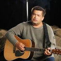

Советская и российская эстрадная группа. Основатель и продюсер - Игорь Матвиенко. Единственный бессменный участник коллектива с 1989 года солист Николай Расторгуев.

* [9-й вaл](9-й%20вaл)
* [Атас](Атас)
* [Бабу бы](Бабу%20бы)
* [Батька Махно](Батька%20Махно)
* [Белый лебедь](Белый%20лебедь)
* [Березы](Березы)
* [Было время, был я беден..](Было%20время,%20был%20я%20беден..)
* [Было время](Было%20время)
* [Весна](Весна)
* [Ветер-ветерок](Ветер-ветерок)
* [Гитара семиструнная](Гитара%20семиструнная)
* [Главное что есть ты у меня](Главное%20что%20есть%20ты%20у%20меня)
* [Главное, что есть ты у меня](Главное,%20что%20есть%20ты%20у%20меня)
* [Годы](Годы)
* [Давай за...](Давай%20за...)
* [Дед](Дед)
* [Дорога](Дорога)
* [Дядя Вася](Дядя%20Вася)
* [За тебя](За%20тебя)
* [Князь Владимир](Князь%20Владимир)
* [Комбат](Комбат)
* [Конь](Конь)
* [Луна](Луна)
* [Люберцы](Люберцы)
* [Любо, братцы, любо](Любо,%20братцы,%20любо)
* [Мент](Мент)
* [Младшая сестра](Младшая%20сестра)
* [Младшая сестренка](Младшая%20сестренка)
* [Мой конь](Мой%20конь)
* [Мы с конем](Мы%20с%20конем)
* [На воле](На%20воле)
* [Не валяй дурака, Америка](Не%20валяй%20дурака,%20Америка)
* [Не для меня](Не%20для%20меня)
* [Ночь](Ночь)
* [Опера](Опера)
* [От Волги до Енисея](От%20Волги%20до%20Енисея)
* [Песня о друге](Песня%20о%20друге)
* [По высокой траве](По%20высокой%20траве)
* [По дороге, да по кольцевой...](По%20дороге,%20да%20по%20кольцевой...)
* [Позови меня тихо по имени](Позови%20меня%20тихо%20по%20имени)
* [Покосы](Покосы)
* [Полустаночки](Полустаночки)
* [Помилуй, Господи, нас грешных](Помилуй,%20Господи,%20нас%20грешных)
* [Прорвёмся](Прорвёмся)
* [Ребята с нашего двора](Ребята%20с%20нашего%20двора)
* [Русские](Русские)
* [Сaмoвoлoчкa](Сaмoвoлoчкa)
* [Самоволочка](Самоволочка)
* [Сестpенка](Сестpенка)
* [Сиpота казанская](Сиpота%20казанская)
* [Сирота казанская](Сирота%20казанская)
* [Скворцы](Скворцы)
* [Скоро дембель](Скоро%20дембель)
* [Служили два товарища](Служили%20два%20товарища)
* [Солдат](Солдат)
* [Спят курганы темные](Спят%20курганы%20темные)
* [Станция Таганская](Станция%20Таганская)
* [Старые друзья](Старые%20друзья)
* [Старый барин](Старый%20барин)
* [Тpaмвaй-пятёpoчкa](Тpaмвaй-пятёpoчкa)
* [Там за туманами](Там%20за%20туманами)
* [Течет река Волга](Течет%20река%20Волга)
* [Трамвай пятерочка](Трамвай%20пятерочка)
* [Ты неси меня река](Ты%20неси%20меня%20река)
* [Ты неси меня, река](Ты%20неси%20меня,%20река)
* [У меня немного денег...](У%20меня%20немного%20денег...)
* [Улочки московские](Улочки%20московские)
* [Хулиган](Хулиган)
* [Шагом марш](Шагом%20марш)
* [Это было, было](Это%20было,%20было)