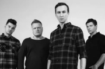

Российская рок-группа из Уфы, основанная в 1998 году.

* [02 (Благовещенск)](02%20(Благовещенск))
* [2000 лет](2000%20лет)
* [6 миллиардов](6%20миллиардов)
* [Fuckin' off](Fuckin'%20off)
* [Бaбoчки](Бaбoчки)
* [В бетонной коробке](В%20бетонной%20коробке)
* [Вавилон](Вавилон)
* [Волк](Волк)
* [Выxoднoй](Выxoднoй)
* [Гореть](Гореть)
* [Государство](Государство)
* [Детки](Детки)
* [Дневник](Дневник)
* [До свидания](До%20свидания)
* [Друзья](Друзья)
* [Дыши](Дыши)
* [Зима](Зима)
* [Змей](Змей)
* [Зубы](Зубы)
* [Катенки](Катенки)
* [Космонавт](Космонавт)
* [Кофе](Кофе)
* [Между строчек](Между%20строчек)
* [Мечта](Мечта)
* [Мне в другую сторону](Мне%20в%20другую%20сторону)
* [Мое время](Мое%20время)
* [Навсегда](Навсегда)
* [Назови мне свое имя](Назови%20мне%20свое%20имя)
* [Не зову](Не%20зову)
* [Небеса](Небеса)
* [Никто не знает](Никто%20не%20знает)
* [Ну и пусть](Ну%20и%20пусть)
* [Одной крови](Одной%20крови)
* [Отвалите](Отвалите)
* [Протест](Протест)
* [С небес на землю](С%20небес%20на%20землю)
* [С – 4](С%20–%204)
* [Самый главный человек](Самый%20главный%20человек)
* [Свобода](Свобода)
* [Сестренка](Сестренка)
* [Сид и Нэнси](Сид%20и%20Нэнси)
* [Синяя Птица](Синяя%20Птица)
* [Сколько](Сколько)
* [Тень](Тень)
* [Тишина внутри](Тишина%20внутри)
* [Три пути](Три%20пути)
* [Успокой меня](Успокой%20меня)
* [Харакири](Харакири)
* [Хорошо](Хорошо)
* [Эхо](Эхо)