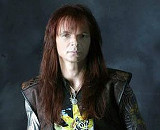

Хеви-металл группа Сергея Маврина, бывшего гитариста группы **Ария**.

* [Castlevania](Castlevania)
* [Будем жить, мать Россия](Будем%20жить,%20мать%20Россия)
* [Вот и все дела](Вот%20и%20все%20дела)
* [Выпьем еще](Выпьем%20еще)
* [Кода](Кода)
* [На осколках веры](На%20осколках%20веры)
* [Ночь в июле](Ночь%20в%20июле)
* [Одиночество](Одиночество)
* [Рожденные жить](Рожденные%20жить)
* [Смейся и плачь](Смейся%20и%20плачь)
* [Смутное время](Смутное%20время)
* [Я свободен](Я%20свободен)