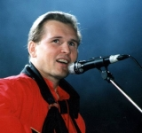

Советский и российский эстрадный певец, композитор, актёр. Народный артист России и Украины.

* [Белый конь](Белый%20конь)
* [Берега](Берега)
* [Венчание](Венчание)
* [Дай бог](Дай%20бог)
* [Когда ты сбрасываешь платье](Когда%20ты%20сбрасываешь%20платье)
* [Мне Осталась Одна Забава](Мне%20Осталась%20Одна%20Забава)
* [Море любви](Море%20любви)
* [Напрасные слова](Напрасные%20слова)
* [Поручик Голицын](Поручик%20Голицын)
* [Я уеду](Я%20уеду)