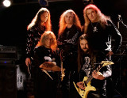

Советская и российская рок-группа, играющая в стилях трэш-метал и хеви-метал. 

* [Romance](Romance)
* [Еще раз ночь](Еще%20раз%20ночь)
* [Когда Я умру](Когда%20Я%20умру)
* [Кресты](Кресты)
* [Кто кого](Кто%20кого)
* [Мастер](Мастер)
* [Наплевать](Наплевать)
* [Небо В Глазах](Небо%20В%20Глазах)
* [Пепел на ветру](Пепел%20на%20ветру)
* [Плач свирели](Плач%20свирели)
* [Руки прочь](Руки%20прочь)
* [Тату](Тату)
* [Только ты сам](Только%20ты%20сам)
* [Тридцать три жизни](Тридцать%20три%20жизни)
* [Храни Меня](Храни%20Меня)
* [Щит и меч](Щит%20и%20меч)