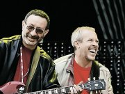

Советская и российская рок-группа. История начинается с 1969 года. Автор текстов и вокалист - Андрей Макаревич, другие участники группы - Александр Кутиков, Евгений Маргулис и Андрей Державин.

* [All I Can Say Is Hello](All%20I%20Can%20Say%20Is%20Hello)
* [Bonfire](Bonfire)
* [I Will Back](I%20Will%20Back)
* [Skipping](Skipping)
* [This happened to me](This%20happened%20to%20me)
* [Until The Candle Burns](Until%20The%20Candle%20Burns)
* [Ангел](Ангел)
* [Ах, графиня](Ах,%20графиня)
* [Ах, какой был изысканный бал](Ах,%20какой%20был%20изысканный%20бал)
* [Ах, что за Луна](Ах,%20что%20за%20Луна)
* [Багги](Багги)
* [Барьер](Барьер)
* [Бег по кругу](Бег%20по%20кругу)
* [Белый день](Белый%20день)
* [Берегом реки](Берегом%20реки)
* [Битва с дураками (День гнева)](Битва%20с%20дураками%20(День%20гнева))
* [Битва с дураками](Битва%20с%20дураками)
* [Битое стекло](Битое%20стекло)
* [Блюз Шанхай](Блюз%20Шанхай)
* [Блюз о безусловном вреде пьянства](Блюз%20о%20безусловном%20вреде%20пьянства)
* [Блюз о несомненном вреде пьянства](Блюз%20о%20несомненном%20вреде%20пьянства)
* [Братский вальсок](Братский%20вальсок)
* [Брошенный в небо](Брошенный%20в%20небо)
* [Будет день](Будет%20день)
* [Будет недолгой ночь](Будет%20недолгой%20ночь)
* [Бурьян породил бурьян](Бурьян%20породил%20бурьян)
* [Было то в притонах Сан-Франциско](Было%20то%20в%20притонах%20Сан-Франциско)
* [Былые дни](Былые%20дни)
* [В Никитском Ботаническом саду](В%20Никитском%20Ботаническом%20саду)
* [В добрый час](В%20добрый%20час)
* [В кpуге света](В%20кpуге%20света)
* [В круге света](В%20круге%20света)
* [В круге чистой воды](В%20круге%20чистой%20воды)
* [В маленьком городе](В%20маленьком%20городе)
* [Вагонные споры](Вагонные%20споры)
* [Варьете](Варьете)
* [Вверх](Вверх)
* [Весь мир сошел с ума](Весь%20мир%20сошел%20с%20ума)
* [Ветер все сильней](Ветер%20все%20сильней)
* [Ветер над городом](Ветер%20над%20городом)
* [Ветер надежды](Ветер%20надежды)
* [Внештатный командир Земли](Внештатный%20командир%20Земли)
* [Вниз по Амазонке](Вниз%20по%20Амазонке)
* [Вот что странно](Вот%20что%20странно)
* [Время бодро меняет флаги](Время%20бодро%20меняет%20флаги)
* [Время пробует меня на зуб](Время%20пробует%20меня%20на%20зуб)
* [Время](Время)
* [Все вехи наши ...](Все%20вехи%20наши%20...)
* [Все вехи наши](Все%20вехи%20наши)
* [Всегда одинок](Всегда%20одинок)
* [Где найти подругу жизни](Где%20найти%20подругу%20жизни)
* [Геpои вчеpашних дней](Геpои%20вчеpашних%20дней)
* [Гимн забору](Гимн%20забору)
* [Гололед](Гололед)
* [Дай мне ответ](Дай%20мне%20ответ)
* [Дай мне руку, душа моя](Дай%20мне%20руку,%20душа%20моя)
* [Дальше и дальше](Дальше%20и%20дальше)
* [Два белых снега](Два%20белых%20снега)
* [Девятый вал](Девятый%20вал)
* [День pожденья](День%20pожденья)
* [День гнева](День%20гнева)
* [Дип Пепл ин рок](Дип%20Пепл%20ин%20рок)
* [Дождь](Дождь)
* [Домажо](Домажо)
* [Дорога в небо](Дорога%20в%20небо)
* [Если бы мы были взpослей](Если%20бы%20мы%20были%20взpослей)
* [Если в городе твоем снег](Если%20в%20городе%20твоем%20снег)
* [За тех, кто в море](За%20тех,%20кто%20в%20море)
* [Закрытые двери](Закрытые%20двери)
* [Замок в небе](Замок%20в%20небе)
* [Звeзды нe eздят в мeтpo](Звeзды%20нe%20eздят%20в%20мeтpo)
* [Звезды не ездят в метро](Звезды%20не%20ездят%20в%20метро)
* [Знаю только я](Знаю%20только%20я)
* [Из Гельминтов](Из%20Гельминтов)
* [Из города уехало кино](Из%20города%20уехало%20кино)
* [Из конца в конец](Из%20конца%20в%20конец)
* [Избавление](Избавление)
* [Имитация](Имитация)
* [Иногда я пою](Иногда%20я%20пою)
* [К Малой Бронной](К%20Малой%20Бронной)
* [Кавалергарда век недолог](Кавалергарда%20век%20недолог)
* [Календарь](Календарь)
* [Караван](Караван)
* [Картонные крылья любви](Картонные%20крылья%20любви)
* [Кафе 'Лира'](Кафе%20'Лира')
* [Кафе Лира](Кафе%20Лира)
* [Кил-Бил](Кил-Бил)
* [Когда ее нет](Когда%20ее%20нет)
* [Когда мне будет 18](Когда%20мне%20будет%2018)
* [Когда мне одиноко](Когда%20мне%20одиноко)
* [Когда мы сойдем с ума](Когда%20мы%20сойдем%20с%20ума)
* [Когда мы уйдем](Когда%20мы%20уйдем)
* [Когда нам не светили перемены](Когда%20нам%20не%20светили%20перемены)
* [Когда я был большим](Когда%20я%20был%20большим)
* [Когда-нибудь](Когда-нибудь)
* [Кого ты хотел удивить](Кого%20ты%20хотел%20удивить)
* [Колыбельная](Колыбельная)
* [Корабли](Корабли)
* [Костер](Костер)
* [Костёр](Костёр)
* [Кошка гуляет сама по себе](Кошка%20гуляет%20сама%20по%20себе)
* [Кошка, которая гуляет сама по себе](Кошка,%20которая%20гуляет%20сама%20по%20себе)
* [Круги на воде](Круги%20на%20воде)
* [Крылья и небо](Крылья%20и%20небо)
* [Кто из них я](Кто%20из%20них%20я)
* [Кто может знать](Кто%20может%20знать)
* [Летучий Голландец](Летучий%20Голландец)
* [Лифт](Лифт)
* [Лица](Лица)
* [Люди в лодках](Люди%20в%20лодках)
* [Маленькие герои](Маленькие%20герои)
* [Маленький город](Маленький%20город)
* [Марионетки](Марионетки)
* [Маски](Маски)
* [Между тем, что было и тем, что будет](Между%20тем,%20что%20было%20и%20тем,%20что%20будет)
* [Между тем, что было, и тем, что будет](Между%20тем,%20что%20было,%20и%20тем,%20что%20будет)
* [Меня заказали](Меня%20заказали)
* [Место, где свет](Место,%20где%20свет)
* [Моим друзьям](Моим%20друзьям)
* [Мой город](Мой%20город)
* [Мой дом](Мой%20дом)
* [Мой друг лучше всех играет блюз](Мой%20друг%20лучше%20всех%20играет%20блюз)
* [Мой мир](Мой%20мир)
* [Мой приятель - художник](Мой%20приятель%20-%20художник)
* [Молитва](Молитва)
* [Морской закон](Морской%20закон)
* [Музыка под снегом](Музыка%20под%20снегом)
* [Мы pacxoдимcя пo дoмaм](Мы%20pacxoдимcя%20пo%20дoмaм)
* [На абрикосовых холмах](На%20абрикосовых%20холмах)
* [На заднем дворе](На%20заднем%20дворе)
* [На пустые страницы истории](На%20пустые%20страницы%20истории)
* [На семи ветрах](На%20семи%20ветрах)
* [Нас еще не согнули годы...](Нас%20еще%20не%20согнули%20годы...)
* [Наш дом](Наш%20дом)
* [Наш остров](Наш%20остров)
* [Нашим лoдкaм](Нашим%20лoдкaм)
* [Не дай мне упасть](Не%20дай%20мне%20упасть)
* [Не надо так](Не%20надо%20так)
* [Не плачь обо мне](Не%20плачь%20обо%20мне)
* [Не плачь](Не%20плачь)
* [Не повод для слёз](Не%20повод%20для%20слёз)
* [Небо напомнит](Небо%20напомнит)
* [Необычайно грустная песня, или телега](Необычайно%20грустная%20песня,%20или%20телега)
* [Но зато мой друг](Но%20зато%20мой%20друг)
* [Новая весна тебя убьёт](Новая%20весна%20тебя%20убьёт)
* [Новогодняя](Новогодняя)
* [Ночь за твоим плечом](Ночь%20за%20твоим%20плечом)
* [Ночь](Ночь)
* [Однажды мир прогнется под нас](Однажды%20мир%20прогнется%20под%20нас)
* [Однажды он прогнется под нас](Однажды%20он%20прогнется%20под%20нас)
* [Оловянные солдатики](Оловянные%20солдатики)
* [Он был первым из первых](Он%20был%20первым%20из%20первых)
* [Он был старше ее](Он%20был%20старше%20ее)
* [Он играет на похоронах и танцах](Он%20играет%20на%20похоронах%20и%20танцах)
* [Она желает (Свалить из СССР)](Она%20желает%20(Свалить%20из%20СССР))
* [Она идет по жизни смеясь](Она%20идет%20по%20жизни%20смеясь)
* [Она идёт по жизни смеясь](Она%20идёт%20по%20жизни%20смеясь)
* [Опрокинутый мир летних снов](Опрокинутый%20мир%20летних%20снов)
* [Опустошение](Опустошение)
* [Основа жизни](Основа%20жизни)
* [Оставь меня](Оставь%20меня)
* [Отгремели шторма роковые](Отгремели%20шторма%20роковые)
* [Оторвись от забот](Оторвись%20от%20забот)
* [Очередь](Очередь)
* [Пальма](Пальма)
* [Памяти В.Высоцкого](Памяти%20В.Высоцкого)
* [Памяти Джона Леннона](Памяти%20Джона%20Леннона)
* [Памяти М. Науменко](Памяти%20М.%20Науменко)
* [Паузы](Паузы)
* [Певец](Певец)
* [Первый шаг](Первый%20шаг)
* [Перекресток семи дорог](Перекресток%20семи%20дорог)
* [Перекрёсток](Перекрёсток)
* [Песенка о новом доме](Песенка%20о%20новом%20доме)
* [Песенка про верблюда](Песенка%20про%20верблюда)
* [Песенка про корову](Песенка%20про%20корову)
* [Песенка про счастье](Песенка%20про%20счастье)
* [Песня вожака стаи](Песня%20вожака%20стаи)
* [Песня о капитане](Песня%20о%20капитане)
* [Песня о скрипаче, который играл на танцах](Песня%20о%20скрипаче,%20который%20играл%20на%20танцах)
* [Песня про миллионера](Песня%20про%20миллионера)
* [Песня про розовые очки](Песня%20про%20розовые%20очки)
* [Песня толстяка](Песня%20толстяка)
* [Песня, которой нет](Песня,%20которой%20нет)
* [По барабану](По%20барабану)
* [По дороге в Непал](По%20дороге%20в%20Непал)
* [По морю плавать...](По%20морю%20плавать...)
* [По морю плавать](По%20морю%20плавать)
* [Поворот (2)](Поворот%20(2))
* [Поворот](Поворот)
* [Пой](Пой)
* [Пока горит свеча](Пока%20горит%20свеча)
* [Пока не спущен курок](Пока%20не%20спущен%20курок)
* [Полный контакт](Полный%20контакт)
* [Полный штиль](Полный%20штиль)
* [Помогите](Помогите)
* [Пони](Пони)
* [Пора в обратный путь](Пора%20в%20обратный%20путь)
* [Посвящeниe apxитeктypнoмy](Посвящeниe%20apxитeктypнoмy)
* [Посвящение А. Градскому](Посвящение%20А.%20Градскому)
* [Посвящение А. Розенбауму](Посвящение%20А.%20Розенбауму)
* [Посвящение В. Высоцкому - 2](Посвящение%20В.%20Высоцкому%20-%202)
* [Посвящение В. Высоцкому](Посвящение%20В.%20Высоцкому)
* [Посвящение ВИДу](Посвящение%20ВИДу)
* [Посвящение ОРТ](Посвящение%20ОРТ)
* [Посвящение Олегу Табакову](Посвящение%20Олегу%20Табакову)
* [Посвящение Стиву Уaндеру](Посвящение%20Стиву%20Уaндеру)
* [Посвящение архитектурному](Посвящение%20архитектурному)
* [Посвящение знакомому музыканту](Посвящение%20знакомому%20музыканту)
* [Посвящение советским рок-группам](Посвящение%20советским%20рок-группам)
* [Посвящение хорошему знакомому](Посвящение%20хорошему%20знакомому)
* [Последние дни](Последние%20дни)
* [Право](Право)
* [Про глупого льва](Про%20глупого%20льва)
* [Про первых и вторых](Про%20первых%20и%20вторых)
* [Про собственное лицо](Про%20собственное%20лицо)
* [Проводница](Проводница)
* [Продавец счастья](Продавец%20счастья)
* [Прости сегодня за вчера](Прости%20сегодня%20за%20вчера)
* [Простите](Простите)
* [Пусть она станет небом](Пусть%20она%20станет%20небом)
* [Путь домой](Путь%20домой)
* [Путь](Путь)
* [Пьесы и роли](Пьесы%20и%20роли)
* [Равнодушный король](Равнодушный%20король)
* [Разговор в поезде](Разговор%20в%20поезде)
* [Реки и мосты](Реки%20и%20мосты)
* [Родной дом](Родной%20дом)
* [Рождественская песня](Рождественская%20песня)
* [Рыбак рыбака](Рыбак%20рыбака)
* [Рыбка в банке](Рыбка%20в%20банке)
* [С детства склонен к перемене](С%20детства%20склонен%20к%20перемене)
* [Сакура - Катана - Сакэ](Сакура%20-%20Катана%20-%20Сакэ)
* [Самая тихая песня](Самая%20тихая%20песня)
* [Свеча](Свеча)
* [Сидя у телевизора](Сидя%20у%20телевизора)
* [Синяя птица](Синяя%20птица)
* [Скажем прямо](Скажем%20прямо)
* [Скажи, мой друг...](Скажи,%20мой%20друг...)
* [Скачки](Скачки)
* [Скворец](Скворец)
* [Сколько лет, сколько зим...](Сколько%20лет,%20сколько%20зим...)
* [Скорый поезд](Скорый%20поезд)
* [Слива](Слива)
* [Слишком короток век](Слишком%20короток%20век)
* [Снег](Снег)
* [Снова весна](Снова%20весна)
* [Солдат](Солдат)
* [Спускаясь к великой реке](Спускаясь%20к%20великой%20реке)
* [Старая дорога](Старая%20дорога)
* [Старая песня о главном](Старая%20песня%20о%20главном)
* [Старые друзья](Старые%20друзья)
* [Старые песни](Старые%20песни)
* [Старый корабль](Старый%20корабль)
* [Старый рок-н-ролл](Старый%20рок-н-ролл)
* [Старый самолёт](Старый%20самолёт)
* [Странные дни](Странные%20дни)
* [Стучaлacь в oкнa звeзднaя cиpeнь](Стучaлacь%20в%20oкнa%20звeзднaя%20cиpeнь)
* [Такие дела, ангел мой](Такие%20дела,%20ангел%20мой)
* [Там будет победа](Там%20будет%20победа)
* [Там, где будет новый день](Там,%20где%20будет%20новый%20день)
* [Тихие песни](Тихие%20песни)
* [То, чего больше нет](То,%20чего%20больше%20нет)
* [То, что люди поют по дороге домой](То,%20что%20люди%20поют%20по%20дороге%20домой)
* [Три окна](Три%20окна)
* [Три сестры](Три%20сестры)
* [Туман](Туман)
* [Туманные поля](Туманные%20поля)
* [Ты или я](Ты%20или%20я)
* [Ты лети](Ты%20лети)
* [У ломбарда](У%20ломбарда)
* [У свободы недетское злое лицо](У%20свободы%20недетское%20злое%20лицо)
* [Увидеть реку](Увидеть%20реку)
* [Улетай](Улетай)
* [Утpeнний aнгeл пycтыx бyтылoк](Утpeнний%20aнгeл%20пycтыx%20бyтылoк)
* [Уходя - уходи](Уходя%20-%20уходи)
* [Финал](Финал)
* [Флаг над замком](Флаг%20над%20замком)
* [Флюгер](Флюгер)
* [Фрейлекс](Фрейлекс)
* [Хрустальный город](Хрустальный%20город)
* [Художник](Художник)
* [Цензура](Цензура)
* [Через двадцать лет](Через%20двадцать%20лет)
* [Черно-белый цвет](Черно-белый%20цвет)
* [Чужие сpеди чужих](Чужие%20сpеди%20чужих)
* [Шанхай блюз](Шанхай%20блюз)
* [Шанхай-блюз](Шанхай-блюз)
* [Шахматы](Шахматы)
* [Шок](Шок)
* [Эпоха большой нелюбви](Эпоха%20большой%20нелюбви)
* [Эти реки никуда не текут](Эти%20реки%20никуда%20не%20текут)
* [Это было так давно](Это%20было%20так%20давно)
* [Это любовь (детка)](Это%20любовь%20(детка))
* [Этот вечный блюз](Этот%20вечный%20блюз)
* [Я вошёл в этот лес](Я%20вошёл%20в%20этот%20лес)
* [Я дам тебе (знать)](Я%20дам%20тебе%20(знать))
* [Я думал](Я%20думал)
* [Я не видел войны](Я%20не%20видел%20войны)
* [Я поверить был бы рад](Я%20поверить%20был%20бы%20рад)
* [Я рядом с тобой](Я%20рядом%20с%20тобой)
* [Я с детства склонен к перемене мест](Я%20с%20детства%20склонен%20к%20перемене%20мест)
* [Я сегодня один](Я%20сегодня%20один)
* [Я смотрю в окно](Я%20смотрю%20в%20окно)
* [Я снова жду осенних холодов](Я%20снова%20жду%20осенних%20холодов)
* [Я сюда еще вернусь](Я%20сюда%20еще%20вернусь)
* [Я сюда ещё вернусь](Я%20сюда%20ещё%20вернусь)
* [Я так устал на войне](Я%20так%20устал%20на%20войне)
* [Я увезу тебя туда](Я%20увезу%20тебя%20туда)
* [Я уже никуда не спешу](Я%20уже%20никуда%20не%20спешу)
* [Я устал от вас, братцы](Я%20устал%20от%20вас,%20братцы)
* [Я устал](Я%20устал)
* [Я хочу знать](Я%20хочу%20знать)